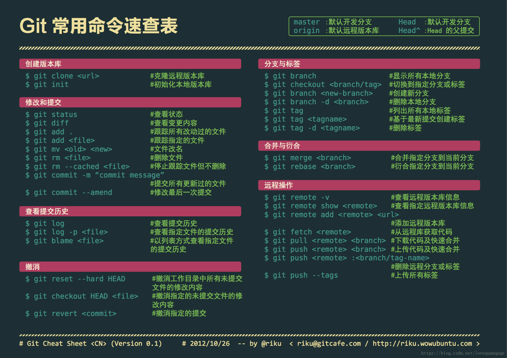

## git 基本概念

- 版本库.git

  当我们使用 git 管理文件时，比如 git init 时，这个时候，会多一个.git 文件，我们把这个文件称之为版本库。
  .git 文件另外一个作用就是它在创建的时候，会自动创建 master 分支，并且将 HEAD 指针指向 master 分支。

- 工作区

  本地项目存放文件的位置

- 暂存区 (Index/Stage)

  顾名思义就是暂时存放文件的地方，通过是通过 add 命令将工作区的文件添加到缓冲区

- 本地仓库

  通常情况下，我们使用 commit 命令可以将暂存区的文件添加到本地仓库
  通常而言，HEAD 指针指向的就是 master 分支

- 远程仓库（Remote）

  举个例子，当我们使用 GitHub 托管我们项目时，它就是一个远程仓库。
  通常我们使用 clone 命令将远程仓库代码拷贝下来，本地代码更新后，通过 push 托送给远程仓库。

## 基本流程

创建本地仓库
`git init`

链接本地仓库与远端仓库

```js
git remote add  origin
origin默认是远端仓库别名  url 可以是「可以使用https或者ssh的方式新建」\
```

检查配置信息

```js
git config --list

Git user name 与email

git config --global user.name "yourname"
git config --global user.email  "your_email"
```

生成 SSH 密钥

```
ssh-keygen -t rsa -C "这里换上你的邮箱"
cd ~/.ssh 里面有一个文件名为id_rsa.pub,把里面的内容复制到git库的我的SSHKEYs中
```

常看远端仓库信息
`git remote -v`

远端仓库重新命名
`git remote rename old new`

提交到缓存区

```
git add .  全部上传到缓存区
git add指定文件
```

提交到本地仓库
`git commit -m 'some message'`

提交远程仓库
`git push <远程主机名> <本地分支名>:<远程分支名>`

查看分支
`git branch`

创建新分支
`git branch <分支名称>`

切换分支
`git checkout`

创建分支并切换
`git checkout -b`

删除分支
`git branch -d`

删除远程分支
`git push -d`

切换分支
`git checkout`ß

## 项目初始化常用命令

- 建立一个新的仓库

```
git clone <仓库地址>
cd smash-gold-egg
touch README.md
git add README.md
git commit -m "add README"
git push -u origin master
```

- 现有的文件夹建立连系

```
cd existing_folder
git init
git remote add origin <仓库地址>
git add .
git commit -m "Initial commit"
git push -u origin master
```

- 已存在的库建议新的连系

```
cd existing_repo
git remote rename origin old-origin
git remote add origin <仓库地址>
git push -u origin --all
git push -u origin --tags
```

## 分支命名规范

- master 分支  
  主分支，用于部署生产环境的分支，确保稳定性。
  master 分支一般由 develop 以及 hotfix 分支合并，任何情况下都不能直接修改代码。
- develop 分支  
   develop 为开发分支，通常情况下，保存最新完成以及 bug 修复后的代码。
  开发新功能时，feature 分支都是基于 develop 分支下创建的。

- feature 分支

  开发新功能，基本上以 develop 为基础创建 feature 分支。
  分支命名：feature/ 开头的为特性分支， 命名规则: feature/user_module、 feature/cart_module。

- release 分支

  release 为预上线分支，发布提测阶段，会 release 分支代码为基准提测。

- hotfix 分支

  分支命名：hotfix/ 开头的为修复分支，它的命名规则与 feature 分支类似。
  线上出现紧急问题时，需要及时修复，以 master 分支为基线，创建 hotfix 分支，修复完成后，需要合并到 master 分支和 develop 分支。

## 来自网络的速查表



## 快捷操作

git push origin master:deploy（推送远程分支代码 master 到分支 deploy 上）
