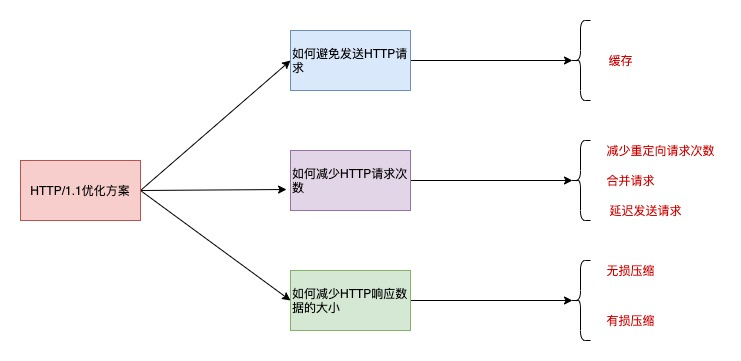
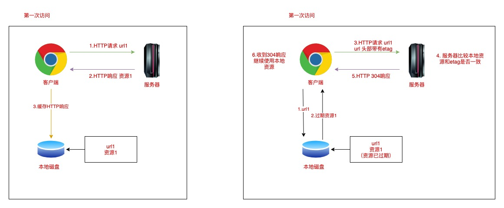

## 你知道 HTTP/1.1 如何优化吗

首先可以想到的是 将 HTTP/1.1 的 短连接改成长链接

不过这个是需要改变底层的传输层。其实我们还可以从以下几个方面考虑 来优化



## 如何避免发送请求

这里并不是真的不请求，而是针对一些重复性的请求，如果每次我们请求的数据都是重复的 那我们是没有必要重复请求的。
所以这里可以通过 HTTP 的缓存技术。那么缓存是是怎么做的呢

客户端在第一请求的时候 会把响应的数据保存在本地磁盘上，将其中请求的 URl 作为 KEY，而响应作为 value 两者形成映射关系
当后续发起相同的请求 就可以先在本地磁盘通过 key 查找到对应的 value 也就是响应，如果找到了，就直接从本地读取

当然了 这其中不可能就直接读取，如果服务器的资源更新了呢？所以这里面还有一套自己的规则 具体的 可以查看 HTTP 分组里面的 缓存文章，里面介绍了缓存的一些规则和说明。



## 如何减少 HTTP 请求次数

1. 减少重定向
   为什么要重定向？

因为服务器的资源迁移 维护等原因 从 url1 迁移到了 url2 然而客户端并不知道，客户端还是请求 url1，这个时候服务器不能只返回错误，体验不好，而是通过 302 响应码和 Location 头部，告诉客户端 资源已迁移，于是客户端再次发送请求 请求 url2 的资源

重定向的请求越多，那么客户端的发起的 HTTP 请求就越多。

2. 合并请求

如果把多个访问小文件的请求合并成一个大的请求，虽然传输的总资源还是一样，但是减少请求，也就意味着减少 了重复发送的 HTTP 头部。
由于 HTTP/1.1 是请求响应模式，并且队头阻塞，合并了请求也可以减少 TCP 的握手和启动。
比如把多个小图合成一张大图，虽然资源没有变 但是 HTTP 请求数量减少了。比如用 webpack 把 js 等文件合并成一个文件 等等。
比如 把比较小的图片打包称 base64，都可以减少请求

3. 延迟发送请求

延迟发送 其实就是按需加载，有些时候 用户不需要一下把所有的资源都加载出来，只有当用户需要的时候再加载。

## 减少 HTTP 响应的数据大小

- 无损压缩

无损压缩是指资源经过压缩后，信息不被破坏，还能完全恢复到压缩前的原样，适合用在文本文件、程序可执行文
件、程序源代码。

比如 我们 压缩一些换行符号和空格。这些都是为了帮助程序员更好的阅读，但是计算机是不需要这些多余的符号的

gzip 就是比较常⻅的无损压缩。客户端支持的压缩算法，会在 HTTP 请求中通过头部中的 Accept-Encoding 字段 告诉服务器:

```
Accept-Encoding: gzip, deflate, br
```

服务器收到后，会从中选择一个服务器支持的或者合适的压缩算法，然后使用此压缩算法对响应资源进行压缩，最 后通过响应头部中的 content-encoding 字段告诉客户端该资源使用的压缩算法。

```
content-encoding: gzip

```

- 有损压缩
  与无损压缩相对的就是有损压缩，经过此方法压缩，解压的数据会与原始数据不同但是非常接近。
  比如音频、视频、图片。
  可以通过 HTTP 请求头部中的 Accept 字段里的「 q 质 􏰀 因子」，告诉服务器期望的资源质 􏰀。
  ```
  Accept: audio/*; q=0.2, audio/basic
  ```
