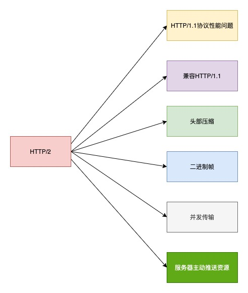
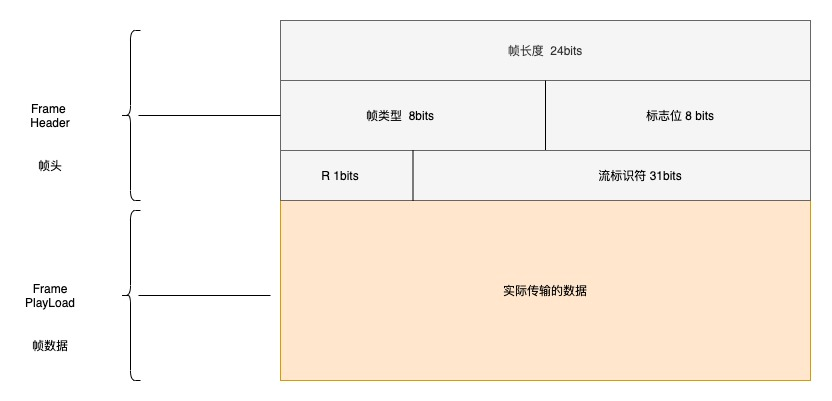
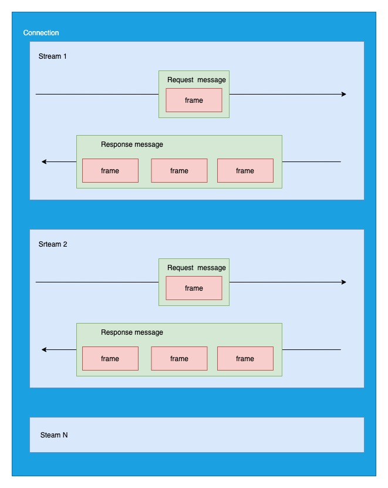
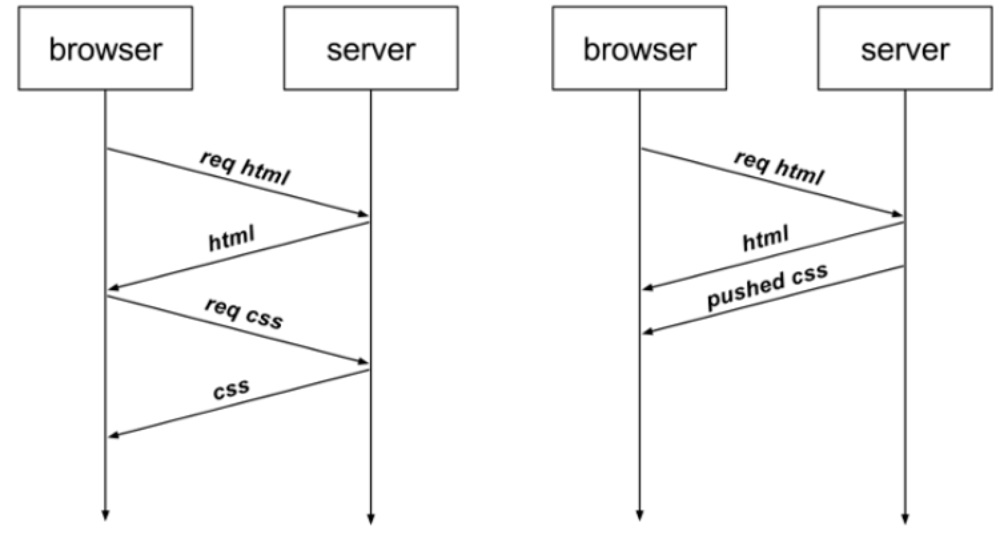
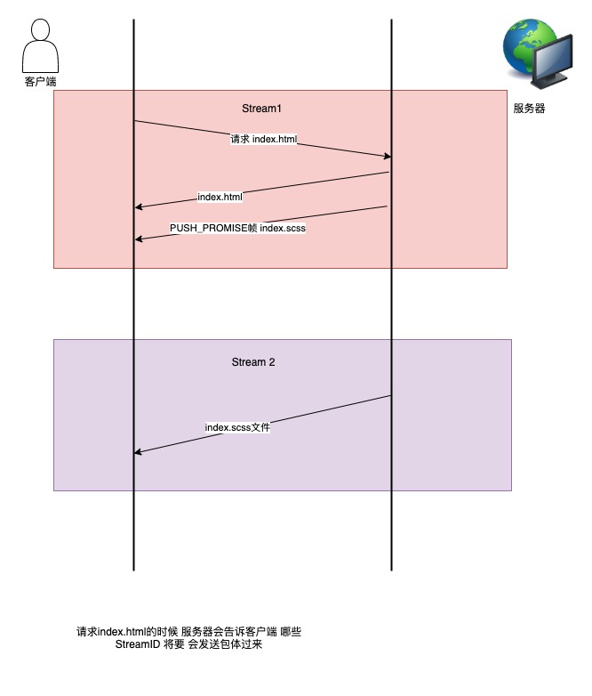

## HTTP2



## HTTP/1.1 的性能问题

- 不支持服务器推送消息
- HTTP 头部重复 并且很大 没有压缩
- 队头阻塞
- 并发连接有限 并且每个连接都要经过 TCP 握手耗时

## 兼容 HTTP/1.1

HTTP/2 是如何兼容 HTTP/1.1 的呢？

1. HTTP/2 没有在 URL 里引入新的协议名称，还是用[http://]表示明文协议 [https://]表示加密协议，所以只需要浏览器和服务器在背后自动升级协议即可

2. 只在应用层做了改变，还是基于 TCP 协议传输，应用层方面为了保持功能上的兼容，HTTP/2 把 HTTP 分解成了 语义和语法两个部分，语义层不做改动和 HTTP/1.1 完全一致，比如请求方法、状态码、头 字段等规则保留不变。但是，HTTP/2 在「语法」层面做了很多改造，基本改变了 HTTP 报文的传输格式。

## 头部压缩

HTTP 协议的报文是由 Header+body 构成的，对于 Body 部分，HTTP/1.1 协议可以使用头字段「Content- Encoding」指定 Body 的压缩方式，比如用 gzip 压缩，这样可以节约带宽，但报文中的另外一部分 Header，是没 有针对它的优化手段。

HTTP/1.1 报文中 Header 存在的问题

1. 包含很多固定的字段 比如 Cookie UserAgent Accept 这些字段携带的数据 是很大的，但是没有压缩，所以有必要压缩
2. 大量的请求和响应报文中有很多字段值是重复的，这样会使得大量带宽被这些冗余的字段浪费掉，所以有必要 去重
3. 字段是 ASCII 编码的，虽然易于人类观察，但效率低，所以有必要改成二进制编码;

HTTP/2 对 Header 进行了改造 以上的问题都解决了

HTTP/2 是开发了 HPACK 算法对 header 进行压缩
HPACK 包含三个组成部分

- 静态字典
- 动态字典
- Huffman 编码（压缩算法）

客户端和服务器两端都会建立和维护「字典」，用⻓度较小的索引号表示 􏰀 复的字符串，再用 Huffman 编码压缩 数据，可达到 50%~90% 的高压缩率。

## 静态编码表

HTTP/2 为高频出现在头部的字符串和字段建立了一张静态表，它是写入到 HTTP/2 框架里的，不会变化的，静态 表里共有 61 组，如下图展示的部分内容

<div align="center">

</div>

Index 表示索引 key Header value 表示对应索引的 value Header name 表示字段的名称
有些 Index 没有对应的 Header value 是因为 这些 value 不是固定的值，而是变化的 这些 value 都会经过 Huffman 编码后发出

## 动态表的编码

静态表只包含了 61 种高频出现在头部的字符串，不再静态表中的的头部字符串就会自动构建在动态表中 他的 Index 是从 62 起步的，会在编码解析的时候 随时更新

举个例子：

我第一次在头部中 添加发送了 user-agent 字段 里面包含了 上百个字节，经过 huffman 编码后发送，客户端和服务器端都会更新自己的动态表 添加一个新的 Index 62，那么在下一次 facing 的时候，就不用重复发送这个字段了，只发送一个字节的 Index 就可以了，因为双方都有自己的动态表，可以获取到字段的数据

所以，使得动态表生效有一个前提:必须同一个连接上，重复传输完全相同的 HTTP 头部。如果消息字段在 1 个连 接上只发送了 1 次，或者 􏰀 复传输时，字段总是略有变化，动态表就无法被充分利用了。

因此，随着在同一 HTTP/2 连接上发送的报文越来越多，客户端和服务器双方的「字典」积累的越来越多，理论上 最终每个头部字段都会变成 1 个字节的 Index，这样便避免了大 􏰁 的冗余数据的传输，大大节约了带宽。

理想很美好，现实很⻣感。动态表越大，占用的内存也就越大，如果占用了太多内存，是会影响服务器性能的，因 此 Web 服务器都会提供类似 http2_max_requests 的配置，用于限制一个连接上能够传输的请求数 􏰁，避免动态 表无限增大，请求数 􏰁 到达上限后，就会关闭 HTTP/2 连接来释放内存。

综上，HTTP/2 头部的编码通过「静态表、动态表、Huffman 编码」共同完成的。

## 二进制帧

HTTP/2 把 HTTP/1.1 的文本格式改成了二进制格式传输数据，提高了 HTTP 的传输效率

HTTP/2 二进制帧的结构图：



一个字节（Byte）表示 1Byte 数据的存储是以字节 为单位 数据的传输是以 位（bit 比特）为单位 1Byte = 8bit

帧头 很小只有 9 个字节 帧开头的前三个字节 表示帧数据的长度

帧长度后面的一个字节表示帧的类型 HTTP/2 一共有 10 种类型 分为数据帧和控制帧

<div align="center">

</div>

帧类型后面的是一个字节的标志位，用于携带简单的控制信息 比如

- END_HEADERS 表示头数据结束标志，相当于 HTTP/1 里头后的空行(“\r\n”);
- END_STREAM 表示单方向数据发送结束，后续不会再有数据帧。
- PRIORITY 表示流的优先级;

帧头最后的四个字节 是流标识符，但是最高位 被保留 不能用 也就是图中的 R 只有 31 位可以用，他的作用是用来标识该 Frame 属于哪个 Stream 接手方 可以根据这个信息在乱序的帧里面找到相同的 Stream ID 帧 从而有序的组装数据

最后面的就是数据帧了，他存放的是通过 HPACK 算法压缩过的 HTTP 头部和包体

## 并发传输

我们知道 HTTP/1.1 是有 队头阻塞的问题，而 HTTP/2 通过 Stream 的设计，让过个 Stream 复用一条 TCP 连接，达到并发的效果，解决了 HTTP/1.1 的队头阻塞问题，提高了 HTTP 传输的吞吐量

开局一张图



- 1 个 TCP 连接包含一个或者多个 Stream Stream 是 HTTP/2 实现并发的关键
- Stream 里可以包含一个或者 多个 Message ，Message 是对应 HTTP/1 中的请求响应 由 HTTP 头部和包体组成
- Message 里面包含一条或者多个 Frame Frame 是 HTTP/2 的最小单位，以二进制压缩格式存放 HTTP/1.1 中的内容（头部 和 包体）

在 HTTP/2 连接上，不同的 Stream 的帧是可以乱序发送的（所以可以并发不同的 Stream）因为每个帧的头部都会携带 Stream ID 所以接收端可以通过 Stream ID 有序组装成 HTTP 消息，而同一 Stream 内部的帧必须是严 格有序的。

客户端和服务器 都可以建立 Stream StreamID 也是有区别的，客户端建立的 Stream 必须是奇数，服务端建立的 Stream 必须是偶数
同一个连接中的 Stream ID 是不能复用的，只能顺序递增，所以当 Stream ID 耗尽时，需要发出一个控制帧 GOWAWAY 来关闭 TCP 连接

在 Nginx 中，可以通过 http2_max_concurrent_streams 配置来设置 Stream 的上限，默认是 128 个。

HTTP/2 通过 Stream 来实现并发，当 HTTP/2 实现 100 个并发 只需要建立一次 TCP 而 HTTP/1.1 需要建立 100 个 TCP 连接。

HTTP/2 还可以针对 每个 Stream 设置不同的 优先级 帧头的标志位 可以设置优先级，比如客户端访问 HTML/CSS 和图片资源时，希望服务器先传递 HTML/CSS，再传图片，那么就可以通过设置 Stream 的优先级来 实现，以此提高用户体验。

## 服务器主动推送

HTTP/1.1 是 不支持服务器主动推送资源给客户端，都是由客户端给服务器发起请求后，然后才能获取服务器的资源

比如 浏览器从服务器获取 HTML 文件，但是我还需要 CSS 文件，HTTP/1.1 就需要 再发一个请求 css 的请求，在 HTTP/2 中可以设置 服务器直接推送 CSS 资源，不用单独再次请求



可以在 Nginx 中设置

```
location /test.html {
  http2_push /test.css;
}
```

HTTP/2 推送的基本原理

客户端发起的请求，必须使用的是奇数号 Stream，服务器主动的推送，使用的是偶数号 Stream。服务器在推送资 源时，会通过 PUSH_PROMISE 帧传输 HTTP 头部，并通过帧中的 Promised Stream ID 字段告知客户端，接下来 会在哪个偶数号 Stream 中发送包体。



## 总结

HTTP/2 是基于 TCP 协议来传输数据的，TCP 是字节流协议，TCP 层必须保证收到的字节数据是完整且连续的， 这样内核才会将缓冲区里的数据返回给 HTTP 应用，那么当「前 1 个字节数据」没有到达时，后收到的字节数据只 能存放在内核缓冲区里，只有等到这 1 个字节数据到达时，HTTP/2 应用层才能从内核中拿到数据，这就是 HTTP/2 队头阻塞问题。（如果发生丢包 就会有队头阻塞问题）

有没有什么解决方案呢?既然是 TCP 协议自身的问题，那干脆放弃 TCP 协议，转而使用 UDP 协议作为传输层协 议，这个大胆的决定， HTTP/3 协议做了!
