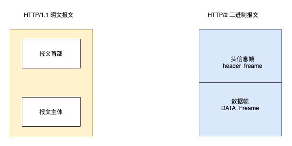

大纲如图所示，这篇主要讲解 HTTP 常见的面试题目

## HTTP 基本知识

> HTTP 是什么 可以简单说一下吗

HTTP 是超文本传输协议，也就是 HyperText Transfer Protocol
根据名字 超文本传输协议 我们可以区分出三个部分

- 超文本
- 传输
- 协议

1. 超文本

HTTP 传输的内容就是超文本，互联网早期 HTTP 只传一些简单的文字，但是发展到今天，超文本可以涵盖 文字 图片 视频 压缩包等
HTML 就是最常见的超文本，它本身只是纯文字文件，但是内部使用了很多标签定义了图片视频等链接，经过浏览器的解释，呈现给我们的就是一个有文字和画面的网页了

2. 传输

所谓传输，就是两点之间传输数据，HTTP 协议是双向协议，所以传输数据要遵从 HTTP 协议，我们可以理解传输就是两点之间传输数据的约定和规范

3. 协议

HTTP 是一个用在计算机世界里的协议。它使用计算机能够理解的语言确立了一种计算机之间交流通信的规范(两个以上的参与者)，以及相关的各种控制和错误处理方式(行为约定和规范)。

> HTTP 是用于从互联网服务器传输超文本到本地浏览器的协议 这个说法正确吗

这个说法不是很准确，也可以服务器到服务器之间传输，所以可以说成两点之间传输

> HTTP 常见的状态码

1. 1xx 类状态码 属于提示信息，是协议处理中的一种中间状态，实际用到的比较少
2. 2xx 类状态码表示服务器成功处理了客户端的请求。
   - 200 OK 最常见的状态码 表示一切正常 服务器返回的响应头会有 body 数据
   - 204 No Content 和 200 的区别是没有 body 数据
   - 206 partial Content 是应用于 HTTP 分块下载或者端点续传 表示相应返回的 body 数据并不是资源的全部
3. 3xx 类状态码表示客户端请求的资源发生了变动，需要客户端用新的 URL 重新发送 获取新的资源 也就是重定向
   - 301 Moved Permanently 表示永久重定向 说明请求资源不存在 需要用新的 URL 请求
   - 302 Found 表示临时重定向，说明资源还在，临时需要另一个 URL 访问
   - 301 和 302 都会在响应头里使用字段 Location 指明后续要跳转的 URL 浏览器器会自动重定向 新的 URL
   - 304 Not Modified 不具有跳转的含义，表示资源未被修改 重定向已经存在的缓冲文件，也称缓存重定向 用于缓存控制
4. 4xx 类状态码表示客户端发送的豹纹有误，服务器无法处理，也就是错误码的含义
   - 400 Bad Request 表示客户端请求的报文有错误，但只是个笼统的错误。
   - 403 Forbidden 表示服务器禁止访问资源，并不是客户端的请求出错
   - 404 Not Found 表示请求的资源在服务器上不存在或未找到，所以无法提供给客户端
5. 5xx 类状态码表示客户端请求报文正确，但是服务器处理时内部发生了错误，属于服务端的错误
   - 500 Internal Server Error 与 400 类型，是个笼统通用的错误码，服务器发生了什么错误，我们并不知道
   - 501 Not Implemented 表示客户端请求的功能还不支持
   - 502 Bad Gateway 通常是服务器作为网关或代理时返回的错误码，表示服务器自身工作正常，访问后端服务器 发生了错误。
   - 503 Service Unavailable 表示服务器当前很忙，暂时无法响应服务器，

> HTTP 常见的字段有哪些

1. Host 字段 客户端发送请求时 用来指定服务器域名 因为一台服务器可以部署多个网站，有了 Host 可以访问到一台服务的指定网站
2. content-length 服务器返回数据时 会有 content-length 字段 表示本次返回数据的长度 `Content-Length: 1000` 表示返回有 1000 个字节
3. Connection 字段 最常用于客户端要求服务器使用 TCP 持久连接，以便其他请求复用，HTTP/1.1 默认时持久连接，但是为了兼容其他版本 需要指定 keep-alive
4. Connection-Type 字段 用于服务器回应时 告诉客户端 本次数据是什么格式 `Content-Type: text/html; charset=utf-8` 这个类型表明 发送的是网页 编码是 UTF-8 ，客户端请求的时候 可以使用 Accept `Accept: */*` 表示可以接收任意格式的数据
5. Content-Encoding 字段 说明数据的压缩方法 表示服务返回的数据使用了什么压缩格式 ` Content-Encoding: gzip`,而 ` Accept-Encoding: gzip, deflate` 则告诉服务器 自己接收哪些压缩方法

> 说一下 GET 和 POST 的区别

GET 方法的含义是请求服务器资源，比如 图片 文本 视频 HTML 等等
POST 是需要向 URL 提交资源数据，数据放在报文的 body 里

> GET 和 POST 方法都是安全和幂等的吗

安全：在 HTTP 中 所谓的安全是指 请求方法不会破环服务器上的资源
幂等：意思是多次执行相同的操作 ，结果都是相同的

所以 GET 是安全和幂等的，因为 GET 是请求数据，不会改变服务器上的资源 多次操作结果都是相等的
而 POST 则不是安全和幂等的，因为 POST 提交数据 可能会修改服务器上的资源 所以是不安全的，多次提交 会创建很多数据，所以不是幂等的

> HTTP/1.1 有哪些优点 哪些缺点

优点

1. 简单 （HTTP 的基本报文格式 header+body 头部信息也是 ke-value 简单的文本形式）
2. 灵活 易于扩展 （HTTP 协议里的各类请求方法、URI/URL、状态码、头字段等每个组成要求都没有被固定死，都允许开发人员自定
   义和扩充。同时 HTTP 由于是工作在应用层( OSI 第七层)，则它下层可以随意变化。
   HTTPS 也就是在 HTTP 与 TCP 层之间增加了 SSL/TLS 安全传输层，HTTP/3 甚至把 TCP 层换成了基于 UDP 的 QUIC。）
3. 应用广泛和跨平台 （HTTP 的应用范围非常的广泛，从台式机的浏览器到手机上的各种 APP）

缺点

1. 无状态 （如果每操作一次 就验证一次信息 会非常麻烦 不过可以添加 cookie 解决无状态的问题）
2. 明文传输
3. 不安全
   - 通信使用明文(不加密)，内容可能会被窃听。
   - 不验证通信方的身份，因此有可能遭遇伪装。
   - 无法证明报文的完整性，所以有可能已遭篡改。
     不安全的问题 可以使用 HTTPS 的方式解决

> HTTP/1.1 性能如何？

HTTP 协议是基于 TCP/IP 并且使用了 请求-应答 的通信模式

1. 长链接
   早期 HTTP/1.0 性能上一个比较大的问题是 每发起一个请求 都要重新建立一次 TCP 连接，而且是串形请求，做了很多无谓的 TCP 连接和断开，为了解决这个问题 HTTP/1.1 提出了长连接 减少了 TCP 的重复连接和断开
   
2. 管道网络传输
   在同一个 TCP 连接里 客户端可以发送多个请求，减少了整体响应的时间，比如 先发送 A 请求 可以不等 A 响应 直接发送 B 请求 管道机制允许浏览器这样做，但是响应 服务器还是按照请求的顺序 响应，如果有一个接口响应比较慢，就会堵塞后面的接口，这个被称为队头阻塞

3. 队头阻塞
   「请求 - 应答」的模式加剧了 HTTP 的性能问题。 因为当顺序发送的请求序列中的一个请求因为某种原因被阻塞时，在后面排队的所有请求也一同被阻塞了，会招致 客户端一直请求不到数据，这也就是「队头阻塞」

所以 HTTP/1.1 总体性能还是一般的 后续的 HTTP2 和 HTTP3 都是在优化 HTTP 的性能

> HTTP 和 HTTPS 的区别在哪

1. HTTP 是超文本传输协议，信息是明文传输，存在安全风险，HTTPS 则解决 HTTP 不安全的缺陷，在 TCP 和 HTTP 网络层之间加入了 SSL/TLS 安全协议，使得报文能够加密传输

2. HTTP 连接建立相对简单，TCP 三次握手之后便可以进行 HTTP 报文传输，而 HTTPS 在三次握手之后，还需要进行 SSL/TLS 的握手过程，才可以进入加密报文传输

3. HTTP 的端口号是 80 HTTPS 的端口号是 443

4. HTTPS 协议需要向 CA（证书权威机构）申请数字证书，来保证服务器的身份的可信性

> HTTPS 解决了 HTTP 的哪些问题？

先说一下 HTTP 存在的问题

1. 窃听风险 比如通信链路可以获取通信内容
2. 篡改风险 强制植物广告 木马
3. 冒充风险 冒充网站

那 HTTPS 怎么解决了这些问题呢，HTTPS 在 HTTP 与 TCP 中间加了 SSL/TLS 协议

1. 信息加密
2. 校验机制
3. 身份证书

> HTTPS 为什么加上了 SSL/TLS 就解决了以上三个问题的风险

1. 混合加密的方式实现信息的机密性，解决了窃听的⻛险。
2. 摘要算法的方式来实现完整性，它能够为数据生成独一无二的「指纹」，指纹用于校验数据的完整性，解决了 篡改的⻛险。
3. 将服务器公钥放入到数字证书中，解决了冒充的⻛险。

- 混合加密

HTTPS 是采用对称加密和非对称加密的混合方式

通信建立的时候 采用非对称加密 加密密钥发送给服务端，非对称加密是几乎无法被破解的，安全性比较高，但是速度慢。非对称加密 有公钥和私钥。

后续数据传输会对明文数据进行对称加密，对称加密和解密的密钥是同一个，所以要保证密钥的安全性。安全性较低 但是加密速度快

- 摘要算法

摘要算法用来实现完整性，能够为数据生成独一无二的「指纹」，用于校验数据的完整性，解决了篡改的⻛险。

客户端在发送明文之前会通过摘要算法算出明文的「指纹」，发送的时候把「指纹 + 明文」一同加密成密文后，发 送给服务器，服务器解密后，用相同的摘要算法算出发送过来的明文，通过比较客户端携带的「指纹」和当前算出 的「指纹」做比较，若「指纹」相同，说明数据是完整的。

- 数字证书

客户端先向服务器端索要公钥，然后用公钥加密信息，服务器收到密文后，用自己的私钥解密。
这就存在些问题，如何保证公钥不被篡改和信任度?
所以这里就需要借助第三方权威机构 CA (数字证书认证机构)，将服务器公钥放在数字证书(由数字证书认证 机构颁发)中，只要证书是可信的，公钥就是可信的。

通过数字证书的方式保证服务器公钥的身份，解决冒充的⻛险。

> HTTPS 是如何建立连接的

SSL/TLS 协议建立的详细流程:

1. ClientHello
   首先，由客户端向服务器发起加密通信请求，也就是 ClientHello 请求。 在这一步，客户端主要向服务器发送以下信息:
   - 客户端支持的 SSL/TLS 协议版本，如 TLS 1.2 版本。
   - 客户端生产的随机数( Client Random )，后面用于生产「会话秘钥」。 (3)客户端支持的密码套件列表，如 RSA 加密算法。
2. SeverHello
   服务器收到客户端请求后，向客户端发出响应，也就是 SeverHello 。服务器回应的内容有如下内容:
   - 确认 SSL/ TLS 协议版本，如果浏览器不支持，则关闭加密通信。
   - 服务器生产的随机数( Server Random )，后面用于生产「会话秘钥」。
   - 确认的密码套件列表，如 RSA 加密算法。
   - 服务器的数字证书。
3. 客户端回应
   客户端收到服务器的回应之后，首先通过浏览器或者操作系统中的 CA 公钥，确认服务器的数字证书的真实性。 如果证书没有问题，客户端会从数字证书中取出服务器的公钥，然后使用它加密报文，向服务器发送如下信息:
   - 一个随机数( pre-master key )。该随机数会被服务器公钥加密。
   - 加密通信算法改变通知，表示随后的信息都将用「会话秘钥」加密通信。
   - 客户端握手结束通知，表示客户端的握手阶段已经结束。这一项同时把之前所有内容的发生的数据做个摘 要，用来供服务端校验。
     上面第一项的随机数是整个握手阶段的第三个随机数，这样服务器和客户端就同时有三个随机数，接着就用双方协 商的加密算法，各自生成本次通信的「会话秘钥」。
4. 服务器的最后回应
   服务器收到客户端的第三个随机数( pre-master key )之后，通过协商的加密算法，计算出本次通信的「会话秘
   钥」。然后，向客户端发生最后的信息:

   - 加密通信算法改变通知，表示随后的信息都将用「会话秘钥」加密通信。
   - 服务器握手结束通知，表示服务器的握手阶段已经结束。这一项同时把之前所有内容的发生的数据做个摘 要，用来供客户端校验。
     至此，整个 SSL/TLS 的握手阶段全部结束。接下来，客户端与服务器进入加密通信，就完全是使用普通的 HTTP 协议，只不过用「会话秘钥」加密内容。

     

> HTTP/1.1 相比 HTTP/1.0 提高了什么性能

改进的性能

1. 使用 TCP 长连接代替短连接的性能开销
2. 支持管道网络传输，可以连续发多个请求 ，不用等第一个请求回来，再发请求

HTTP/1.1 还有的性能问题

1. 请求/响应头部 未经压缩就发送 首部信息越多延迟越大 只能压缩 body 部分
2. 发送冗长等首部，每次互相发送相同的首部 造成更多的浪费
3. 服务器是按照请求的顺序响应的，如果有一个响应比较慢 那么会阻塞后面的响应 也就是队头阻塞
4. 没有请求优先级控制
5. 请求只能从客户端开始，服务器只能被动响应

> 那 HTTP/2 做了哪些优化

1. 头部压缩 HTTP/2 会压缩 header 如果你同时发送多个请求，他们的头部是一样的活着相似，那么协议实惠帮你清除重复的部分。这就是 HPACK 算法：在客户端和服务器 同时维护一张头部信息表 所有的字段都会存入这个表，生成一个索引，以后就不发送同样的字段，只会发送索引，大大提高了速度
2. 二进制格式 HTTP/2 不再像 HTTP/1.1 里的纯文本形式的报文，而是全面采用了二进制格式，头信息和数据体都是二进制，并且统称为帧(frame):头信息帧和数据帧。这样计算机收到报文 就不需要将报文转化成二进制，增加了数据的传输效率

   

3. 数据流

HTTP/2 的数据包不是按照顺序发送，同一个连接里面连续的数据包，可能属于不同的回应，因为必须对数据包做标记，指出他是数据那个回应

每个请求或回应的所有数据包，称为一个数据流，每个数据流都标记一个独一无二的编号，其中规定客户端发送的数据流编号为奇数，服务器发送的数据流编号为偶数

客户端还可以指定数据流的优先级，优先级高的请求，服务器就先响应该请求

4. 多路复用

HTTP/2 是可以在一个连接中并发多个请求或者响应，而不用按照顺序一一对应 移除了 HTTP/1.1 中的串行请求，不需要排队等待，也就不会再出现「队头阻塞」问题，降低了延迟，大幅度提高 了连接的利用率。

5. 服务器推送

HTTP/2 改变了 传统的 请求-应答的方式 服务器不再是被动的响应，服务器也可以主动的向客户端发送消息

> HTTP/2 有哪些缺陷 HTTP/3 做了哪些优化

HTTP2 的问题是，多个 HTTP 请求是在一个 TCP 连接 里，下层的 TCP 协议是不知道有多少个 HTTP 请求，所以一旦发生了丢包，将会触发 TCP 的重传机制，这样在一个 TCP 连接中的所有的 HTTP 请求都必须等待这个包被重新传回来

- HTTP/1.1 中的管道( pipeline)传输中如果有一个请求阻塞了，那么队列后请求也统统被阻塞住了
- HTTP/2 多个请求复用一个 TCP 连接，一旦发生丢包，就会阻塞住所有的 HTTP 请求。

所以 HTTP/3 把 HTTP 下层的 TCP 协议改成了 UDP

UDP 是不管顺序的 也不管丢包，所以不会出现队头阻塞和丢包重传的问题

但是 UDP 传输是不可靠的，所以 基于 UDP 的 QUIC 协议 可以实现类似 TCP 的可靠传输

- QUIC 有自己的一套机制可以保证传输的可靠性的。当某个流发生丢包时，只会阻塞这个流，其他流不会受到 影响。
- TLS3 升级成了最新的 1.3 版本，头部压缩算法也升级成了 QPack 。
- HTTPS 要建立一个连接，要花费 6 次交互，先是建立三次握手，然后是 TLS/1.3 的三次握手。QUIC 直接把 以往的 TCP 和 TLS/1.3 的 6 次交互合并成了 3 次，减少了交互次数。

但是 QUIC 是一个新的协议 很多网络设备不清楚 QUIC 只会当成 UDP 所以 HTTP/3 普及比较缓慢
