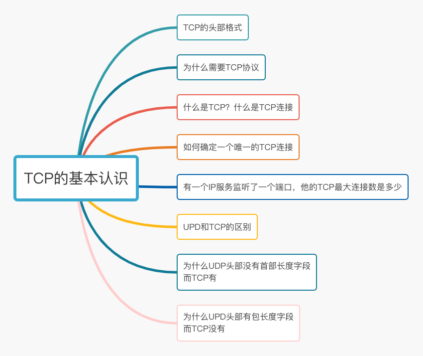
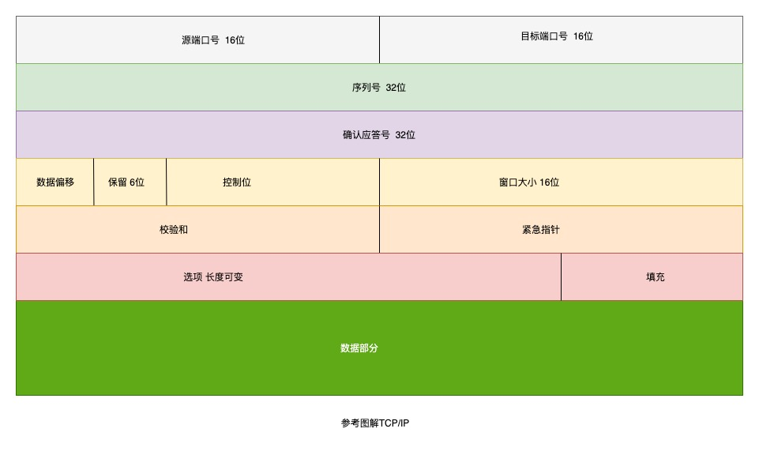
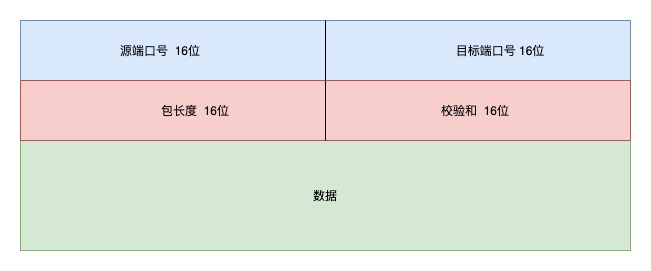

## 认识一下 TCP 的头格式

- 序列号是在建立连接的时候由计算机生成的随机数作为初始值，通过 SYN 包传给接受端主机，每发送一次就累加一次该数据字节数的大小。解决网络包的乱序问题

- 确认应答号：指下一次收到的数据的序列号，实际上是指已收到的确认应答号减一为止的数据，发送端收到这个确认应答以后可以认为在这个序号以前的数据都被正常的接手

- 控制位 有以下几种 只解释几种常见的
  - CWR
  - ECE
  - URG
  - ACK 该位为 1 时 确认应答的字段变为有效，TCP 规定 除了最初建立连接时的 SYN 包之外 该位必须设置 为 1
  - PSH
  - RST 该位为 1 时，表示 TCP 连接中出现异常必须强制断开连接。
  - SYN 用于建立连接，SYN 为 1 表示 希望建立连接 并在其序列号的字段进行序列号初始值的设定
  - FIN 该位为 1 时，表示今后不会再有数据发送，希望断开连接。当通信结束希望断开连接时，通信双方的主 机之间就可以相互交换 FIN 位为 1 的 TCP 段。

## 为什么我们需要 TCP 协议 TCP 工作在哪一层

因为 TCP 是一个工作在传输层的可靠数据传输的服务，它能确保接收端接收的网络包是无损坏、无间隔、非冗余
和按序的。

IP 网络层 是不可靠的 它不能保证网络包的交付 也不能保证数据的完整性 可靠性，所以 需要上层的 TCP 协议来完成

## 什么是 TCP 什么是 TCP 连接

TCP 是面向连接的、可靠的、基于字节流的传输层通信协议。

- 面向连接：一定是一对一 才能连接 不能像 UDP 协议可以一个主机同时向多个主机发送消息，也就是一对多 是无法做到的
- 可靠的：无论网络链路出现了什么变化，TCP 都可以保证一个报文可以达到接收端
- 字节流：消息是「没有边界」的，所以无论我们消息有多大都可以进行传输。并且消息是「有序的」，当「前 一个」消息没有收到的时候，即使它先收到了后面的字节，那么也不能扔给应用层去处理，同时对「􏰀 复」的 报文会自动丢弃。

TCP 连接？

用于保证可靠性和流量控制维护的某些状态信息，这些信息的组合 包括 Socket 序列号 和窗口大小称为 连接

建立一个 TCP 连接需要客户端和服务器达成三个信息的共识

- Socket 由 IP 地址和端口号组成
- 序列号 用来解决乱序问题
- 窗口大小 流量控制

## 如何确定一个唯一的 TCP 连接

TCP 四元组可以唯一的确定一个连接

- 源地址
- 源端口
- 目的地址
- 目的端口

源地址和目标地址 的字段（32 位）是在 IP 头部中，作用是通过 IP 协议发送报文给对方主机

源端口和目的端口的字段（16 位） 是在 TCP 头部中 作用是告诉 TCP 协议应该把报文发送给哪个进程

## 有一个 IP 的服务器监听了一个端口，它的 TCP 的最大连接数是多少

理论公式是

TCP 的最大连接数 = 客户端的 IP 数 X 客户端的端口数

对于 IP4 客户端的 IP 数最多为 2 的 32 次方 客户端的 端口数 为 2 的 16 次方 所以服务器单机最大 TCP 连接数 约为 2 的 48 次方

因为受一些 操作 和机器的约束 服务器并不能发挥最大并发连接

- 内存限制 每个 TCP 连接占用了一定的内存，操作系统的内存是有限的
- 文件描述符有限制

## UDP 和 TCP 的区别 以及应用场景

来 看下 UDP 的头部格式：

- 目标和源端口：主要告诉 UDP 协议应该把报文发送给哪个进程
- 包长度：该字段保存了 UDP 首部的长度和数据的长度之和
- 校验和：校验和是为了提供可靠的 UDP 首部和数据设计的

TCP 和 UDP 的区别

1. 连接

- TCP 是面向连接的传输层协议，传输数据前要先建立连接
- UDP 是不需要连接，即可传输数据

2. 服务对象

- TCP 是一对一的两点服务，即一条连接只有两个端点
- UDP 支持一对一 一对多 多对多的交互通信

3. 可靠性

- TCP 是可靠交付数据的，数据可以 无差错 不丢失 不重复到达
- UDP 不保证数据可靠交付

4. 拥塞控制 流量控制

- TCP 有拥塞控制和流量控制机制 保证数据传输的安全性
- UDP 则没有，即使网络非常拥堵，也不会影响 UDP 的发送速率

5. 首部开销

- TCP 首部长度比较长，会有一定的开销，首部在没有使用「选项」字段时是 20 个字节，如果使用了「选项」 字段则会变⻓的。
- UDP 首部只有 8 个字节 并且是固定不可变的 开销比较小

6. 传输方式

- TCP 是流式传输，没有边界 但是保证顺序和可靠
- UDP 是一个包一个包发送 是有边界的 但是可能会丢包和乱序

7. 分片不同

- TCP 的数据大小如果大于 MSS 的大小 则会在传输层进行分片，目标主机收到后，也同样在传输层组装 TCP 的数据包，如果中途丢失了一个分片，则只需要传输这个丢失的分片即可
- UDP 的数据大小如果大于 MTU 大小 则会在 IP 层进行分层，目标主机收到后，在 IP 层组装完成数据 接着再传输给传输层，但是如果中途丢了一个分片，在实现可靠传输的 UDP 时则就需要 􏰀 传所有的数据包，这样传输 效率非常差，所以通常 UDP 的报文应该小于 MTU。

TCP 和 UDP 的应用场景

因为 TCP 是面向连接 能保证数据的可靠性 常用于

- FTP 文件传输
- HTTP / HTTPS

因为 UDP 面向无连接 可以随时发送数据，所以常用于

- 包总量比较少的通信 比如 DNS SNMP
- 视频 音频等多媒体通信
- 广播通信

## 为什么 UDP 头部没有首部长度字段 而 TCP 有

因为 TCP 有可变长的 选项 字段 而 UDP 头部长度是固定的 不会变化，所以不需要多一个字段去记录 UDP 的首部长度

## 为什么 UDP 头部有 包长度 字段 而 TCP 头部没有 包长度 字段呢？

TCP 计算数据长度公式

TCP 数据的长度 = IP 总长度 - IP 首部长度 - TCP 首部长度

IP 总⻓度 和 IP 首部⻓度，在 IP 首部格式是已知的 因为 TCP 的长度是可以计算出来的，所以为了不增加首部开销 就没有 TCP 的包长度字段

UDP 的包长度也是可以计算出来，可能这个是因为为了网络设备硬件设计和处理方便，首部⻓度需要是 4 字节的整数倍。
