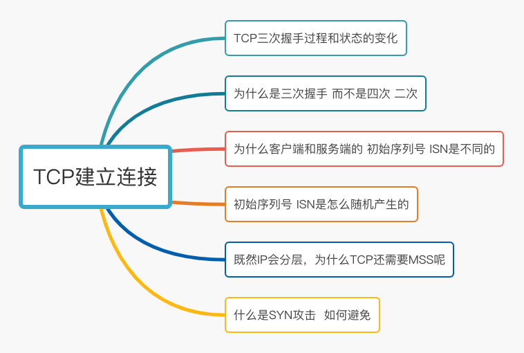
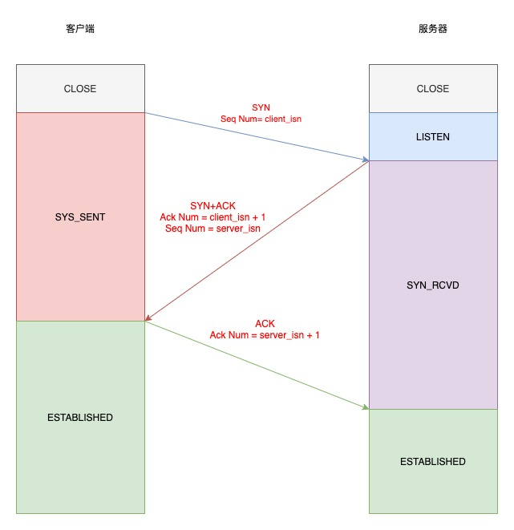
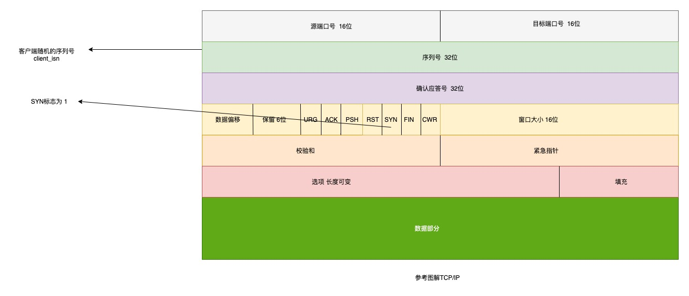
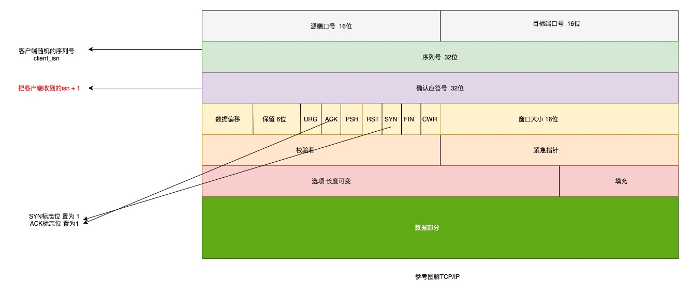
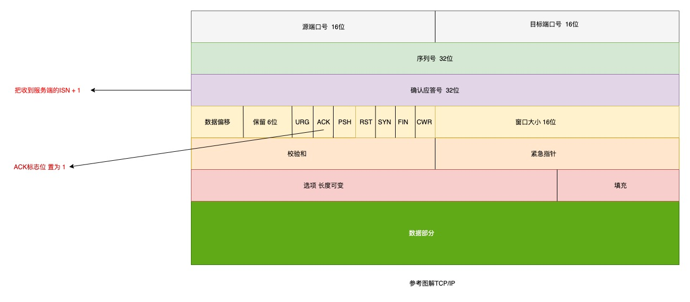
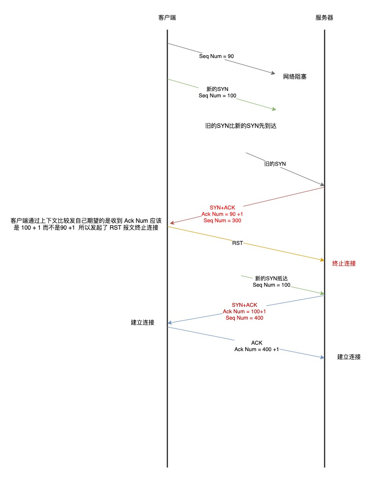
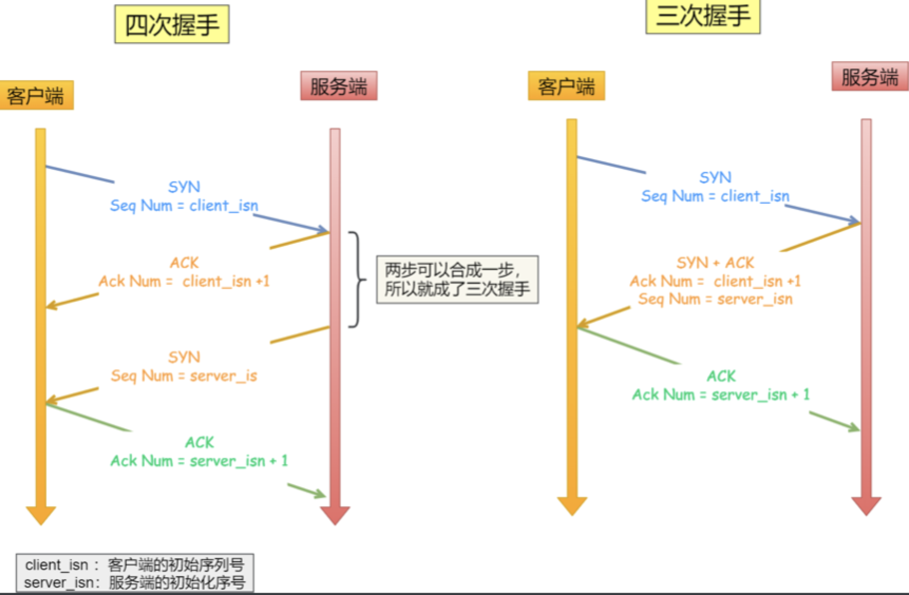
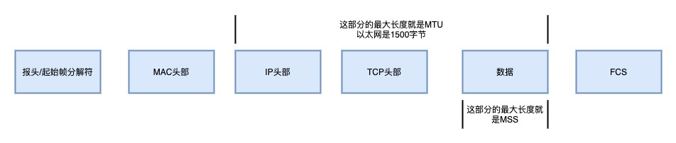

## 三次握手过程和状态的变化

TCP 是面向连接的协议，所以使用 TCP 必须建立连接，建立连接是通过三次握手建立的

1. 开始前 服务端和客户端都是 CLOSED 状态，显示服务器主动监听某个端口，处于 LISTEN 状态

2. 客户端会随机初始化序列号（client_isn） 将这个序列号 放置在 TCP 的首部序号字段中 同时把 SYN 标志为置为 1 表示 SYN 报文 接着把 SYN 报文发送给服务端 表示向服务器 发起连接 该报文 不包含应用层数据，之后 客户端处于 SYN-SENT 状态

3. 服务端收到客户端的 SYN 报文后 服务端也会初始化一个随机的序列号 （server_isn） 将此序号填入 TCP 的首部 序号 字段重化工，其次把 TCP 的首部 确认应答 字段填入 client_isn + 1 接着把 SYN 和 ACK 的标志为 置为 1 最后把报文发给客户端 该报文也不包含应用层数据 之后服务器处于 SYN-RCVD 状态
   

4. 客户端收到服务端的报文后，还要向服务端回应最后一个应答报文，首先 该报文 TCP 首部 ACK 标志位 置为 1 其次确认应答号 字段 填入 server_isn + 1 最后把报文发给服务器 这次报文可以携带客户端的数据 给到服务器，之后客户端的状态 处于 ESTABLISHED 状态

5. 服务器收到客户端端报文后 也进入 ESTABLISHED 状态

三次握手的过程 第一次 和第二次 握手是不可以携带数据的 第三次是可以携带应用层数据的 三次握手完成后 双方就可以相互发送数据了

## 为什么是三次握手 而不是两次或者 四次呢？

- 避免历史连接

三次握手的首要原因是为了防止旧的重复连接初始化造成混乱

网络环境比较复杂 如果网络比较拥堵 旧的数据包比新的数据包先抵达 这个时候 TCP 会终止连接 看下面的图

客户端连续发送多次 SYN 建立连接的报文，在网络拥堵情况下:

1.  一个旧的 SYN 报文比新的 SYN 先到达了服务器
2.  那么此时服务端会回复一个 ACK + SYN
3.  客户端收到数据 根据上下文发现这个 ACK 不是自己想要的 判断这是一个历史连接 那么 客户端会发送一个 RST 终止连接

如果是两次握手 那么客户端没有足够的上下文判断 这个连接是否是历史连接

- 同步双方初始序列号

TCP 协议的通信双方 都必须维护一个 序列号 序列号是可靠传输的一个关键因素

1.  接收方可以去除重复的数据
2.  接收方可以根据数据包的序列号案序接收
3.  可以标识发送出去的数据包 哪些是被已接收的

当客户端发送携带「初始序列号」的 SYN 报文的时 候，需要服务端回一个 ACK 应答报文，表示客户端的 SYN 报文已被服务端成功接收，那当服务端发送「初始序 列号」给客户端的时候，依然也要得到客户端的应答回应，这样一来一回，才能确保双方的初始序列号能被可靠的 同步。

四次握手其实也能够可靠的同步双方的初始化序号，但由于第二步和第三步可以优化成一步，所以就成了「三次握 手」。
而两次握手只保证了一方的初始序列号能被对方成功接收，没办法保证双方的初始序列号都能被确认接收。

- 避免资源浪费

如果只有两次握手 当客户端的 SYN 请求连接在网络中堵塞 客户端没有接收到 ACK 报文 就会重新发送 SYN 由于没有第三次握手 服务器不清楚客户端是否接收到了自己发送的建立连接的 ACK 确认信号

如果客户端的 SYN 阻塞了，重复发送多次 SYN 报文，那么服务器在收到请求后就会建立多个冗余的无效链接， 造成不必要的资源浪费。

所以：

TCP 建立连接时，通过三次握手能防止历史连接的建立，能减少双方不必要的资源开销，能帮助双方同步初始化序
列号。序列号能够保证数据包不 􏰀 复、不丢弃和按序传输。

不能两次握手的原因：无法防止历史连接的建立，会造成双方资源的浪费，也无法可靠的同步双方序列号
不能四次握手的原因： 三次握手就已经理论上最少可靠连接建立，所以不需要使用更多的通信次数

## 为什么客户端和服务端端初始序列号 ISN 是不相同的

如果一个已经失效的连接被重复使用了，但是该旧连接的历史报文还残留在网络中，如果序列号相同，那么就无法分辨
出该报文是不是历史报文，如果历史报文被新的连接接收了，则会产生数据错乱。 所以，每次建立连接前 ，新初始化一个序列号主要是为了通信双方能够根据序号将不属于本连接的报文段丢弃。 另一方面是为了安全性，防止黑客伪造的相同序列号的 TCP 报文被对方接收。

## 初始化序列号 ISN 是如何随机产生的

起始 ISN 是基于时钟的，每 4 毫秒 + 1，转一圈要 4.55 个小时。

ISN = M + F (localhost, localport, remotehost, remoteport)

- M 是一个计时器，这个计时器每隔 4 毫秒加 1。
- F 是一个 Hash 算法，根据源 IP、目的 IP、源端口、目的端口生成一个随机数值。要保证 Hash 算法不能被 外部轻易推算得出，用 MD5 算法是一个比较好的选择。

## 既然 IP 层会分片 为什么 TCP 层还需要 MSS

- MTU 一个网络包的最大长度 以太网中一般是 1500 字节
- MSS 除去 IP 和 TCP 头部之后 一个网络包所能容纳的 TCP 数据的最大长度

如 整个 TCP 的整个报文（头部+数据）交给 IP 层进行分片 那么会有什么异常呢？

简单的说 当 IP 层有超出 MTU 的大小数据 IP 层就会进行分片 然后交给 TCP 传输层

但是 IP 层是没有超时重传机制的，如果在 IP 层一个分片丢失了 那么整个 IP 报文都要重新传输

当接收方发现 TCP 报文(头部 + 数据)的某一片丢失后，则不会响应 ACK 给对方，那么发送方的 TCP 在超时 后，就会重发「整个 TCP 报文(头部 + 数据)」

所以 IP 层分片传输 效率是非常低的

所以，为了达到最佳的传输效能 TCP 协议在建立连接的时候通常要协商双方的 MSS 值，当 TCP 层发现数据超过
MSS 时，则就先会进行分片，当然由它形成的 IP 包的⻓度也就不会大于 MTU ，自然也就不用 IP 分片了。

如果一个 TCP 分片丢失后，进行重发时也是以 MSS 为单位，而不用 􏰀 传所有的分片

## 什么事 SYN 攻击 如何避免 SYN 攻击
