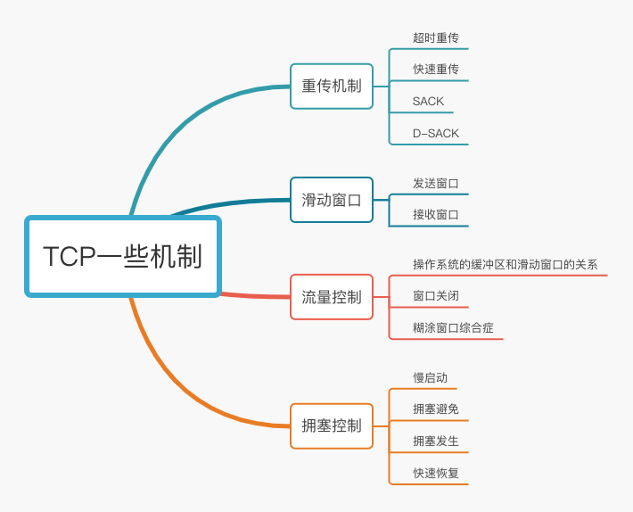

# 拥塞控制

## 为什么要有拥塞控制

一般来说，计算网络都处于一个共享的环境中，因此也有可能因为其他主机之间的通信导致网络变的拥堵

在网络出现拥堵的时候，如果还继续发送大量的数据包，可能会导致数据包的延时 丢失，这个时候 TCP 久会重传数据，但是一重传就会导致网络负担加大
，可能会导致网络瘫痪

所以 TCP 不能忽略网络上发生的事情，当网络发生拥塞时，TCP 会自我牺牲，降低发送的数据量

于是就有了拥塞控制 目的是为了避免 发送方的数据填满网络

## 什么是拥塞窗口 和发送窗口有什么关系

为了在发送方调解 所要发送的数据量 定义了一个叫 拥塞窗口的概念

拥塞窗口 cwnd 是发送方维护的一个状态变量 它会根据网络的拥塞程度动态变化

我们在前面提到过发送窗口 swnd 和接收窗口 rwnd 是约等于的关系，那么由于加入了拥塞窗口的概念后，此时
发送窗口的值是 swnd = min(cwnd, rwnd)，也就是拥塞窗口和接收窗口中的最小值。

拥塞窗口变化的规则

- 只要网络中出现了拥塞 cwnd 就会减少
- 只要网络中没有出现拥塞 cwnd 就会增大

## 如何知道当前网络是否拥塞

只要发送方没有在规定的时间内接收到 ACK 应答报文，也就是发生了超时重传，就会认为网络出现了拥塞

## 拥塞控制有哪些控制算法

- 慢启动
- 拥塞避免
- 拥塞恢复
- 快速恢复

## 慢启动

TCP 在刚建立的时候，首先有个慢启动的过程，慢启动意思是一点一点提高发送数据的量

慢启动算法有一个规则：当发送方每收到一个 ACK 那么 cwnd 窗口大小就会 加 1

假设 拥塞窗口 cwnd 和发送窗口 swnd 大小是一样的

- 建立完成 初始化 cwnd 数量是 1 表示可以传 一个 MSS 大小的数据
- 当收到 ACK 确认 这个时候 cwnd 加 1 此时为 2 表示可以一次 能够发送两个
- 当收到两个 ACK 确认的时候 这个时候 cwnd 加 2 此时为 4 表示可以一次发送四个
- 当接收到 四个 ACK 确认的时候，这个时候 cwnd 加 4 此时为 8 表示一次可以发送 8 个

由此可以看出 慢启动的发包的增长是指数级的

## 慢启动门限

慢启动门限变量，当到达这个门限 慢启动就停止 改用避免拥塞算法

- 当 cwnd < ssthresh 使用慢启动算法
- 当 cwnd > ssthresh 使用 避免拥塞算法

## 避免拥塞算法

一般来说
