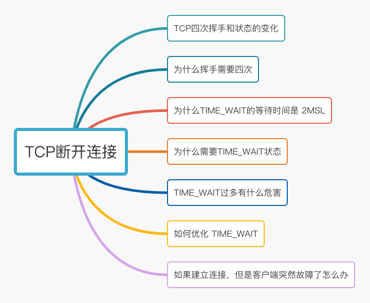
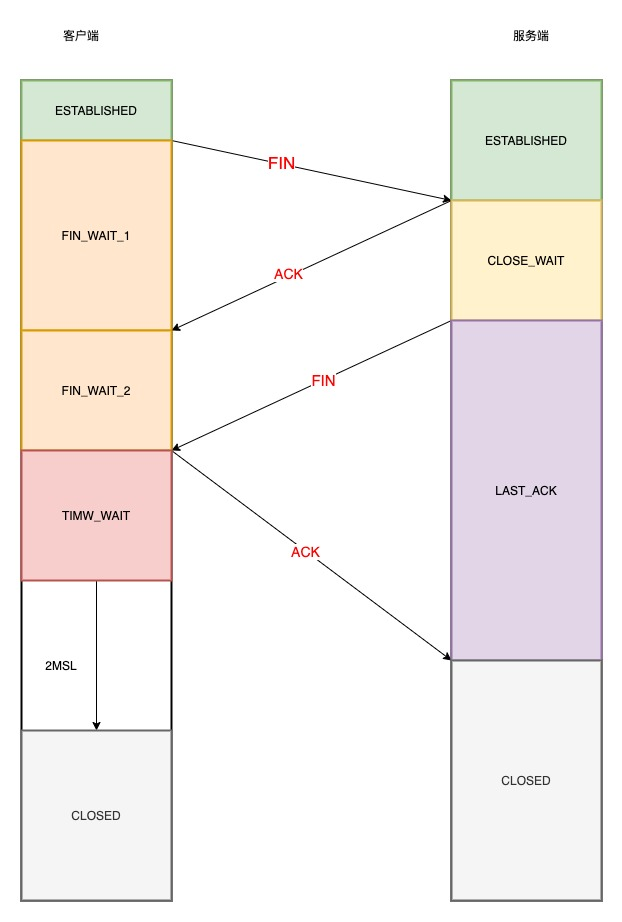
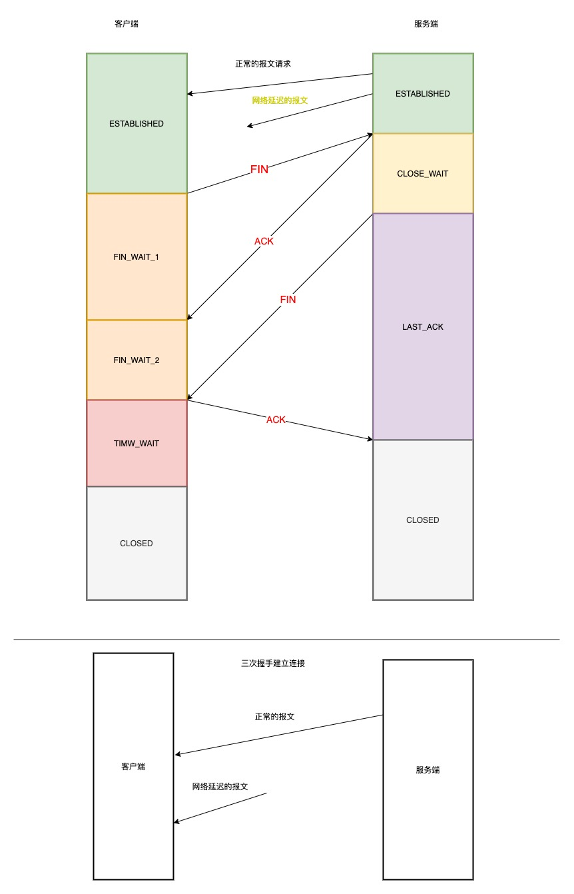
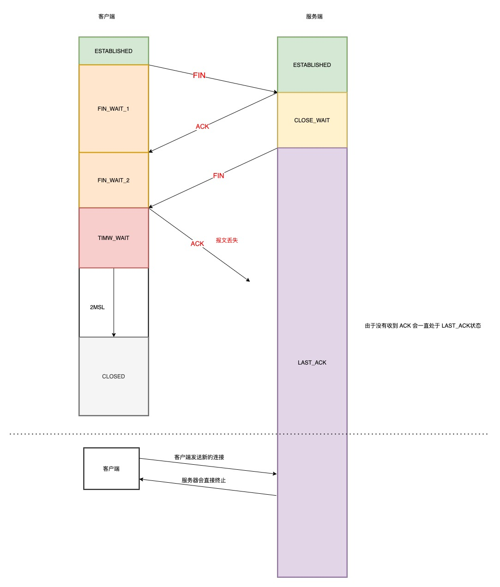

## 四次挥手过程 和状态的变化

- 客户端打算关闭连接 此时会发送一个 TCP 首部 FIN 标志位 被置为 1 的报文 也叫 FIN 报文，之后客户端进入 FIN_WAIT_1 状态
- 服务端收到该报文后，就向客户端发送 ACK 应答报文，接着服务器进入 CLOSE_WAIT 状态
- 客户端收到服务端的 ACK 应答报文后 之后进入 FIN_WAIT_2 状态
- 等待服务器处理完数据后， 服务器再次向客户端发送 FIN 报文 之后服务器进入 LAST_ACK 状态
- 客户端收到服务器的 FIN 报文后，会一个 ACK 的应答报文 之后进入 TIME_WAIT 状态
- 服务器接收 ACK 报文后 就进入了 CLOSED 状态，到这里服务器就已经完成了连接的关闭
- 客户端在等待 2MSL 时间后 自动进入 CLOSED 状态 到这里客户端也完成了 连接的关闭

只有主动关闭的时候 才会有 TIME_WAIT 状态

## 为什么需要四次挥手

关闭连接的时候 客户端向服务端发送一个 FIN 时 只是表示客户端不再发送数据了，但是还可以接受数据

服务端 收到客户端的 FIN 报文 先回一个 ACK 应答报文，而服务端可能还有数据处理和发送， 等待服务器不再发送数据，再发送 FIN 报文给客户端同意关闭连接

这里的 服务端发送给客户端的 ACK 和 FIN 一般是分开发送的，所以比三次握手多了一次 需要四次

## 为什么 TIME_WAIT 等待的时间是 2MSL

MSL 意思是报文的最大生存时间，如果超过这个时间 那么报文就会被丢弃

TIME_WAIT 等待 2 倍的 MSL，比较合理的解释是: 网络中可能存在来自发送方的数据包，当这些发送方的数据包 被接收方处理后又会向对方发送响应，所以一来一回需要等待 2 倍的时间。

2MSL 的时间是从客户端接受到 FIN 后发送 ACK 开始计时的，如果 在 TIME_WAIT 时间内 因为客户端的 ACK 没有传输到服务端，客户端又接收到了服务端重新发送到 FIN 报文 那么这个时间会重新计时

2MSL 在 Linux 中一般是 60s

## 为什么需要 TIME_WAIT

主动发起关闭连接到一方才会有 TIME_WAIT

需要这个状态的原用有两个

- 防止旧的数据包被接受

看上面的图 如果 TIME_WAIT 时间很短或者 不存在的话 服务端在网络关闭连接前发送了一个报文 被网络延迟了

这个时候 有一个相同的 TCP 端口 连接被复用，这个时候 被延迟的报文发送到了客户端 那么客户端是有可能正常的接受这个过期的报文 这个时候会产生数据错乱

所以 TCP 设计了 TIME_WAIT 经过 2MSL 时间 双方产生的数据包 都会在这个时间内消失 再出现的数据包一定是新建立的连接产生的

- 保证 被动关闭连接的一方能被正确的关闭 即保证最后的 ACK 能让被动关闭放接受，从而帮助其关闭

看上图

如果没有 TIME_WAIT 或者很短，那么客户端在最后发给服务端的报文 在传输过程丢失了 那么服务端会一直处于 LAST_ACK 状态

当客户端发起建立连接的 SYN 请求报文后，服务端会发送 RST 报文给客户端，连接建立的过程就会被终 止。

---

如果 TIME_WAIT 时间足够长

- 服务端正常能接受 最后一个报文 然后关闭连接
- 服务端没有收到 最后一个 ACK 报文 服务端则会重新发送 FIN 关闭连接报文 并等待新的 ACK 报文

这样就可以保证对方可以正确的关闭

## TIME_WAIT 过多的危害
