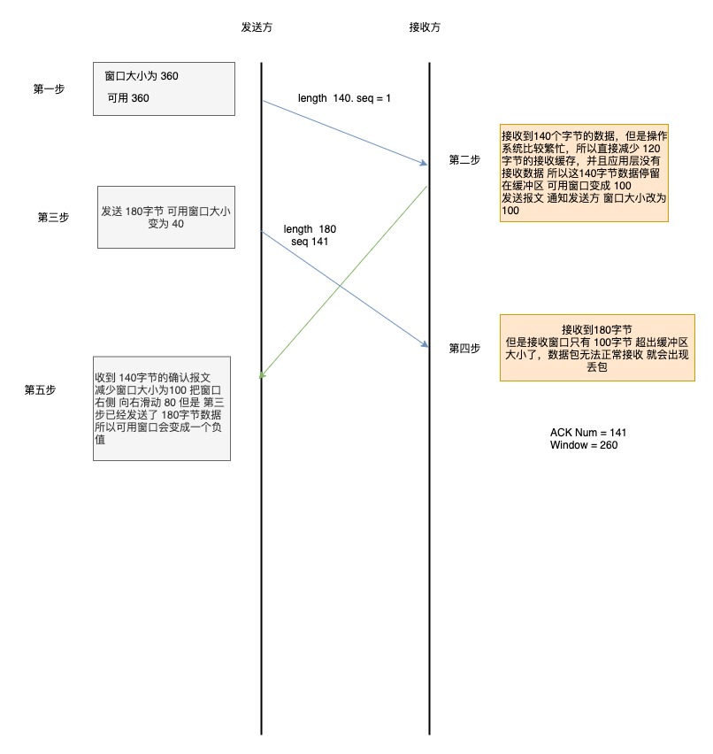
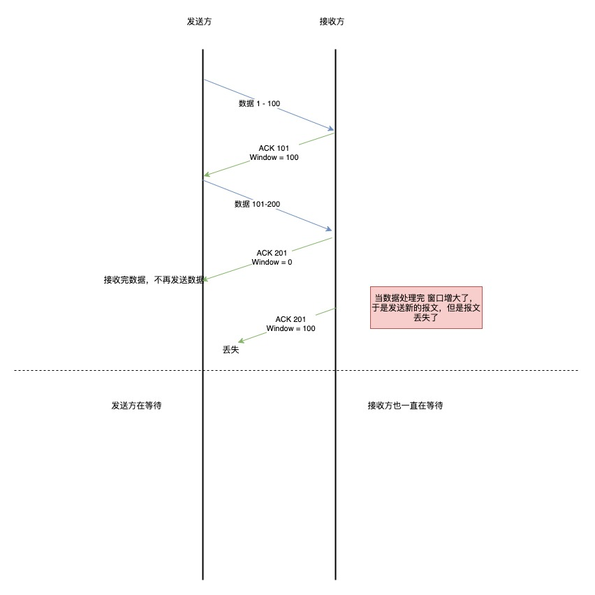
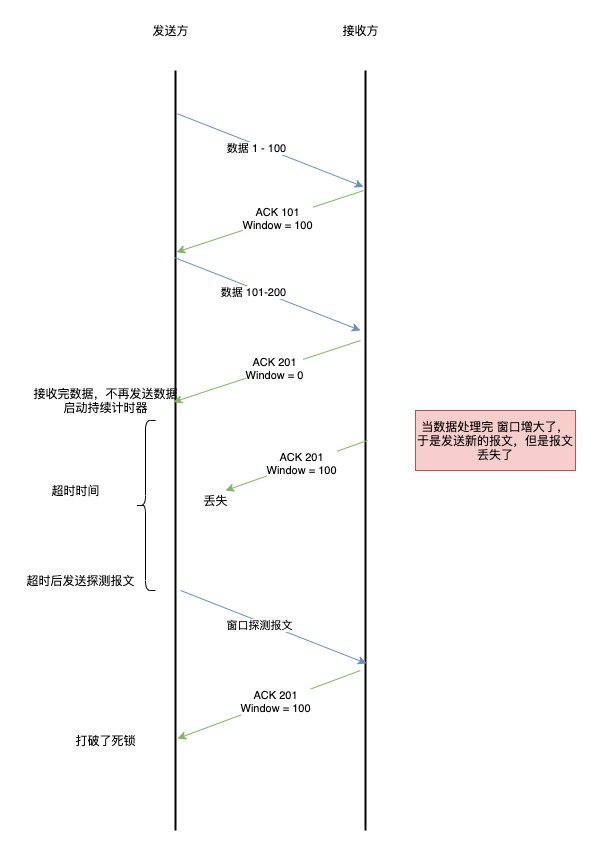

# 流量控制

发送端根据自己的情况来发送数据 但是接收端 可能会收到一个数据包处理很费时或者一个毫无关联的包，在花费了一些时间，那么本来应该接收的数据 可能会被丢弃 那么就会触发重传机制，所以就会浪费这些网络流量

为了解决这种问题，TCP 提供了一种机制 可以让发送 根据接收方 的实际接收能力控制发送的数据量，这个就是流量控制

他的具体操作是：接收端主机向发送端通知自己可以接收数据的大小 于是发送端会发送不超过这个限度的数据，该大小限度被称为窗口的大小

## 操作系统的缓冲区是如何影响发送窗口和接收窗口的

1. 当应用程序没有及时读区缓存时

- 客户端作为发送方 服务度端作为接收方 发送和接收初始窗口为 360
- 服务端非常繁忙 当收到客户端的数据 应用层 没有及时读区

最后窗口收缩为 0 也就是发生了窗口关闭 当发送可用窗口 为 0 时 发送方实际会定时发送窗口探测报文 以便知道接收方的窗口是否繁盛了改变

2. 当服务系统资源紧张的时候 操作系统可能会直接减少接收缓冲区的大小，这个时候应用程序又无法读取缓存数据，就会出现数据包丢失
   

所以 如果先发生了 减少缓存 再收缩窗口 就会出现丢包的现象

为了防止这种现象，TCP 规定不允许同时减少缓存又收缩窗口 ，而是采用先收缩窗口，过段时间再减少缓存 这样就可以避免了丢包的情况

## 窗口关闭的潜在危险

如果窗口大小为 0 时 就会阻止发送方给接收方传递数据 直到窗口变为非 0 这就是窗口关闭

如果当发生窗口关闭时，接收方处理完数据 会向发送方 发送一个窗口非 0 的 ACK 报文 如果这个报文丢失了 那么双方就会产生死锁

## TCP 是如何解决窗口关闭产生的死锁

为了解决这个问题 TCP 为每个连接设有一个定时器，只要 TCP 连接一方接收到对方的零窗口通知，就启动持续计时器

如果持续计时器超时，那么就会发送窗口探测报文，而对方在确认这个探测报文，就会给自己现在窗口的大小

- 如果接收窗口仍然为 0 那么收到这个报文的一方就会重新启动持续计时器
- 如果接收窗口不是 0 那么死锁的局面就打破了 可以继续发送数据

窗口探测的次数一般是 3 次，如果超过 3 次还是 0 那么 TCP 会发送 RST 报文来中断连接

## 糊涂窗口综合症

如果接收方太忙了，来不及取走接收窗口里的数据，那么就会导致发送方的发送窗口越来越小

最后，如果接收方腾出几个字节并告诉发送方还有几个字节的窗口，那么发送方会发送这几个字节的数据，这个就是糊涂窗口综合症

TCP+IP 有 40 几个字节 为了传输几个字节的数据，要多传输 40 几个字节 这个是很浪费的

糊涂窗口综合症的现象是可以发生在发送方和接收方

- 接收方通知一个很小的窗口大小
- 发送方发送很小的数据

## 如何解决 接收方通知很小的窗口大小

当窗口大小 小于 min（MSS 缓存空间/2）也就是小于 MSS 与 1/2 缓存中的最小值 就会向发送方通知窗口为 0 也就阻止了数据再发送过来
等接收方处理了一些数据 窗口大小 > MSS 或者接收方缓存空间大于一般 就可以使用

## 如何解决 让发送方避免发送小的数据

使用 Nagle 算法，该算法的思路是延时处理，它满足以下两个条件中的一条才可以发送数据:

- 等到窗口大小 >= MSS 或者数据大小 >= MSS
- 收到之前发送数据的 ACK 包
