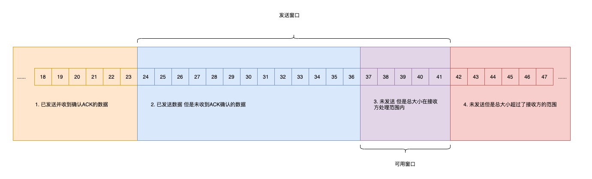
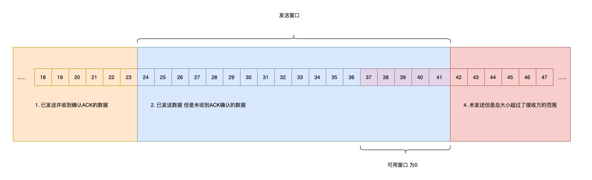
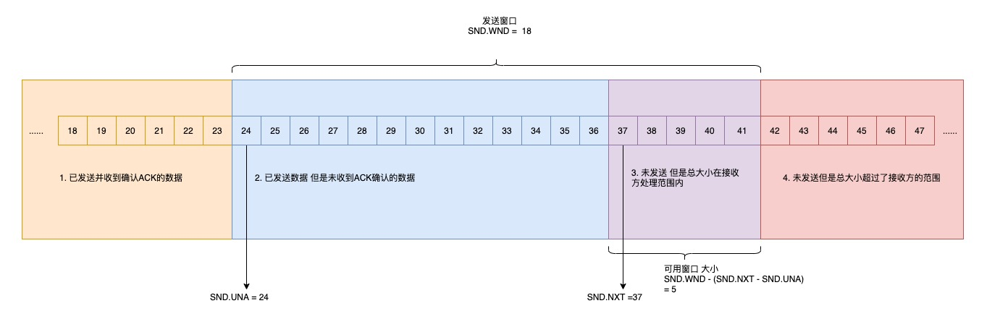

# 滑动窗口

TCP 每发送一个数据 都要进行一次应答 当上一个数据包的收到了应答 才进行发送下一个数据包

这种方式效率是非常低的

数据包的往返时间越长 通信的效率就越低。为了解决这个问题 TCP 引入了窗口的概念

有了窗口，就可以指定窗口的大小，窗口的大小就是指无需等待确认应答，可以继续发送数据的最大值

窗口的实际实现是 操作系统开辟的一个缓存空间，发送放主机在等到确认应答返回之前，必须在缓冲区保留已经发送的数据，如果按期收到确认应答，此时数据可以从缓存区清除

图中这种模式叫 累计确认 或者 累计应答

## 窗口的大小由那一方确认

TCP 头部里有一个字段就 Window 也就是窗口大小

这个字段是接收端告诉发送端自己还有多少缓冲区可以接收数据，于是发送端就可以根据这个接收端端处理能力来发送数据，而不会导致接收端处理不过来

所以 窗口的大小通常是有接收方的窗口大小来决定的

发送方发送的数据大小不能超过 接收方的窗口大小 否则接收方就无法正常接收到数据

## 发送方的滑动窗口

看下发送方的窗口示意图

- 1 是已发送并确认收到 ACK 确认数据 1-23 字节
- 2 是已发送但是未收到 ACK 确认的数据 24-36 字节
- 3 是未发送但是总大小在接收范围内 37-41 字节
- 4 是未发送但是总大小在接收范围外的 接收方没有空间了 42 以后的字节

当发送方把数据全部 都一下发送出去 可用的窗口大小就为 0 了 表示可用窗口已经耗尽，在没有收到 ACK 确认应答之前不再发送数据
如下图

当之前发送的数据 24-27 字节的 ACK 确认应答被接收后，如果发送窗口的大小没有发生改变，则滑动窗口往右边移动 4 个字节 因为已经有 4 个字节数据被应答确认了
那么接下来 42-45 就变成了可用窗口 如下图

## 程序是如何表示发送方的四个部分呢？

滑动窗口方案是用三个指针来跟踪在四个传输类别中的每一个类别的字节，其中两个指针式绝对指针（指特定的序列号）一个是相对指针（需要做偏移）
看下图

- SND.WND 表示窗口发送的大小 由接收方指定
- SND.UND 是一个绝对指针 它是指向已发送但是未收到确认的第一个字节的序列号，也就是图中的 24
- SND.NXT 是一个绝对指针 它是指向未发送但是可发送范围的第一个字节的序列号 也就是图中的 37
- 指向第四部分 的第一个字节是相对指针，它需要 SND.UNA 指针加上 SND.WND 大小的偏移 就可以指向第四部分的第一个字节

可用窗口的大小 = SND.WND - (SND.NXT - SND.UNA)

## 接收方的滑动窗口

一共三个部分 使用两个指针进行划分

- RCV.WND 表示接收的窗口大小 会发送给发送方
- RCV.NXT 是一个指针 它指向期望从发送方发送来的下一个数据字节序列号 也就是图中第二部分 第一个字节
- 图中第三部分 的第一个字节是相对指针 它需要 RCV.NXT 指针加上 RCV.WND 大小的偏移量 就可以指向第三部分第一个字节

## 接收窗口 和发送窗口的大小是相等的吗

并不是完全相等的 接收窗口的大小约等于 发送窗口的大小

因为滑动窗口并不是一成不变的，当接收方的应用进程读取数据速度特别快 这样接收窗口就可以很快的空缺出来，那么新的接收窗口大小，是通过 TCP 报文中的 Windows 字段告诉发送方的，那么这个传输过程存在延时，所以接收窗口的大小和发送窗口是约等于的关系
