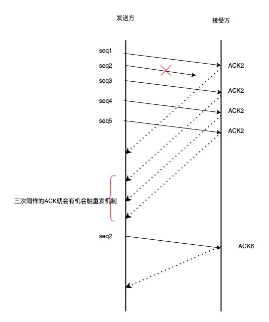

# 重传机制

TCP 实现可靠传输方式之一 是通过序列号与应答确认
在 TCP 中 当发送端端数据到达接收主机时 接收端主机会返回一个确认应答的消息 表示已接收到消息

如下图所示

图片来源 tcp/ip 图解

## 超时重传

有时候数据因为各种因素的影响 并不会如期到达 ，所以这个时候就会 启动重传机制

重传机制的其中一个方式，就是在发送数据时，设定一个定时器，当超过指定的时间后，没有收到对方的 ACK 确 认应答报文，就会 重发该数据，也就是我们常说的超时重传。

- 数据包丢失重传
- 确认应答丢失重传

### 超时时间应该设置为多少呢

RTT 是数据从网络一端传送到另一端所需要的时间 也就是包的往返时间

超时重传的时间是以 RTO 表示的

RTO 的的值不能太大或者太小

看上图

- 当 RTO 时间太大 重发就慢 没有效率 性能比较差
- 当 RTO 时间太短 可能导致还没丢 就重新发送 增加网络消耗

所以 精确的 RTO 时间是非常重要的，这样可以保证我们的重传机制

所以 重传 RTO 时间的值应该略大于 报文往返的 RTT 时间

因为报文往返的 RTT 值是不固定的 经常的波动，所以我们的 超时重传时间 RTO 的值也是一个动态变化的值

关于 RTO 的时间计算 在这里不再深究。

如果超时 重 发的数据，再次超时的时候，又需要 重 传的时候，TCP 的策略是超时间隔加倍。
也就是每当遇到一次超时重传的时候，都会将下一次超时时间间隔设为先前值的两倍。两次超时，就说明网络环境 差，不宜频繁反复发送。
超时触发 重传存在的问题是，超时周期可能相对较⻓。那是不是可以有更快的方式呢? 于是就可以用「快速 重传」机制来解决超时 重 发的时间等待。

## 快速重传

TCP 的快速重传是以数据为驱动重传 不是以时间为驱动

看下工作机制图

看上图

- 先发了第一份数据 seq1 于是回 ACK2
- 第二份数据 seq2 丢失了 没有收到 seq3 到到达了 但是这个时间 接收方预期数据是 seq2 所以 这个时候还是返回 ACK2
- 接着 seq4 和 seq5 接着到达 还是回 ACK2（预期的数据）因为 seq2 还没收到
- 发送端收到了三个 ACK2 知道了 seq2 还没收到 于是就会在定时器过期之前发送 丢失的 seq2
- 最后 收到了 seq2 因为 3 4 5 都收到了 所以最后回复 ACK6

当接收三个同样的 ACK 报文时 就回触发重传机制

快速重传机制只解决了一个问题就是超时时间的问题，但是还有另外一个问题，就是重传的时候是重传之前的一个 还是 重传所有的问题

因为 接收端收到的都是 ACK2 那么是只传一个 seq2 还是 seq2 seq3 seq4 seq5 都重传呢？ 为了解决不知道该重传哪些 TCP 报文 于是就有了 SACK 方法

## SACK

这种方式 需要在 TCP 头部 选项 字段里加一个 SACK 的东西 他可以将缓存的地图发送给发送方 这样发送发就知道哪些数据收到了，哪些数据没收到，知道了这些信息 接可以只重传丢失的数据

看下图

如果要支持 sack 必须双发都打开支持才可以 在 Linux 下 可以通过 net.ipv4.tcp_sack 打开这个功能

## D-SACK

D-SACK 全称 Duplicate SACK 主要是用了 SACK 来告诉发送发 哪些数据被重复接收了

- ACK 丢包

1. 接收放发给发送方的两个应答报文 丢失 所以导致 发送方超时 重传第一个数据包
2. 接收放接收到重复的数据包 于是回了一个 SACK = 100-200 告诉 接收方 数据已经被接收了，这个 sack 就代表着 d-sack
3. 这样发送方就知道接收数据没有丢 只是应答报文丢了

- 网络延迟

1. 数据包 200-299 被网络延迟了 导致发送方没有收到 ACK 确认报文
2. 后面的报文到达后收到了三个相同的确认报文 触发重传机制 但是在重传后 被延迟的数据包 有到达了接收方
3. 所以接收方回了一个 应答报文 SACK = 200-300 所以这个 SACK 就是 D-SACK 表示收到重复的包
4. 发送方就知道了 重传触发的原因是因为 网络延迟 而不是因为丢包

# 滑动窗口

TCP 每发送一个数据 都要进行一次应答 当上一个数据包的收到了应答 才进行发送下一个数据包

这种方式效率是非常低的

数据包的往返时间越长 通信的效率就越低。为了解决这个问题 TCP 引入了窗口的概念

有了窗口，就可以指定窗口的大小，窗口的大小就是指无需等待确认应答，可以继续发送数据的最大值

窗口的实际实现是 操作系统开辟的一个缓存空间，发送放主机在等到确认应答返回之前，必须在缓冲区保留已经发送的数据，如果按期收到确认应答，此时数据可以从缓存区清除

图中这种模式叫 累计确认 或者 累计应答

## 窗口的大小由那一方确认

TCP 头部里有一个字段就 Window 也就是窗口大小

这个字段是接收端告诉发送端自己还有多少缓冲区可以接收数据，于是发送端就可以根据这个接收端端处理能力来发送数据，而不会导致接收端处理不过来

所以 窗口的大小通常是有接收方的窗口大小来决定的

发送方发送的数据大小不能超过 接收方的窗口大小 否则接收方就无法正常接收到数据

## 发送方的滑动窗口

看下发送方的窗口示意图

- 1 是已发送并确认收到 ACK 确认数据 1-23 字节
- 2 是已发送但是未收到 ACK 确认的数据 24-36 字节
- 3 是未发送但是总大小在接收范围内 37-41 字节
- 4 是未发送但是总大小在接收范围外的 接收方没有空间了 42 以后的字节

当发送方把数据全部 都一下发送出去 可用的窗口大小就为 0 了 表示可用窗口已经耗尽，在没有收到 ACK 确认应答之前不再发送数据
如下图

当之前发送的数据 24-27 字节的 ACK 确认应答被接收后，如果发送窗口的大小没有发生改变，则滑动窗口往右边移动 4 个字节 因为已经有 4 个字节数据被应答确认了
那么接下来 42-45 就变成了可用窗口 如下图

## 程序是如何表示发送方的四个部分呢？

滑动窗口方案是用三个指针来跟踪在四个传输类别中的每一个类别的字节，其中两个指针式绝对指针（指特定的序列号）一个是相对指针（需要做偏移）
看下图

- SND.WND 表示窗口发送的大小 由接收方指定
- SND.UND 是一个绝对指针 它是指向已发送但是未收到确认的第一个字节的序列号，也就是图中的 24
- SND.NXT 是一个绝对指针 它是指向未发送但是可发送范围的第一个字节的序列号 也就是图中的 37
- 指向第四部分 的第一个字节是相对指针，它需要 SND.UNA 指针加上 SND.WND 大小的偏移 就可以指向第四部分的第一个字节

可用窗口的大小 = SND.WND - (SND.NXT - SND.UNA)

## 接收方的滑动窗口

一共三个部分 使用两个指针进行划分

- RCV.WND 表示接收的窗口大小 会发送给发送方
- RCV.NXT 是一个指针 它指向期望从发送方发送来的下一个数据字节序列号 也就是图中第二部分 第一个字节
- 图中第三部分 的第一个字节是相对指针 它需要 RCV.NXT 指针加上 RCV.WND 大小的偏移量 就可以指向第三部分第一个字节

## 接收窗口 和发送窗口的大小是相等的吗

并不是完全相等的 接收窗口的大小约等于 发送窗口的大小

因为滑动窗口并不是一成不变的，当接收方的应用进程读取数据速度特别快 这样接收窗口就可以很快的空缺出来，那么新的接收窗口大小，是通过 TCP 报文中的 Windows 字段告诉发送方的，那么这个传输过程存在延时，所以接收窗口的大小和发送窗口是约等于的关系

# 流量控制

发送端根据自己的情况来发送数据 但是接收端 可能会收到一个数据包处理很费时或者一个毫无关联的包，在花费了一些时间，那么本来应该接收的数据 可能会被丢弃 那么就会触发重传机制，所以就会浪费这些网络流量

为了解决这种问题，TCP 提供了一种机制 可以让发送 根据接收方 的实际接收能力控制发送的数据量，这个就是流量控制

他的具体操作是：接收端主机向发送端通知自己可以接收数据的大小 于是发送端会发送不超过这个限度的数据，该大小限度被称为窗口的大小

## 操作系统的缓冲区是如何影响发送窗口和接收窗口的

1. 当应用程序没有及时读区缓存时

- 客户端作为发送方 服务度端作为接收方 发送和接收初始窗口为 360
- 服务端非常繁忙 当收到客户端的数据 应用层 没有及时读区

最后窗口收缩为 0 也就是发生了窗口关闭 当发送可用窗口 为 0 时 发送方实际会定时发送窗口探测报文 以便知道接收方的窗口是否繁盛了改变

2. 当服务系统资源紧张的时候 操作系统可能会直接减少接收缓冲区的大小，这个时候应用程序又无法读取缓存数据，就会出现数据包丢失
   

所以 如果先发生了 减少缓存 再收缩窗口 就会出现丢包的现象

为了防止这种现象，TCP 规定不允许同时减少缓存又收缩窗口 ，而是采用先收缩窗口，过段时间再减少缓存 这样就可以避免了丢包的情况

## 窗口关闭的潜在危险

如果窗口大小为 0 时 就会阻止发送方给接收方传递数据 直到窗口变为非 0 这就是窗口关闭

如果当发生窗口关闭时，接收方处理完数据 会向发送方 发送一个窗口非 0 的 ACK 报文 如果这个报文丢失了 那么双方就会产生死锁

## TCP 是如何解决窗口关闭产生的死锁

为了解决这个问题 TCP 为每个连接设有一个定时器，只要 TCP 连接一方接收到对方的零窗口通知，就启动持续计时器

如果持续计时器超时，那么就会发送窗口探测报文，而对方在确认这个探测报文，就会给自己现在窗口的大小

- 如果接收窗口仍然为 0 那么收到这个报文的一方就会重新启动持续计时器
- 如果接收窗口不是 0 那么死锁的局面就打破了 可以继续发送数据

窗口探测的次数一般是 3 次，如果超过 3 次还是 0 那么 TCP 会发送 RST 报文来中断连接

## 糊涂窗口综合症

如果接收方太忙了，来不及取走接收窗口里的数据，那么就会导致发送方的发送窗口越来越小

最后，如果接收方腾出几个字节并告诉发送方还有几个字节的窗口，那么发送方会发送这几个字节的数据，这个就是糊涂窗口综合症

TCP+IP 有 40 几个字节 为了传输几个字节的数据，要多传输 40 几个字节 这个是很浪费的

糊涂窗口综合症的现象是可以发生在发送方和接收方

- 接收方通知一个很小的窗口大小
- 发送方发送很小的数据

## 如何解决 接收方通知很小的窗口大小

当窗口大小 小于 min（MSS 缓存空间/2）也就是小于 MSS 与 1/2 缓存中的最小值 就会向发送方通知窗口为 0 也就阻止了数据再发送过来
等接收方处理了一些数据 窗口大小 > MSS 或者接收方缓存空间大于一般 就可以使用

## 如何解决 让发送方避免发送小的数据

使用 Nagle 算法，该算法的思路是延时处理，它满足以下两个条件中的一条才可以发送数据:

- 等到窗口大小 >= MSS 或者数据大小 >= MSS
- 收到之前发送数据的 ACK 包

# 拥塞控制

## 为什么要有拥塞控制

一般来说，计算网络都处于一个共享的环境中，因此也有可能因为其他主机之间的通信导致网络变的拥堵

在网络出现拥堵的时候，如果还继续发送大量的数据包，可能会导致数据包的延时 丢失，这个时候 TCP 久会重传数据，但是一重传就会导致网络负担加大
，可能会导致网络瘫痪

所以 TCP 不能忽略网络上发生的事情，当网络发生拥塞时，TCP 会自我牺牲，降低发送的数据量

于是就有了拥塞控制 目的是为了避免 发送方的数据填满网络

## 什么是拥塞窗口 和发送窗口有什么关系

为了在发送方调解 所要发送的数据量 定义了一个叫 拥塞窗口的概念

拥塞窗口 cwnd 是发送方维护的一个状态变量 它会根据网络的拥塞程度动态变化

我们在前面提到过发送窗口 swnd 和接收窗口 rwnd 是约等于的关系，那么由于加入了拥塞窗口的概念后，此时
发送窗口的值是 swnd = min(cwnd, rwnd)，也就是拥塞窗口和接收窗口中的最小值。

拥塞窗口变化的规则

- 只要网络中出现了拥塞 cwnd 就会减少
- 只要网络中没有出现拥塞 cwnd 就会增大

## 如何知道当前网络是否拥塞

只要发送方没有在规定的时间内接收到 ACK 应答报文，也就是发生了超时重传，就会认为网络出现了拥塞

## 拥塞控制有哪些控制算法

- 慢启动
- 拥塞避免
- 拥塞恢复
- 快速恢复

## 慢启动
