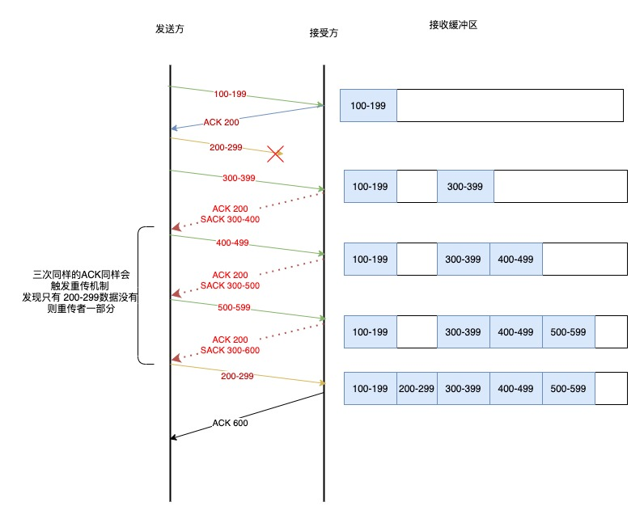
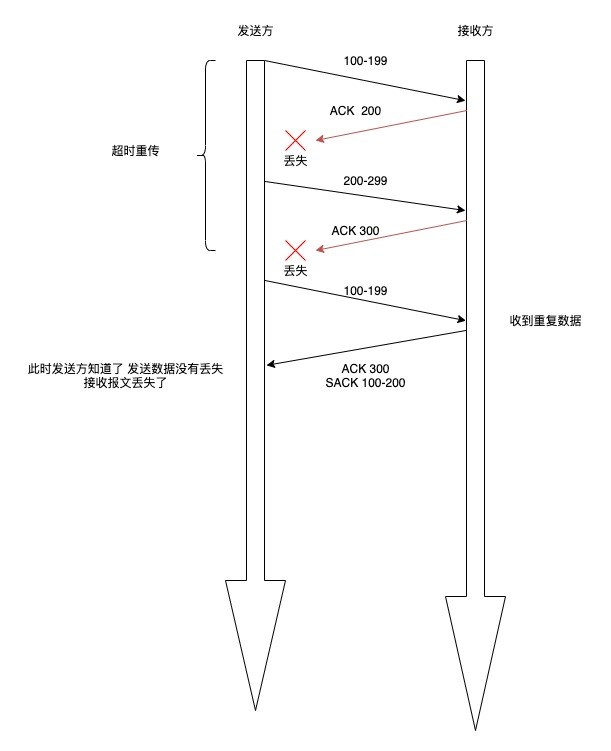
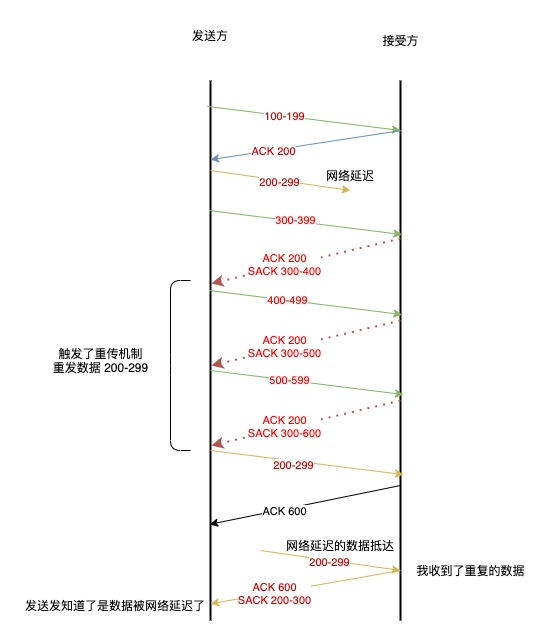

# 重传机制

TCP 实现可靠传输方式之一 是通过序列号与应答确认
在 TCP 中 当发送端端数据到达接收主机时 接收端主机会返回一个确认应答的消息 表示已接收到消息

如下图所示

图片来源 tcp/ip 图解

## 超时重传

有时候数据因为各种因素的影响 并不会如期到达 ，所以这个时候就会 启动重传机制

重传机制的其中一个方式，就是在发送数据时，设定一个定时器，当超过指定的时间后，没有收到对方的 ACK 确 认应答报文，就会 重发该数据，也就是我们常说的超时重传。

- 数据包丢失重传
- 确认应答丢失重传

### 超时时间应该设置为多少呢

RTT 是数据从网络一端传送到另一端所需要的时间 也就是包的往返时间

超时重传的时间是以 RTO 表示的

RTO 的的值不能太大或者太小

看上图

- 当 RTO 时间太大 重发就慢 没有效率 性能比较差
- 当 RTO 时间太短 可能导致还没丢 就重新发送 增加网络消耗

所以 精确的 RTO 时间是非常重要的，这样可以保证我们的重传机制

所以 重传 RTO 时间的值应该略大于 报文往返的 RTT 时间

因为报文往返的 RTT 值是不固定的 经常的波动，所以我们的 超时重传时间 RTO 的值也是一个动态变化的值

关于 RTO 的时间计算 在这里不再深究。

如果超时 重 发的数据，再次超时的时候，又需要 重 传的时候，TCP 的策略是超时间隔加倍。
也就是每当遇到一次超时重传的时候，都会将下一次超时时间间隔设为先前值的两倍。两次超时，就说明网络环境 差，不宜频繁反复发送。
超时触发 重传存在的问题是，超时周期可能相对较⻓。那是不是可以有更快的方式呢? 于是就可以用「快速 重传」机制来解决超时 重 发的时间等待。

## 快速重传

TCP 的快速重传是以数据为驱动重传 不是以时间为驱动

看下工作机制图

看上图

- 先发了第一份数据 seq1 于是回 ACK2
- 第二份数据 seq2 丢失了 没有收到 seq3 到到达了 但是这个时间 接收方预期数据是 seq2 所以 这个时候还是返回 ACK2
- 接着 seq4 和 seq5 接着到达 还是回 ACK2（预期的数据）因为 seq2 还没收到
- 发送端收到了三个 ACK2 知道了 seq2 还没收到 于是就会在定时器过期之前发送 丢失的 seq2
- 最后 收到了 seq2 因为 3 4 5 都收到了 所以最后回复 ACK6

当接收三个同样的 ACK 报文时 就回触发重传机制

快速重传机制只解决了一个问题就是超时时间的问题，但是还有另外一个问题，就是重传的时候是重传之前的一个 还是 重传所有的问题

因为 接收端收到的都是 ACK2 那么是只传一个 seq2 还是 seq2 seq3 seq4 seq5 都重传呢？ 为了解决不知道该重传哪些 TCP 报文 于是就有了 SACK 方法

## SACK

这种方式 需要在 TCP 头部 选项 字段里加一个 SACK 的东西 他可以将缓存的地图发送给发送方 这样发送发就知道哪些数据收到了，哪些数据没收到，知道了这些信息 接可以只重传丢失的数据

看下图

如果要支持 sack 必须双发都打开支持才可以 在 Linux 下 可以通过 net.ipv4.tcp_sack 打开这个功能

## D-SACK

D-SACK 全称 Duplicate SACK 主要是用了 SACK 来告诉发送发 哪些数据被重复接收了

- ACK 丢包

1. 接收放发给发送方的两个应答报文 丢失 所以导致 发送方超时 重传第一个数据包
2. 接收放接收到重复的数据包 于是回了一个 SACK = 100-200 告诉 接收方 数据已经被接收了，这个 sack 就代表着 d-sack
3. 这样发送方就知道接收数据没有丢 只是应答报文丢了

- 网络延迟

1. 数据包 200-299 被网络延迟了 导致发送方没有收到 ACK 确认报文
2. 后面的报文到达后收到了三个相同的确认报文 触发重传机制 但是在重传后 被延迟的数据包 有到达了接收方
3. 所以接收方回了一个 应答报文 SACK = 200-300 所以这个 SACK 就是 D-SACK 表示收到重复的包
4. 发送方就知道了 重传触发的原因是因为 网络延迟 而不是因为丢包
