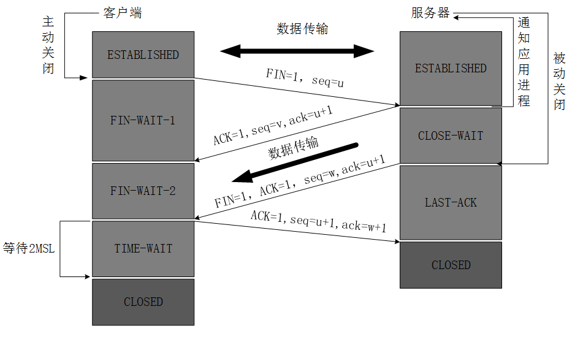

## 总览过程

- 输入地址，浏览器查找 ip 地址（dns 域名解析）
- 浏览器发送 http 请求 （tcp 建立连接 三次握手）
- 服务器永久重定向响应
- 服务器处理请求，返回 HTTP 响应
- 浏览器渲染 HTML

## 过程分析

- 输入地址，浏览器查找 ip 地址（dns 域名解析）  
  当我们在浏览器输入地址，然后浏览器会根据地址进行域名解析 (url 解析)

  - 协议
  - 登录信息验证
  - 域名:服务器地址
  - 端口号（http 默认 80 https 默认 443 FTP 默认 21）
  - 请求资源文件路径
  - 查询字符串等

  其次 DNS 会进行缓存查找  
  缓存位置分为 ： 内存缓存（memory Cache） 硬盘缓存（Disk Cache）

  - 打开网页：查找 Disk Cache 是否有匹配，有就直接使用，没有就发送网络请求
  - 普通刷新（F5）:因为 tab 没有关闭 因此 memory cache 是可用的，会优先被使用，其次才是 Disk Cache
  - 强制刷新（Ctrl+F5）:浏览器不适用缓存 ，因此发送的请求头部均带有 Cache-control: no-cache，服务器直接返回 200 和最新内容

  - 浏览器缓存
  - 系统缓存
  - 路由器缓存
  - ISP DNS 缓存

  其次如果没有命中本地 host 缓存，那么 DNS 会发起一个请求到本地服务器 进行 DNS 查询，
  主要分为两种

  - 递归查询
  - 迭代查询

  DNS 负载均衡是什么意思？  
  当有很多用户访问一个网站，并且网站请求资源都在同一个服务器上，那么这台服务器可以随时会崩掉，这个时候我们就需要用到 DNS 负载均衡

  原理：在 DNS 服务器上同为一个主机名称配置多个 IP 地址，在 DNS 查询时，DNS 对每个查询都以主机记录的 Ip 地址返回不同的解析结果，然后客户端可以访问不同服务器资源

- 浏览器发送 http 请求
  拿到域名之后，这个时候浏览器会向服务器发起请求
  首先是建立 TCP 连接（这个时候需要三次握手建立连接）

  - 三次握手  
    第一次：客户端发起请求，携带 SYN=1 随机产生一个 seq=j 的数据包到服务器，客户端进入等待状态。

    第二次：服务端接收到数据包 由标志位 SYN=1 可以知道是建立链接的请求，服务端将标志位 SYN 和 ACK 的值都改为 1，ack 等于 j+1，并随即产生一个 seq=k 的值，并将数据包发给客户端

    第三次：客户端收到请求，检查 ack 是否等于 j+1 ACK 是否为 1，如果都正确，就将 ACK=1 ack=k+1 数据包传给服务端，服务端检查 ack 是否是 k+1,正确则建立连接

    为什么需要三次握手：为了防止已失效的连接请求报文段突然又传送到了服务端，因而产生错误

- 服务器永久重定向响应

  301：表示旧地址 A 的资源已经被永久地移除了（这个资源不可访问了）  
  302：表示旧地址 A 的资源还在（仍然可以访问），这个重定向只是临时地从旧地址 A 跳转到地址 B

- 服务器处理请求，返回 HTTP 响应  
  发送 http 请求会经过缓存，缓存的具体分析可以查看上一节内容。

  服务器响应，获取到资源  
   响应报文由响应行（request line）、响应头部（header）、响应主体三个部分组成

  - 状态码
    1xx：指示信息--表示请求已接收，继续处理。  
     2xx：成功--表示请求已被成功接收、理解、接受。  
     3xx：重定向--要完成请求必须进行更进一步的操作。  
     4xx：客户端错误--请求有语法错误或请求无法实现。  
     5xx：服务器端错误--服务器未能实现合法的请求。

- 浏览器渲染页面

  - 1、构建 html 树 （dom）
  - 2、构建 css 树（cssom）
  - 3、将两棵树合并成一棵树 （render tree）
  - 4、Layout 布局（文档流、盒模型、计算大小、位置）【主要动 html 或有关的 css】
  - 5、paint 绘制（绘制颜色、阴影等）【主要动 css】
  - 6、compsite 合并 根据层叠关系展示画面

- 断开连接

tcp 断开连接 ，四次挥手

- TCP 四次挥手  
  第一次挥手: 客户端发起关闭的请求，发送数据 FIN = m  
  第二次挥手：服务端获取数据，发送 ack = m+1 服务端进入等待状态  
  第三次挥手：服务端发送一个 FIN = k 用来关闭服务端和客户端的数据传送  
  第四次挥手：客户端收到数据，并发一个请求给服务端 确认收到 序号为 k+1

  为什么需要四次挥手：因为 tcp 是全双共通信，客户端和服务端都可以接受和发送数据，因此完全断开，需要双发都确认不再发送数据

;
