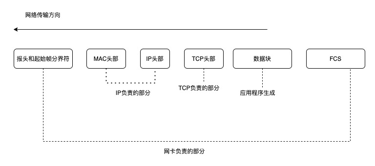

## 第一步 解析 URL

看看 url 里的各个元素分别是什么意思

所以这个 url 实际上是请求服务器的资源

如果 web 服务器后面没有路径资源 那么就代表默认访问根路径下 事先设置的默认 文件 比如 index.html 等

## 生成 HTTP 请求信息

对 URL 解析后，确定了 web 服务器和文件名 接下来就是根据这些信息 生成 HTTP 请求

## 真实地址查询 DNS

通过浏览器解析 URL 并生成 HTTP 消息后，需要委托操作系统将消息发送给 web 服务器

发送之前我们还需要查询服务器域名对应的 IP 地址 ，因为委托操作系统发送消息时必须提供通信对象的 IP 地址

先看看 DNS 中的域名层级关系

- 根 DNS 服务器
- 顶级域 DNS 服务器 （com）
- 权威 DNS 服务器 （server.com）

根域的 DNS 服务器信息保存在互联网中所有的 DNS 服务器中，这样任何 DNS 服务器就可以找到根 DNS 服务器

- 客户端首先会发送一个 DNS 请求，问www.server.com的IP地址是啥，并发给本地DNS服务器（是客户端中TCP/IP设置中填写的DNS服务器地址）
- 本地域名服务器收到客户端的请求后，首先会进行递归查询 查询缓存中是否有 www.server.com 如果有 则直接返回 IP 地址，如果没有则进入 迭代查询
  本地 DNS 服务器 回去问 根域名服务器，根域名服务器是最高层次的 它不直接用于域名解析，只是告诉你下一步去哪找
- 根 DNS 收到来自本地 DNS 的域名请求，发现后置是 .com 于是回复说 这个域名归.com 区域管理 给你.com 的顶级域名服务器地址给你 你去问他
- 本地 DNS 收到顶级域名的地址 于是发起请求 问 .com 顶级域，你可以给我 www.server.com的IP地址吗
- 顶级域名服务器收到请求后，我给你负责 www.server.com区域的权威DNS服务的地址 你去问他
- 本地 DNS 服务器于是 向区域权威的 DNS 服务器 发起请求 你可以给我 www.server.com的IP地址吗？
- 权威 DNS 服务器查询后将对应的 IP 地址返回给 本地 DNS
- 本地 DNS 拿到 IP 地址后，再把地址给到客户端

## 协议栈

通过 DNS 获取到 IP 后 接可以把 HTTP 的传输工作交给操作系统的协议栈

协议栈的内部分为几个部分，分别承担着不同的工作

应用程序（浏览器） 通过调用 Socket 库 来委托协议栈工作。 协议栈的上部分有两块 分别是负责收发数据的 TCP 和 UDP 协议，他们会接受应用层的委托执行收发数据的操作

协议栈的另一部分是用 IP 协议控制网络包首发操作，在互联网上上传数据时，数据会被切分成一块块的网络包，IP 就负责把网络包发送给对方

IP 中 还有 ICMP 协议 ARP 协议

- ICMP 用于告知网络包传送过程中产生的错误以及各种控制信心
- ARP 用于 根据 IP 地址查询相应的以太网 MAC 地址

IP 下面的 网卡驱动程序 负责控制网卡硬件，而最下面的网卡则负责完成实际的收发操作，也就是对网络中的信号执行发送和接受操作

## TCP

发出请求之前 首先要建立连接 这里就需要在传输数据之前 三次握手建立连接 （具体三次握手的详细过程 可以参考 下面的 文章 TCP 建立连接）

> TCP 分割数据

如果 HTTP 请求消息 比较长，超过了 MSS 的长度，这时 TCP 就需要把 HTTP 的数据拆解成一块块的数据发送，而不是一次性发送所有数据

- MTU 一个网络包的最大长度
- MSS 除去 IP 和 TCP 头部之后，一个网络包所容纳的 TCP 数据的最大长度

数据会被以 MSS 的长度对单位进行拆分，拆分出来的每一块数据都会被放进单独的网络包中，也就是在每个被拆分的数据加上 TCP 头部信息 然后交给 IP 模块来发送消息

TCP 协议里面有两个端口号 一个是浏览器监听的端口（随机生成） 一个是 web 服务器监听的端口号 HTTP 默认端口是 80 HTTP 默认端口号是 443

建立连接后 TCP 报文中的数据部分就是存放 HTTP 头部+数据 组装好 TCP 报文后 就需要交给网络层处理

## IP

TCP 模块在执行连接 收发 断开等各种操作时，都需要委托 IP 模块将 数据封装成网络包发送给通信对象

在 IP 协议里有源地址 IP 和目标地址 IP

- 源地址 IP 就时客户端输出等 IP 地址
- 目标地址 就是通过 DNS 域名解析得到 Web 服务器 IP

> 如果 客户端有多个网卡 就会有多个 IP 地址，那么 IP 头部的源地址应该选择哪个呢

这个时候需要根据路由表的规则来判断哪一个网卡作为源地址 IP，这里不再过多的分析

之后就可以生成 IP 头部报文

## 两点传输 MAC

生成了 IP 头部报文之后 需要在网络包上加上 MAC 的头部

MAC 头部是以太网使用的头部，它包含了接收方和发送方的 MAC 地址信息 用于两点之间的传输

MAC 包头的协议类型只使用

- 0800 IP 协议
- 0806 ARP 协议

> MAC 发送方和接收方的确认

发送方的 MAC 地址获取 直接读取即可 因为 MAC 地址是在网卡生产时写入 ROM 里的 所以可以直接读取放到 MAC 头部

那么接收方的 MAC 地址如何获取呢？首先通过路由表获取 对应的 接收方 的 IP 地址

然后通过 ARP 协议帮我们找到路由器的 MAC 地址

- 在同一个子网内 ARP 协议会以广播的形式 对以太网中所有的设备发送 这个 IP 请把 MAC 地址发给我 然后对应的 IP 会回复自己的 MAC 地址
- 不在同一个子网内 就通过 ARP 询问默认网关对应的 MAC 地址, 将数据转发给网关。

  后续操作系统会把本次查询的结果放到 ARP 缓存的内存空间 不过缓存时间只有几分钟

也就是发包时

- 先查询 ARP 缓存 如果缓存中有对方的 MAC 地址，那么就不需要发送 ARP 查询 直接使用 ARP 中的缓存地址
- 如果没有则通过 ARP 广播查询

然后 MAC 报文生成

## 网卡

网络包只是存放在内存中的二进制数字信息，没有办法直接发送给对方。所以我们需要将数字信息转化为电信号，才可以在网线上传输，这才是真正的数据发送。

负责这个操作的就是网卡，要控制网卡还需要网卡驱动程序

网卡驱动从 IP 模块获取到包之后 会将其复制到网卡内到缓存中，接着会在其开头上加上报头和起始帧分界符，在末尾加上用于检测错误的帧校验序列

- 起始帧分界符是一个用来表示包起始位置的标记
- 末尾的 FCS 用来检查包传输过程是否损坏

最后网卡会将包转为电信号，通过网线发送

## 交换机

交换机是将网络包原样转发给目的地，交换机工作在 MAC 层 也称 二层网络设备

> 交换机包的接收操作

首先 电信号到达网线的接口，交换机的模块进行接收，接下来交换机模块将电信号转化成数字信号

通过末尾 FCS 校验错误，如果没有问题 那么放入缓冲区

将包放入缓冲区 解接下来 需要查询一下 这个包的接收方 MAC 地址是否已经在 MAC 地址表中记录

交换机的 MAC 地址表主要包含两个信息

- 一个是设备的 MAC 地址
- 另一个是该设备连接在交换机的哪个端口上

交换机根据 MAC 地址表查找 MAC 地址 然后将信号发送到相应的端口。

> 如果 MAC 地址表找不到指定的 MAC 地址

如果 MAC 地址表中找不到指定 MAC 地址，那么可能是因为具有该地址的设备还没有向交换机发送过包，或者是因为一段时间没有工作，导致包被删除了

这种情况 交换机无法判断应该把包发送到哪个端口上，所以这个时候只能将包发到除了源端口之外的所有端口上，无论该设备连接在哪个端口上都可以收到包

数据包通过交换机来到了路由器

## 路由器

> 路由器和交换机的区别

网络包经过交换机 现在到达了路由器，并在此被转发到下一个路由器或者目标设备
转发到原理和交换机类似，也是通过查表判断包转发到目标

- 路由器是基于 IP 设计的，又被称为三层网络设备，路由器各个端口都具有 MAC 地址和 IP 地址
- 交换机是基于以太网设计的，又被称为 二层网络设备 交换机的端口上没有 MAC 地址

> 路由器的基本原理

路由器的端口具有 MAC 地址 因为它可以称为以太网中的发送方和接收方，同时还有 IP 地址，当转发包时，首先路由器端口会接收发给自己的以太网包，然后路由表查询转发目标，再由相应的端口作为发送方将以太网发送出去

完成包的接收操作之后 路由器就会去掉包开头的 MAC 头部，MAC 头部的作用就是将包送达路由器，其中接收方的 MAC 地址就是路由器端口的 MAC 地址，因为当包到达路由器之后 MAC 头部就会被丢弃
然后路由器就会根据 MAC 头部后的 IP 头部内容进行包的转发

- 首先查询路由表判断转发的目标
- 根据路由表的网关列判断对方的地址

  - 如果网关是一个 IP 地址 则这个 IP 地址就是我们要转发的目标地址 还未到达终点，还需要路由器继续转发

  1. 知道对方的 IP 地址之后，接下来需要通过 ARP 协议根据 IP 地址查询 MAC 地址，并将查询的结果作为接收方 MAC 地址。

  2. 路由器也有 ARP 缓存，因此首先会在 ARP 缓存中查询，如果找不到则发送 ARP 查询请求。

  3. 接下来是发送方 MAC 地址字段，这里填写输出端口的 MAC 地址。还有一个以太类型字段，填写 0800 (十六进
     制)表示 IP 协议。

  4. 网络包完成后，接下来会将其转换成电信号并通过端口发送出去。这一步的工作过程和计算机也是相同的。

  5. 发送出去的网络包会通过交换机到达下一个路由器。由于接收方 MAC 地址就是下一个路由器的地址，所以交换机 会根据这一地址将包传输到下一个路由器。

  6. 接下来，下一个路由器会将包转发给再下一个路由器，经过层层转发之后，网络包就到达了最终的目的地。

  不知你发现了没有，在网络包传输的过程中，源 IP 和目标 IP 始终是不会变的，一直变化的是 MAC 地址，因为需
  要 MAC 地址在以太网内进行两个设备之间的包传输。

  - 如果网关为空，则 IP 头部中的接收方 IP 地址就是要转发到的目的地址 也就是找到了 IP 头部里的目标地址 已经到达终点

## 服务器

数据包到达服务器，服务器打开数据，根据需要 返回对应的数据给客户端，返回的 HTTP 相应 同样也需要给数据包 添加 TCP 头部 IP 头 MAC 头部等 只是这一次源地址是服务器地址 ，目的地址是客户端 IP 地址
