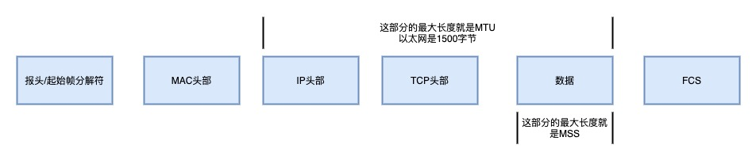

## 第一步 解析 URL

看看 url 里的各个元素分别是什么意思

所以这个 url 实际上是请求服务器的资源

如果 web 服务器后面没有路径资源 那么就代表默认访问根路径下 事先设置的默认 文件 比如 index.html 等

## 生成 HTTP 请求信息

对 URL 解析后，确定了 web 服务器和文件名 接下来就是根据这些信息 生成 HTTP 请求

## 真实地址查询 DNS

通过浏览器解析 URL 并生成 HTTP 消息后，需要委托操作系统将消息发送给 web 服务器

发送之前我们还需要查询服务器域名对应的 IP 地址 ，因为委托操作系统发送消息时必须提供通信对象的 IP 地址

先看看 DNS 中的域名层级关系

- 根 DNS 服务器
- 顶级域 DNS 服务器 （com）
- 权威 DNS 服务器 （server.com）

根域的 DNS 服务器信息保存在互联网中所有的 DNS 服务器中，这样任何 DNS 服务器就可以找到根 DNS 服务器

- 客户端首先会发送一个 DNS 请求，问www.server.com的IP地址是啥，并发给本地DNS服务器（是客户端中TCP/IP设置中填写的DNS服务器地址）
- 本地域名服务器收到客户端的请求后，首先会进行递归查询 查询缓存中是否有 www.server.com 如果有 则直接返回 IP 地址，如果没有则进入 迭代查询
  本地 DNS 服务器 回去问 根域名服务器，根域名服务器是最高层次的 它不直接用于域名解析，只是告诉你下一步去哪找
- 根 DNS 收到来自本地 DNS 的域名请求，发现后置是 .com 于是回复说 这个域名归.com 区域管理 给你.com 的顶级域名服务器地址给你 你去问他
- 本地 DNS 收到顶级域名的地址 于是发起请求 问 .com 顶级域，你可以给我 www.server.com的IP地址吗
- 顶级域名服务器收到请求后，我给你负责 www.server.com区域的权威DNS服务的地址 你去问他
- 本地 DNS 服务器于是 向区域权威的 DNS 服务器 发起请求 你可以给我 www.server.com的IP地址吗？
- 权威 DNS 服务器查询后将对应的 IP 地址返回给 本地 DNS
- 本地 DNS 拿到 IP 地址后，再把地址给到客户端

## 协议栈

通过 DNS 获取到 IP 后 接可以把 HTTP 的传输工作交给操作系统的协议栈

协议栈的内部分为几个部分，分别承担着不同的工作

应用程序（浏览器） 通过调用 Socket 库 来委托协议栈工作。 协议栈的上部分有两块 分别是负责收发数据的 TCP 和 UDP 协议，他们会接受应用层的委托执行收发数据的操作

协议栈的另一部分是用 IP 协议控制网络包首发操作，在互联网上上传数据时，数据会被切分成一块块的网络包，IP 就负责把网络包发送给对方

IP 中 还有 ICMP 协议 ARP 协议

- ICMP 用于告知网络包传送过程中产生的错误以及各种控制信心
- ARP 用于 根据 IP 地址查询相应的以太网 MAC 地址

IP 下面的 网卡驱动程序 负责控制网卡硬件，而最下面的网卡则负责完成实际的收发操作，也就是对网络中的信号执行发送和接受操作

## TCP

发出请求之前 首先要建立连接 这里就需要在传输数据之前 三次握手建立连接 （具体三次握手的详细过程 可以参考 下面的 文章 TCP 建立连接）

> TCP 分割数据

如果 HTTP 请求消息 比较长，超过了 MSS 的长度，这时 TCP 就需要把 HTTP 的数据拆解成一块块的数据发送，而不是一次性发送所有数据

- MTU 一个网络包的最大长度
- MSS 除去 IP 和 TCP 头部之后，一个网络包所容纳的 TCP 数据的最大长度

数据会被以 MSS 的长度对单位进行拆分，拆分出来的每一块数据都会被放进单独的网络包中，也就是在每个被拆分的数据加上 TCP 头部信息 然后交给 IP 模块来发送消息

TCP 协议里面有两个端口号 一个是浏览器监听的端口（随机生成） 一个是 web 服务器监听的端口号 HTTP 默认端口是 80 HTTP 默认端口号是 443

建立连接后 TCP 报文中的数据部分就是存放 HTTP 头部+数据 组装好 TCP 报文后 就需要交给网络层处理

## IP

TCP 模块在执行连接 收发 断开等各种操作时，都需要委托 IP 模块将 数据封装成网络包发送给通信对象

在 IP 协议里有源地址 IP 和目标地址 IP

- 源地址 IP 就时客户端输出等 IP 地址
- 目标地址 就是通过 DNS 域名解析得到 Web 服务器 IP

> 如果 客户端有多个网卡 就会有多个 IP 地址，那么 IP 头部的源地址应该选择哪个呢

这个时候需要根据路由表的规则来判断哪一个网卡作为源地址 IP，这里不再过多的分析

之后就可以生成 IP 头部报文

## 两点传输 MAC

生成了 IP 头部报文之后 需要在网络包上加上 MAC 的头部

MAC 头部是以太网使用的头部，它包含了接收方和发送方的 MAC 地址信息 用于两点之间的传输

MAC 包头的协议类型只使用

- 0800 IP 协议
- 0806 ARP 协议

> MAC 发送方和接收方的确认

发送方的 MAC 地址获取 直接读取即可 因为 MAC 地址是在网卡生产时写入 ROM 里的 所以可以直接读取放到 MAC 头部

那么接收方的 MAC 地址如何获取呢？首先通过路由表获取 对应的 接收方 的 IP 地址

然后通过 ARP 协议帮我们找到路由器的 MAC 地址

- 在同一个子网内 ARP 协议会以广播的形式 对以太网中所有的设备发送 这个 IP 请把 MAC 地址发给我 然后对应的 IP 会回复自己的 MAC 地址
- 不在同一个子网内 就通过 ARP 询问默认网关对应的 MAC 地址, 将数据转发给网关。

  后续操作系统会把本次查询的结果放到 ARP 缓存的内存空间 不过缓存时间只有几分钟

也就是发包时

- 先查询 ARP 缓存 如果缓存中有对方的 MAC 地址，那么就不需要发送 ARP 查询 直接使用 ARP 中的缓存地址
- 如果没有则通过 ARP 广播查询

然后 MAC 报文生成

## 网卡
