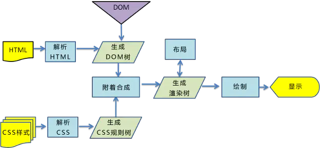

客户端从服务器获取代码到页面渲染是怎么实现的 [开辟一个 GUI 渲染进程，自上而下解析代码，最后绘制页面]

这张图就是大致整个流程，那么我们分别来分析一下 每个过程以及需要注意的点

- 解析 HTML 生成 DOM 树
- 解析 CSS 生成 CSSOM 规则树
- 合并 DOM 和 CSSOM 树 生成 render 树
- 遍历渲染树开始布局，并计算每个节点的位置大小（layout）
- 通过布局树 进行分层（根据定位属性/透明属性/clip 属性/transform 属性） 生产图层树
- 然后绘制出页面 显示在浏览器上

自上而下渲染解析代码的过程是同步的，但是也有异步的过程

## 关于 css 资源的加载

- 遇到 `<style>` 内嵌样式

  同步执行 交给 GUI 渲染线程解析

- 遇到 `<link>` 外链样式

  异步执行 开辟一个新的 HTTP 网络请求线程  
  （注意：同一个源下，根据不同的浏览器，最多只允许开辟 4~7 个 HTTP 线程 也叫做 HTTP 的并发数）  
  不会等待资源信息请求回来，GUI 渲染线程继续向下渲染  
  GUI 渲染线程同步操作处理完成后，再把基于 HTTP 网络请求回来的资源文件进行解析

- 遇到`@import` 导入样式
  同步执行，开辟一个新的 HTTP 网络请求线程 去请求资源  
  但是在资源文件没有请求回来之前，GUI 渲染会被阻塞，不允许继续向下渲染  
  （所以 @import 会阻塞渲染 不建议使用）

## 关于 `<script>`资源请求

- 默认都是同步执行的，必须基于 HTTP 网络线程，把资源请求回来之后，并且交给 JS 渲染线程渲染解析完成后，GUI 渲染线程才可以继续向下渲染，所以`<script>` 也会阻塞 GUI 渲染，所以 script 一般都放在最下面

- async 属性 遇到 `<script async>` 首先也是开辟一个 HTTP 网络线程去请求文件资源，与此同时 GUI 渲染线程继续向下（这里把 script 改成了异步方式） 一旦资源请求回来，GUI 的渲染会被终端，先进行 js 的渲染解析

- defer 属性 遇到 `<script defer>` 和 async 类似 但是不一样的地方是 GUI 同步的代码渲染完成后才解析 请求回来的文件资源

## 遇到 img 和音视频

- 遇到这些资源，也会发送新的 HTTP 网络线程，请求文件资源，不会阻碍 GUI 的渲染（是异步的），当 GUI 渲染完成后，才会解析请求回来的资源

WebKit 浏览器预测解析：chrom 的预加载扫描器 html-preload-scanner 通过扫描节点中 src 和 link 等属性，找到外部连接资源进行预加载，避免了资源加载的等待时间，同样实现提前加载以及加载和执行分离

## 参考文献

https://developer.mozilla.org/zh-CN/docs/Web/Performance/How_browsers_work
