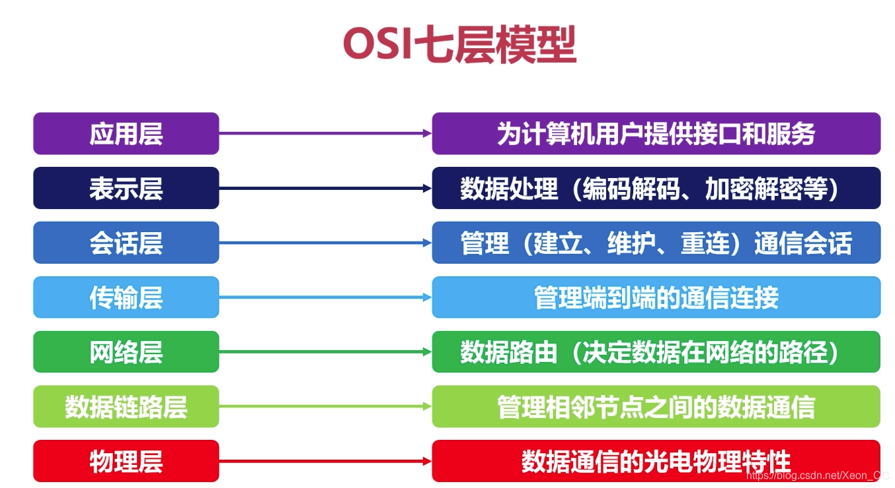
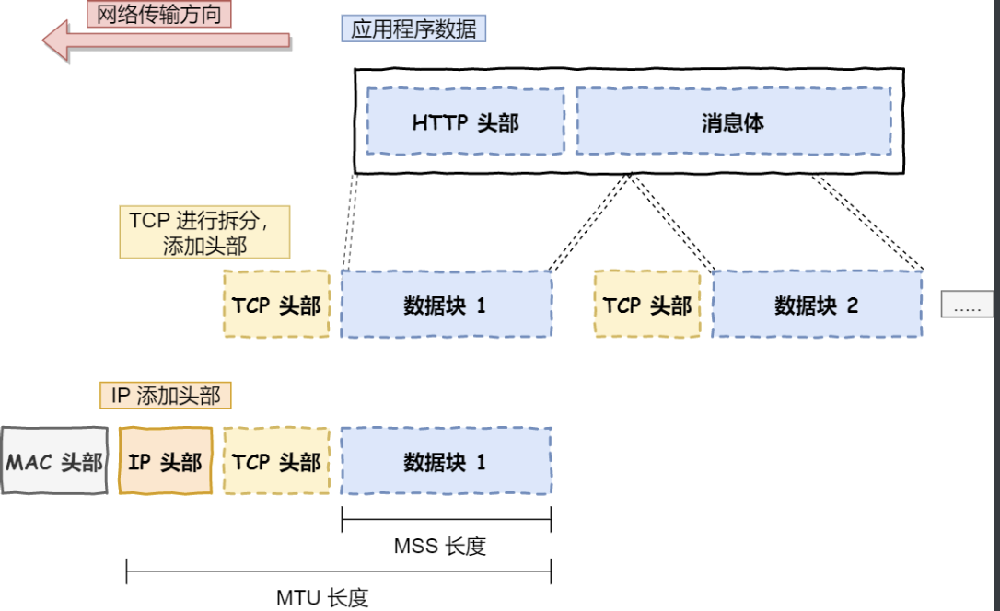
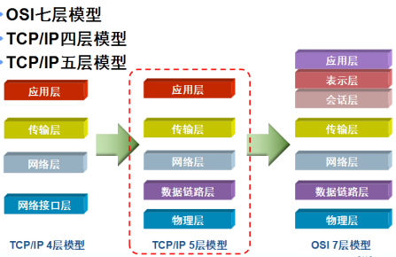
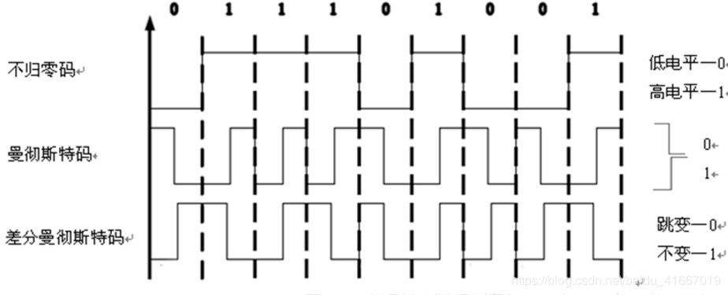

## OSI 七层网络模型

分层带来的好处

- 将复杂的流程分解为几个功能单一的子进程
- 整个流程更加清晰 复杂问题简单化
- 更容易发现问题 并解决问题

分层模型

只看图可能对这些概念比较虚 不是很容易理解 ，我们来解释一下，当然也许我的解释可能存在错误

- 应用层

我们可以直接接触到的就是应用层，我们的电脑或者手机的应用软件都是在应用层实现的，我们的应用层只关心为用户提供功能，不关心数据是如何传输的比如我们邮寄快递 ，我们只需要把快递给邮寄员，填写相关信息，我们不用关心，具体是如何运输的

- 传输层

当两个设备通信的时候，应用就把应用数据传输到下一层，就是传输层，传输层是为应用层提供网络支持

在传输层有两个传输协议，分别是 TCP 和 UDP

TCP 的全称叫传输层控制协议(Transmission Control Protocol)，大部分应用使用的正是 TCP 传输层协议，比 如 HTTP 应用层协议。TCP 相比 UDP 多了很多特性，比如流 􏰀 控制、超时 􏰁 传、拥塞控制等，这些都是为了保证 数据包能可靠地传输给对方。

UDP 就相对很简单，简单到只负责发送数据包，不保证数据包是否能抵达对方，但它实时性相对更好，传输效率 也高

应用需要传输的数据可能会非常大，如果直接传输就不好控制，因此当传输层的数据包大小超过 MSS(TCP 最大 报文段⻓度) ，就要将数据包分块，这样即使中途有一个分块丢失或损坏了，只需要 􏰁 新这一个分块，而不用 􏰁 新 发送整个数据包。在 TCP 协议中，我们把每个分块称为一个 TCP 段(TCP Segment)。

当设备作为接收方时，传输层则要负责把数据包传给应用，但是一台设备上可能会有很多应用在接收或者传输数 据，因此需要用一个编号将应用区分开来，这个编号就是端口。

比如 80 端口通常是 Web 服务器用的，22 端口通常是远程登录服务器用的。而对于浏览器(客户端)中的每个标 签栏都是一个独立的进程，操作系统会为这些进程分配临时的端口号。
由于传输层的报文中会携带端口号，因此接收方可以识别出该报文是发送给哪个应用。

传输层实际上是 应用间数据传输到媒介，实际的传输功能在下一层 网络层

- 网络层

网络层最常使用的是 IP 协议(Internet Protocol)，IP 协议会将传输层的报文作为数据部分，再加上 IP 包头组装 成 IP 报文，如果 IP 报文大小超过 MTU(以太网中一般为 1500 字节)就会再次进行分片，得到一个即将发送到网 络的 IP 报文。

网络层负责将数据从一个设备传输到另一个设备，世界上那么多设备，又该如何找到对方呢?因此，网络层需要有
区分设备的编号。

我们一般用 IP 地址给设备进行编号，对于 IPv4 协议， IP 地址共 32 位，分成了四段，每段是 8 位。只有一个单纯 的 IP 地址虽然做到了区分设备，但是寻址起来就特别麻烦，全世界那么多台设备，难道一个一个去匹配?这显然 不科学。
因此，需要将 IP 地址分成两种意义:

- 一个是网络号，负责标识该 IP 地址是属于哪个子网的;
- 一个是主机号，负责标识同一子网下的不同主机;

怎么分的呢?这需要配合子网掩码才能算出 IP 地址 的网络号和主机号。那么在寻址的过程中，先匹配到相同的网
络号，才会去找对应的主机。
除了寻址能力， IP 协议还有另一个 􏰁 要的能力就是路由。实际场景中，两台设备并不是用一条网线连接起来的， 而是通过很多网关、路由器、交换机等众多网络设备连接起来的，那么就会形成很多条网络的路径，因此当数据包 到达一个网络节点，就需要通过算法决定下一步走哪条路径。
所以，IP 协议的寻址作用是告诉我们去往下一个目的地该朝哪个方向走，路由则是根据「下一个目的地」选择路 径。寻址更像在导航，路由更像在操作方向盘。

- 数据链路层

实际场景中，网络并不是一个整体，比如你家和我家就不属于一个网络，所以数据不仅可以在同一个网络中设备间
进行传输，也可以跨网络进行传输。
一旦数据需要跨网络传输，就需要有一个设备同时在两个网络当中，这个设备一般是路由器，路由器可以通过路由 表计算出下一个要去的 IP 地址。
那问题来了，路由器怎么知道这个 IP 地址是哪个设备的呢?
于是，就需要有一个专⻔的层来标识网络中的设备，让数据在一个链路中传输，这就是数据链路层(Data Link Layer)，它主要为网络层提供链路级别传输的服务。

每一台设备的网卡都会有一个 MAC 地址，它就是用来唯一标识设备的。路由器计算出了下一个目的地 IP 地址，再 通过 ARP 协议找到该目的地的 MAC 地址，这样就知道这个 IP 地址是哪个设备的了。

- 物理层

当数据准备要从设备发送到网络时，需要把数据包转换成电信号，让其可以在物理介质中传输，这一层就是物理层 (Physical Layer)，它主要是为数据链路层提供二进制传输的服务。

以上都简单的介绍了一部分的概念 后面会详细介绍相关概念

## TCP/IP 参考模型

- TCP/IP 是传输控制协议/网络互联协议的简称
- 早期的 TCP/IP 模型是一个四层结构 从上往下依次是网络接口层 互联网层 传输层 和应用层
- 后来在使用过程中 借鉴 OSI 七层参考模型 将网络层划分为了 物理层 和数据链路层 想成五层结构

### 协议的概念和作用

- 为了让计算机能够通信，计算机需要定义通信规则，这些规则就是协议
- 规则是多种的 协议也是多种的
- 协议就是数据封装格式+传输

### 常用的协议

- TCP/IP 协议呗称为传输控制协议/互联网协议，又称网络通信协议
- 是由网络层的 IP 协议和传输层的 TCP 协议组成的，是一个很大的协议集合
- 物理层和数据链路层没有定义任何特定协议 支持所有的标准和专用的协议

| 名称              | 协议                     |
| ----------------- | ------------------------ |
| 应用层            | HTTP FTP TFTP DNS 。。。 |
| 传输层            | TCP UDP                  |
| 网络层            | IP ARP ICMP 。。。。     |
| 数据链路层/物理层 | 由底层网络定义的协议     |

## 网络接口层

- 网络接口层是 TCP/IP 模型的最底层，负责接收从上一个层交来的数据，并将数据报文通过底层的无力网络发送出去，比较常见的就是设备的驱动程序，此层没有特定的协议
- 网络接口层又分为物理层和数据链路层

### 物理层

- 计算机在传递数据的时候传递的都是 0 和 1 的数据，而物理层关心的是用什么信号来表示 0 和 1，是否可以双向通信，最初的连接如何建立以及如何完成连接 如何终止，
  物理层是为数据传输提供可靠的环境
- 尽可能的屏蔽掉无力设备和传输媒介，使得数据链路层不考虑这些差异 只考虑本层的协议和服务
- 为用户提供一条物理传输媒体上传送和接收比特流的能力
- 需要解决物理连接 维护和释放的问题

#### 数字信号的编码

- 非归零编码
  优点：编/译码简单
  缺点：内部不含时钟信号 收发端同步困呐
  用途：计算机内部 或者低速数据通信
- 曼彻斯特编码
  优点： 内部自含时钟 收发端同步容易 抗干扰能力强
  缺点：编/译码复杂 占用更多的通信通道 要比非归零编码多占用一倍多信道带宽
  用途：802.3 局域网

