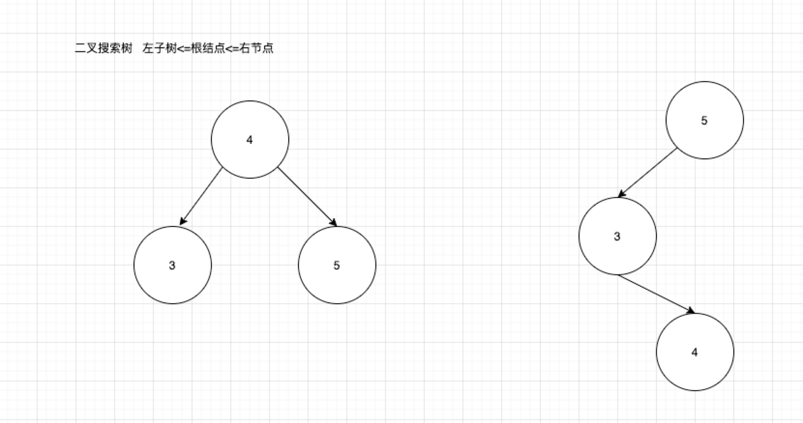
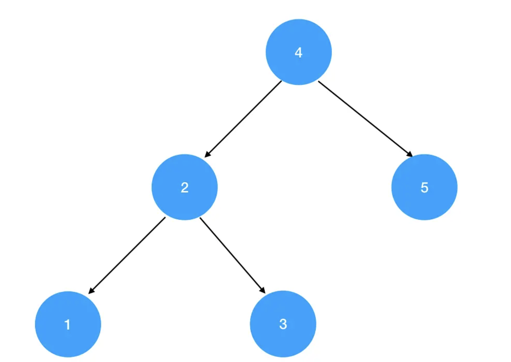
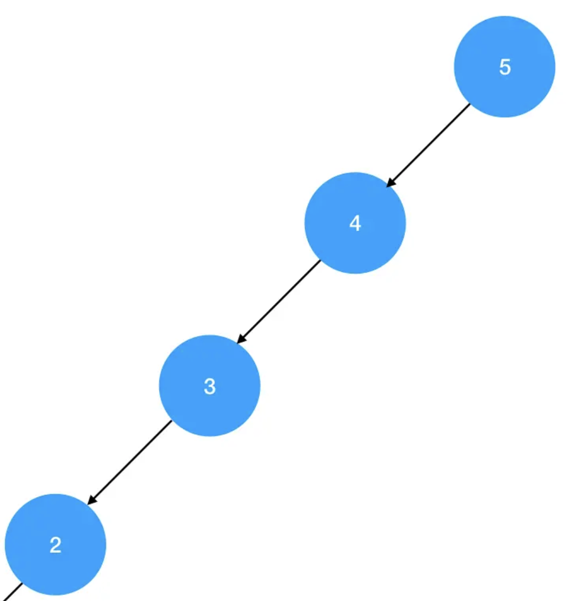

## 什么是二叉搜索树

- 是一颗空树
- 是一颗由根结点 左子树 右子树组成的树，同时左子树右子树也都是二叉搜索树，并且所有左子树的的数据域都小于等于根结点的数据域，根结点的所有数据域都小于右子树的数据域 左子树<=根结点<=右子树

满足以上其中一个条件就是二叉搜索树

图示例


## 二叉搜索树的查找 删除 插入

- 查找功能

给定一个目标数据 val，根据二叉树的数据域的有序性，我们可以这样查找

1. 递归遍历二叉树，若当前遍历到的结点为空，就意味着没找到目标结点，直接返回
2. 若当前遍历到的结点对应的数据域值刚好等于 val，则查找成功，返回。
3. 当遍历到的节点的数据域大于 val，则应该在左子树进一步查找，设置下一步的遍历范围 root.left 继续递归
4. 当遍历到的节点的数据域小于 val，则应该在右子树进一步查找，设置下一步的遍历范围 root.right 继续递归

查看代码

```js
function search(root, n) {
  if (!root) {
    return;
  }
  if (root.val === n) {
    console.log("查找到目标节点");
  } else if (root.val > n) {
    search(root.left, n);
  } else {
    search(root.right, n);
  }
}
```

- 插入新节点
  插入节点和查询节点的操作是非常像的，因为二叉搜索树是有序的。我们会根据当前节点的值 和 目标节点判断是向左子树走还是右子树

```js
function insertIntoBST(root, n) {
  // 若 root 为空，说明当前是一个可以插入的空位
  if (!root) {
    // 用一个值为n的结点占据这个空位
    root = new TreeNode(n);
    return root;
  }

  if (root.val > n) {
    // 当前结点数据域大于n，向左查找
    root.left = insertIntoBST(root.left, n);
  } else {
    // 当前结点数据域小于n，向右查找
    root.right = insertIntoBST(root.right, n);
  }

  // 返回插入后二叉搜索树的根结点
  return root;
}
```

- 删除节点

1. 节点不存在 直接返回即可
2. 删除的节点 是叶子结点 直接删除即可
3. 删除的目标节点有左子树 那么就需要去左子树里面寻找小于目标节点值的最大值 用这个节点覆盖掉目标节点
4. 删除的目标节点有右子树，那么就需要去右子树寻找大于目标节点值的最小节点，用这个节点覆盖掉目标节点
5. 删除掉目标节点有左子树 也有右子树 这时就有两种做法了：要么取左子树中值最大的结点，要么取右子树中取值最小的结点。两个结点中任取一个覆盖掉目标结点，都可以维持二叉搜索树的数据有序性

```js
function deleteNode(root, n) {
  // 如果没找到目标结点，则直接返回
  if (!root) {
    return root;
  }
  // 定位到目标结点，开始分情况处理删除动作
  if (root.val === n) {
    // 若是叶子结点，则不需要想太多，直接删除
    if (!root.left && !root.right) {
      root = null;
    } else if (root.left) {
      // 寻找左子树里值最大的结点
      const maxLeft = findMax(root.left);
      // 用这个 maxLeft 覆盖掉需要删除的当前结点
      root.val = maxLeft.val;
      // 覆盖动作会消耗掉原有的 maxLeft 结点
      root.left = deleteNode(root.left, maxLeft.val);
    } else {
      // 寻找右子树里值最小的结点
      const minRight = findMin(root.right);
      // 用这个 minRight 覆盖掉需要删除的当前结点
      root.val = minRight.val;
      // 覆盖动作会消耗掉原有的 minRight 结点
      root.right = deleteNode(root.right, minRight.val);
    }
  } else if (root.val > n) {
    // 若当前结点的值比 n 大，则在左子树中继续寻找目标结点
    root.left = deleteNode(root.left, n);
  } else {
    // 若当前结点的值比 n 小，则在右子树中继续寻找目标结点
    root.right = deleteNode(root.right, n);
  }
  return root;
}

// 寻找左子树最大值
function findMax(root) {
  while (root.right) {
    root = root.right;
  }
  return root;
}

// 寻找右子树的最小值
function findMin(root) {
  while (root.left) {
    root = root.left;
  }
  return root;
}
```

二叉搜索树的特性

二叉搜索树的中序遍历序列是有序的！

## 平衡二叉搜索树

什么是平衡二叉搜索树，平衡二叉搜索树是指任意节点的左右子树高度差的绝对值都不大于 1 的二叉搜索树，又称 AVL 树

平衡二叉树的出现是为了降低二叉搜索树的查找时间复杂度


看图 这是一个平衡二叉树


看图 这就不是一个平衡二叉树

为什么平衡二叉树的查找效率比普通的二叉树查找效率高呢，因为平衡二叉树中序遍历是有序的，我们可以通过二分查找的方法来缩小查找的范围

而不用遍历整个树，从而提高的查询的效率

## 平衡二叉树的判断

给定一个二叉树，判断它是否是高度平衡的二叉树。

给定二叉树 [3,9,20,null,null,15,7]

```
    3
   / \
  9  20
    /  \
   15   7
```

返回 true

```js
const isBalanced = function (root) {
  // 立一个flag，只要有一个高度差绝对值大于1，这个flag就会被置为false
  let flag = true;
  // 定义递归逻辑
  function dfs(root) {
    // 如果是空树，高度记为0；如果flag已经false了，那么就没必要往下走了，直接return
    if (!root || !flag) {
      return 0;
    }
    // 计算左子树的高度
    const left = dfs(root.left);
    // 计算右子树的高度
    const right = dfs(root.right);
    // 如果左右子树的高度差绝对值大于1，flag就破功了
    if (Math.abs(left - right) > 1) {
      flag = false;
      // 后面再发生什么已经不重要了，返回一个不影响回溯计算的值
      return 0;
    }
    // 返回当前子树的高度
    return Math.max(left, right) + 1;
  }

  // 递归入口
  dfs(root);
  // 返回flag的值
  return flag;
};
```
