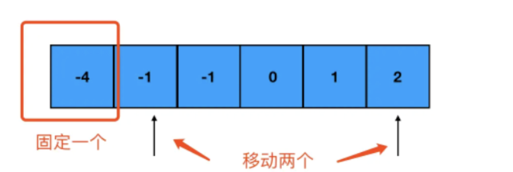

双层循环 可以考虑双指针
凡有序 必二分

## 删除排序数组中的重复项（简单）

给你一个有序数组 nums ，请你 原地 删除重复出现的元素，使每个元素 只出现一次 ，返回删除后数组的新长度。

不要使用额外的数组空间，你必须在 原地 修改输入数组 并在使用 O(1) 额外空间的条件下完成。

输入：nums = [1,1,2]
输出：2, nums = [1,2]

这是一道简单题，但是我依然没做出来，看题解才发现果然很简单
，用到了双指针，对双指针还不是很熟

```js
/**
 * @param {number[]} nums
 * @return {number}
 */
var removeDuplicates = function (nums) {
  let n = nums.length;
  if (!n) return 0;
  let i = 0;
  for (let j = 1; j < n; j++) {
    if (nums[i] !== nums[j]) {
      ++i;
      nums[i] = nums[j];
    }
  }
  return i + 1;
};
```

分析一下，分别有两个指针 i 和 j ,初始值分别是 0 和 1

每次移动 j ,判断当前 i 和 j 是否相同，如果一样则不做任何处理继续向后，
如果不同，那么 i 向前移动一位，并且把 js 上的数值赋值给移动的后的 i 位置
一直到最后，返回 i+1 就是不重复的数组

[带有示意图的题解](https://leetcode-cn.com/problems/remove-duplicates-from-sorted-array/solution/shuang-zhi-zhen-shan-chu-you-xu-shu-zu-z-3pi4/)

次数（1）

## 验证回文串(简单)

给定一个字符串，验证它是否是回文串，只考虑字母和数字字符，可以忽略字母的大小写。

说明：本题中，我们将空字符串定义为有效的回文串。

示例 1:

输入: "A man, a plan, a canal: Panama"
输出: true

```js
// 正则 \W 匹配数字 字母（多个） \w 匹配单个
/**
 * @param {string} s
 * @return {boolean}
 */
var isPalindrome = function (s) {
  if (s === "") return true;
  let str = s.replace(/\W|_/g, "").toLowerCase();
  console.log(str);
  let left = 0,
    right = str.length - 1;
  while (left < right) {
    if (str[left] !== str[right]) return false;
    left++;
    right--;
  }
  return true;
};
```

思路很简单 使用正则去除无用的字符并转化成小写，双指针遍历，左右两头循环比较，如果有不同的则就不是回文串，
也可以直接用 js 反转 api 反转字符串比较是否相同

## 反转字符串（简单题）

输入：["h","e","l","l","o"]
输出：["o","l","l","e","h"]

题目很好理解，反转数组，使用 js 提供的 reverse 反转方法一下就可以实现，但是面试肯定不是想考这个，所以我们可以用双指针来做

```js
/**
 * @param {character[]} s
 * @return {void} Do not return anything, modify s in-place instead.
 */
var reverseString = function (s) {
  let i = 0,
    j = s.length - 1;
  while (i < j) {
    let temp = s[i];
    s[i] = s[j];
    s[j] = temp;
    i++;
    j--;
  }
  return s;
};
```

取第一个和最后一个然后互换位置，依次循环即可，比较见到那不再赘述

次数（1）

## 剑指 Offer 22. 链表中倒数第 k 个节点（简单）

输入一个链表，输出该链表中倒数第 k 个节点。为了符合大多数人的习惯，本题从 1 开始计数，即链表的尾节点是倒数第 1 个节点。

例如，一个链表有 6 个节点，从头节点开始，它们的值依次是 1、2、3、4、5、6。这个链表的倒数第 3 个节点是值为 4 的节点。

给定一个链表: 1->2->3->4->5, 和 k = 2.

返回链表 4->5.

做题思路：双指针思想，定义两个参数，然后 form 指针循环向前走 k 次，循环结束，再次循环这次 form 和 later 都循环，直到 form 为空，此时 later 就是倒数 k 个节点

```js
/**
 * Definition for singly-linked list.
 * function ListNode(val) {
 *     this.val = val;
 *     this.next = null;
 * }
 */
/**
 * @param {ListNode} head
 * @param {number} k
 * @return {ListNode}
 */
var getKthFromEnd = function (head, k) {
  let later = head,
    form = head,
    i = 0;
  for (; i < k; i++) {
    if (form === null) return null;
    form = form.next;
  }
  while (form !== null) {
    form = form.next;
    later = later.next;
  }
  return later;
};
```

次数（1）

## 盛最多水的容器

给定一个长度为 n 的整数数组  height 。有  n  条垂线，第 i 条线的两个端点是  (i, 0)  和  (i, height[i]) 。

找出其中的两条线，使得它们与  x  轴共同构成的容器可以容纳最多的水。

返回容器可以储存的最大水量。


输入：[1,8,6,2,5,4,8,3,7]
输出：49

题意分析：这题最容易想到的 暴力解法 双层循环 一顿操作 超时 哈哈，看了解析 双指针的解法，也很容易理解从头尾开始遍历 寻找最大的值

代码

```js
function maxArea(height: number[]): number {
  let number = 0;
  let i = 0,
    j = height.length - 1;
  while (i < j) {
    const area = Math.min(height[i], height[j]) * (j - i);
    if (area > number) number = area;
    if (height[i] < height[j]) {
      i++;
    } else {
      j--;
    }
  }
  return number;
}
```

次数（1）

## 合并两个有序数组

给你两个按 非递减顺序 排列的整数数组  nums1 和 nums2，另有两个整数 m 和 n ，分别表示 nums1 和 nums2 中的元素数目。

请你 合并 nums2 到 nums1 中，使合并后的数组同样按 非递减顺序 排列。

注意：最终，合并后数组不应由函数返回，而是存储在数组 nums1 中。为了应对这种情况，nums1 的初始长度为 m + n，其中前 m 个元素表示应合并的元素，后 n 个元素为 0 ，应忽略。nums2 的长度为 n 。

输入：nums1 = [1,2,3,0,0,0], m = 3, nums2 = [2,5,6], n = 3
输出：[1,2,2,3,5,6]
解释：需要合并 [1,2,3] 和 [2,5,6] 。
合并结果是 [1,2,2,3,5,6] ，其中斜体加粗标注的为 nums1 中的元素。

分析：之前做过这道题 不过是合并之后再排序 利用了 js 提供的方法，这次记录另一种写法 后双指针

根据上面的的示例 分析一下 代码的过程 首先 如果 nums1 数组不存在，很好理解 把另一个数组都循环赋值给 nums1 同理 j<0
然后定义 i 指针指向 nums1 的位置 j 指针指向 nums2 的位置 k 指向 nums1 数组最后的位置
第一步 开始比较 3 和 6 因为 6>3 所以 nums1[k--] = nums2[j--] 把 6 放到 nums1 最后一个位置 然后向前移动一位 j k
第二步 开始比较 3 和 5 同上
第三步 开始比较 3 和 2 因为 3>2 所以 nums1[k--] = nums1[i--]; 把 3 放到对应的位置 然后向前移动一位 i k
。。。。。。后面步骤省略

```js
function merge(nums1: number[], m: number, nums2: number[], n: number): void {
  let i = m - 1,
    j = n - 1,
    k = m + n - 1;
  while (i >= 0 || j >= 0) {
    if (i < 0) {
      nums1[k--] = nums2[j--];
    } else if (j < 0) {
      nums1[k--] = nums1[i--];
    } else if (nums1[i] < nums2[j]) {
      nums1[k--] = nums2[j--];
    } else {
      nums1[k--] = nums1[i--];
    }
  }
}
```

## 三数之和

给你一个包含 n 个整数的数组  nums，判断  nums  中是否存在三个元素 a，b，c ，使得  a + b + c = 0 ？请你找出所有和为 0 且不重复的三元组。
注意：答案中不可以包含重复的三元组。

示例 1：
输入：nums = [-1,0,1,2,-1,-4]
输出：[[-1,-1,2],[-1,0,1]]

分析： 当然开始是没做出来的，哈哈，看了别人的解析，然后理解 就是排序+双指针

双指针法用在涉及求和、比大小类的数组题目里时，大前提往往是：该数组必须有序 所以我们第一步要排序

然后，对数组进行遍历，每次遍历到哪个数字，就固定哪个数字。然后把左指针指向该数字后面一个坑里的数字，把右指针指向数组末尾，让左右指针从起点开始，向中间前进



每次指针移动一次位置，就计算一下两个指针指向数字之和加上固定的那个数之后，是否等于 0。如果是，那么我们就得到了一个目标组合；否则，分两种情况来看：

- 相加之和大于 0，说明右侧的数偏大了，右指针左移
- 相加之和小于 0，说明左侧的数偏小了，左指针右移

```js
function threeSum(nums: number[]): number[][] {
  let n = nums.length;
  if (n === 0 || n === 1 || n === 2) return [];
  nums.sort((a, b) => a - b);
  let res = [],
    i = 0;
  for (; i < n - 2; i++) {
    // j 左指针
    let j = i + 1,
      // k右指针
      k = n - 1;
    // 遇到重复数字 跳过
    if (i > 0 && nums[i] === nums[i - 1]) {
      continue;
    }
    while (j < k) {
      if (nums[i] + nums[j] + nums[k] > 0) {
        k--;
        //  处理右指针元素重复的情况
        while (j < k && nums[k] === nums[k + 1]) {
          k--;
        }
      } else if (nums[i] + nums[j] + nums[k] < 0) {
        j++;
        // 处理左指针元素重复的情况
        while (j < k && nums[j] === nums[j - 1]) {
          j++;
        }
      } else {
        // 得到目标数字组合，推入结果数组
        res.push([nums[i], nums[j], nums[k]]);
        j++;
        k--;
        while (j < k && nums[k] === nums[k + 1]) {
          k--;
        }
        while (j < k && nums[j] === nums[j - 1]) {
          j++;
        }
      }
    }
  }
  return res;
}
```

## 二分查找

给定一个 n 个元素有序的（升序）整型数组 nums 和一个目标值 target ，写一个函数搜索 nums 中的 target，如果目标值存在返回下标，否则返回 -1。

```js
var search = function (nums, target) {
  let left = 0,
    right = nums.length - 1;
  while (left <= right) {
    // 为什么要这么取 中位数 看了一下回答 说是 如果 直接 （right+left）/ 2 取的话 如果 left 和 right 都很大的话 可能会造成数的越界
    let mid = Math.floor((right - left) / 2) + left;
    if (nums[mid] === target) {
      return mid;
    } else if (nums[mid] > target) {
      right = mid - 1;
    } else {
      left = mid + 1;
    }
  }
  return -1;
};
```
