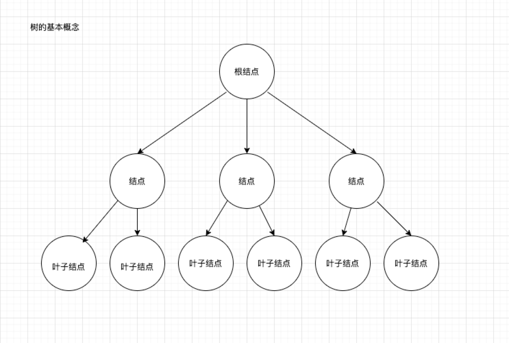
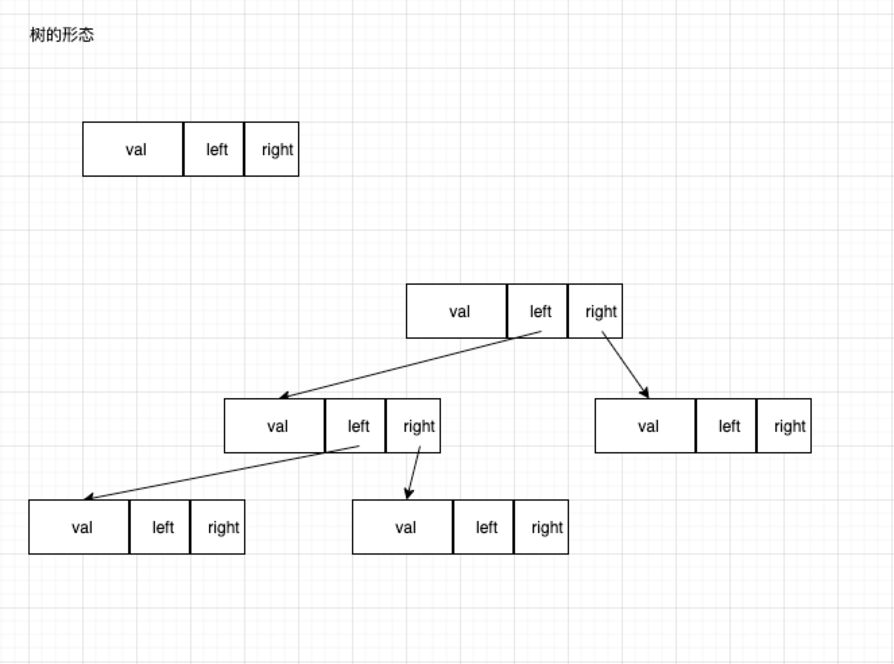
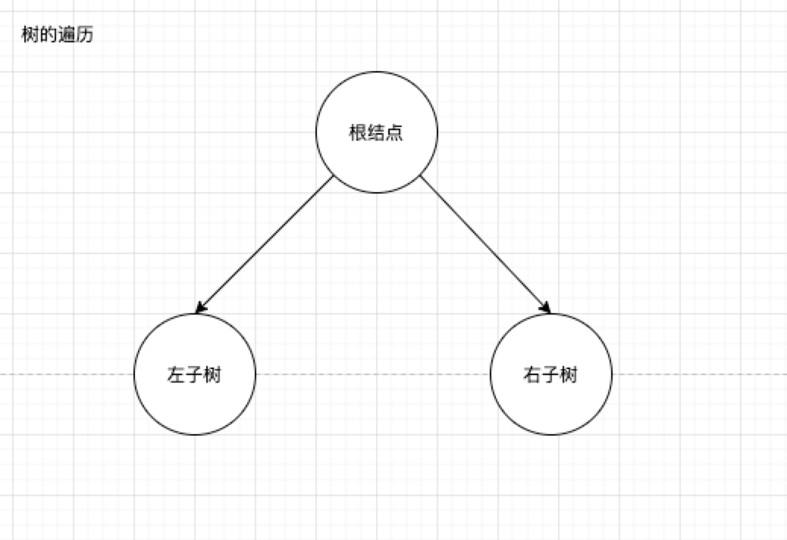
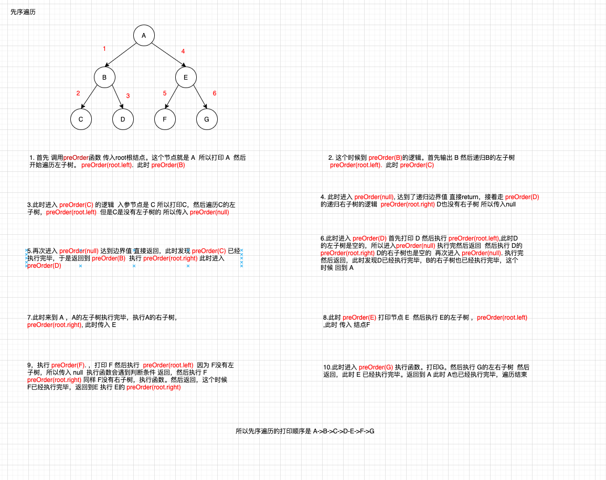
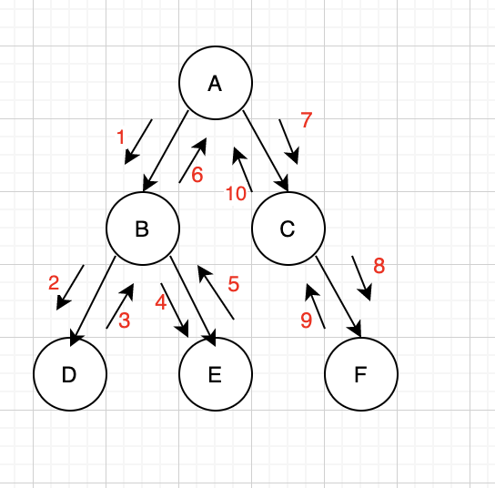
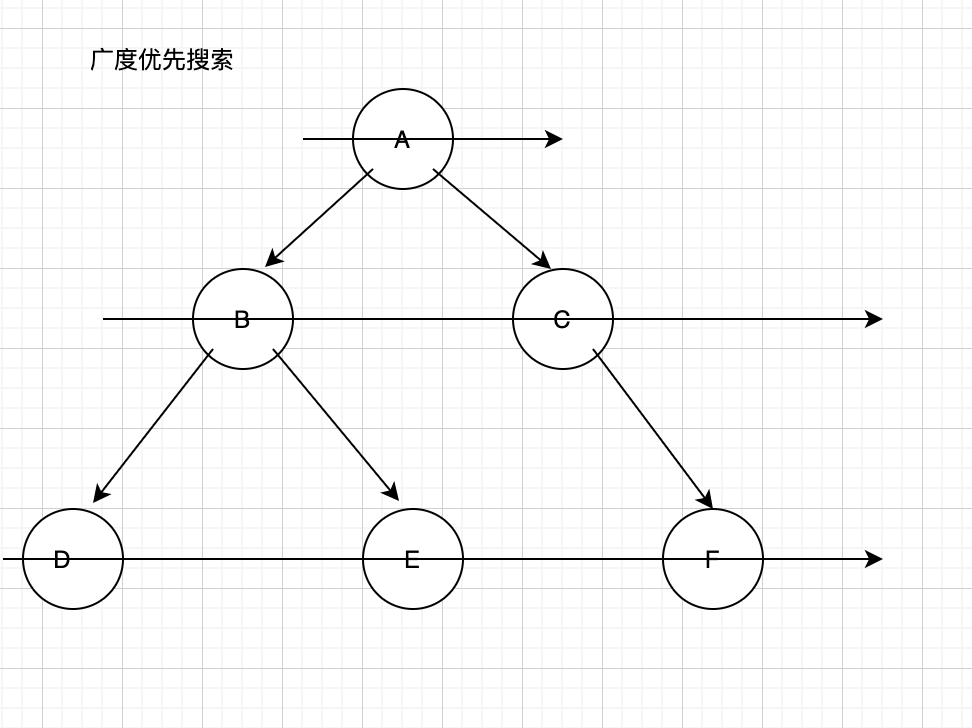

## 树的基本概念



树的几个概念

- 树的层次计算规则：根结点所在的那一层记为第一层 其子结点所在的第二层 以此类推
- 结点和树的高度计算规则：叶子结点高度记为 1，每向上一层 高度 +1 一直累加到目标结点，此时的值就是目标结点的高度，树中结点最大高度成为树的高度
- “度的概念”：一个结点开叉出去多少个子树，被记为结点的度 比如上面的图 根结点的度 是 3 因为有三个子结点
- 叶子结点：叶子结点就是度为 0 的结点，因为叶子结点 没有儿子

二叉树的概念

- 二叉树可以没有根结点 作为一颗空树
- 如果不是空树，那么必须有根结点 左子树 和 右子树

在 js 中 树使用对象来定义，一共有三块

- 数据域
- 左侧子结点的引用
- 右侧子结点的引用

树的构造函数

```js
function TreeNode(val) {
  this.val = val;
  this.left = this.right = null;
}
```

所以一颗树大体样式应该是这样的 见下图


## 二叉树的遍历

二叉树的遍历有四种，分别是

- 先序遍历(递归遍历)
- 中序遍历(递归遍历)
- 后续遍历(递归遍历)
- 层次遍历(迭代遍历)

我们先来看一个最简单的树的遍历



这样一颗树的遍历有三种

- 根结点 -> 左子树 -> 右子树 （先序）
- 左子树 -> 根结点 -> 右子树 （中序）
- 左子树 -> 右子树 -> 根结点 （后序）

先序中序后序 其实指的就是根结点的时机

看一下先序遍历函数的代码

```js
// 入参是树的根结点
function preOrder(root) {
  // 递归边界值判断
  if (!root) {
    return;
  }
  console.log(root.val, "当前节点的值");
  // 递归遍历左子树
  preOrder(root.left);

  // 递归遍历右子树
  preOrder(root.right);
}
```

图解先序遍历过程 帮助理解



看一下中序遍历的代码

```js
// 所有遍历函数的入参都是树的根结点对象
function inOrder(root) {
  // 递归边界，root 为空
  if (!root) {
    return;
  }

  // 递归遍历左子树
  inOrder(root.left);
  // 输出当前遍历的结点值
  console.log("当前遍历的结点值是：", root.val);
  // 递归遍历右子树
  inOrder(root.right);
}
```

图解省略 可以自己根据先序的 自己分析

看一下后序遍历的代码

```js
    function postOrder(root) {
    // 递归边界，root 为空
    if(!root) {
        return
    }

    // 递归遍历左子树
    postOrder(root.left)
    // 递归遍历右子树
    postOrder(root.right)
    // 输出当前遍历的结点值
    console.log('当前遍历的结点值是：', root.val)
}
}
```

## DFS 和 BFS

## DFS

DFS 也叫深度优先搜索，所谓深度优先搜索 其实就是穷举 把所有的可能都走一遍
DFS 和 二叉树的遍历



分析一下图中二叉树的先序遍历

从 A 节点出发，访问左侧的子结点，如果左侧子结点还有左子树，那么依然向下访问，一直到到左子树为空为止，然后返回最近的父节点，访问父节点的右侧节点

```js
// 所有遍历函数的入参都是树的根结点对象
function preorder(root) {
  // 递归边界，root 为空
  if (!root) {
    return;
  }

  // 输出当前遍历的结点值
  console.log("当前遍历的结点值是：", root.val);
  // 递归遍历左子树
  preorder(root.left);
  // 递归遍历右子树
  preorder(root.right);
}
```

在这个递归函数中，递归式用来先后遍历左子树、右子树,递归边界在识别到结点为空时会直接返回,  
二叉树的先序遍历正是深度优先搜索思想的递归实现。可以说深度优先搜索过程就类似于树的先序遍历、是树的先序遍历的推广。

### BFS

BFS 也叫广度优先搜索，与深度优先搜索不同的是 广度优先搜索 只关心自己当前所看的元素 当遍历如下图 A 节点时，此时只能看到 B 和 C 左右子结点
所以会遍历 B 和 C 节点，每次遍历 广度优先搜索 都会把当前视图内元素都遍历完 才进行下一步，一层一层的扫描



看一下 二叉树用 BFS 遍历的伪代码

```js
function bfs(root) {
  // 初始化队列
  let queue = [];
  queue.push(root);
  while (queue.length) {
    let top = queue[0]; // 取出队头元素
    console.log(top.val); // 打印队头元素
    // 如果左子树存在 则左子树入队
    if (top.left) {
      queue.push(top.left);
    }
    // 如果右子树存在则右子树入队
    if (top.right) {
      queue.push(top.right);
    }
    queue.shift(); // 访问完毕队头元素出对
  }
}
```

## 迭代实现二叉树的先中后三种遍历

先看先序遍历

看到一道 leetcode 的实战题目

给定一个二叉树，返回它的前序（先序）遍历序列。

输入: [1,null,2,3]
输出: [1,2,3]
进阶: 递归算法很简单，你可以通过迭代算法完成吗？

分析：这题用递归是很简单的，所以我们用迭代来实现，由此引出迭代算法

先序遍历的规则是 先遍历根结点 再遍历左结点 再遍历 右节点

## 二叉树的中序遍历

给定一个二叉树的根节点 root ，返回 它的 中序 遍历 。

输入：root = [1,null,2,3]
输出：[1,3,2]

递归是比较简单的一种方式，基本上学习过树的一些概念 都可以想到

```js
function inorderTraversal(root: TreeNode | null): number[] {
  let res = [];
  const dfs = (root) => {
    if (!root) return;
    dfs(root.left);
    res.push(root.val);
    dfs(root.right);
  };
  dfs(root);
  return res;
}
```

迭代：

维护一个栈，遇到左子树就放入栈中，直到左子树为空 然后出栈 放入数组

```js
function inorderTraversal(root: TreeNode | null): number[] {
  let res = [];
  let stack = [];
  while (stack.length || root) {
    while (root) {
      stack.push(root);
      root = root.left;
    }
    let node = stack.pop();
    res.push(node.val);
    root = node.right;
  }
  return res;
}
```

如果不理解 可以看官方的动图
[官方图解](https://leetcode.cn/problems/binary-tree-inorder-traversal/solution/er-cha-shu-de-zhong-xu-bian-li-by-leetcode-solutio/)
