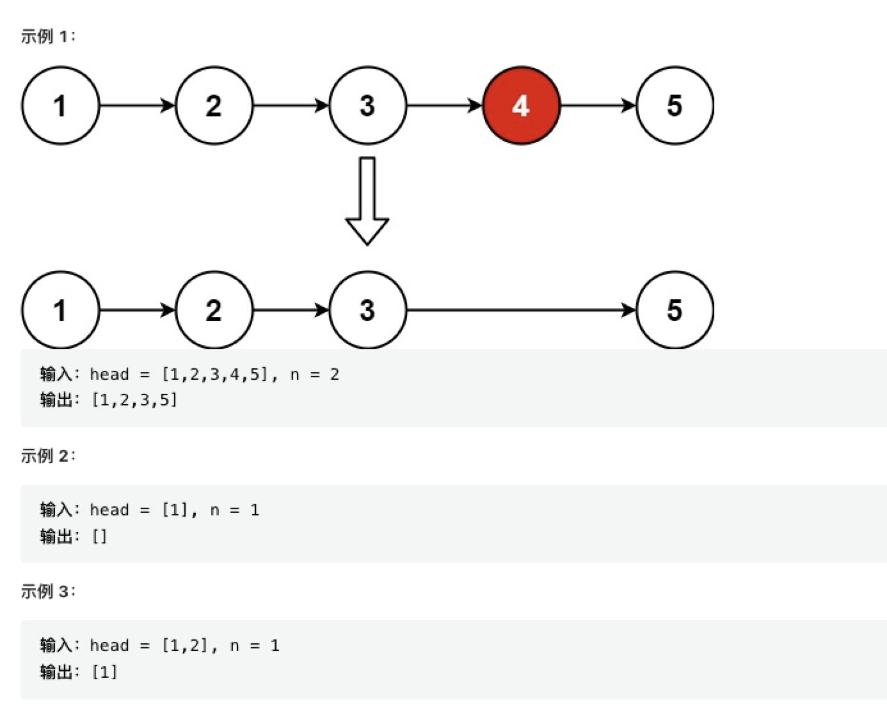

## 链表基础知识

链表和数组相似，他们都是有序的列表，都是线性结构（有且仅有一个前驱，有且仅有一个后驱） 不同点在于 在链表中 数据单位的名称成为“结点”，结点之间的分布，在内存中可以是离散的

看一下 数组的元素分布示意图


数组在内存中最为关键的一个特征，他是一段连续的内存空间，元素之间紧紧相连，二链表中的结点 则允许散落在内存空间的各个 2 角落

看一下链表的中的元素分布示意图


因为数组中的元素是连续的，每个元素的内存地址可以根据索引距离头部的距离计算出来，所以每个元素可以通过数组的索引下标获取到

但是对链表来说 元素和元素之间看起来没有联系，于是就创造了关联 ，每个结点包含了数据域和指针域 在 js 中链表是以嵌套对象的形式来实现的

```
{
  // 数据域
  val:1,
  // 指针域
  next:{
    val:2,
    next:{}
  }

}
```

数据域存储当前结点点数据值，而指针域则代表下一个结点的引用,有了 next 指针记录结点的引用，每个结点至少都知道下一个结点是什么，原本独立的结点之间就有了联系（看图）


看一下简化后的链表图


链表结点的创建 需要一个构造函数

```js
function ListNode(val) {
  this.val = val;
  this.next = null;
}
```

创建一个简单的链表 1->2

```js
const node = new ListNode(1);
node.next = new ListNode(2);
```

### 链表的增删改查

链表的增加和删除都是通过改变 next 的指向来完成的

- 链表元素的添加

如果在链表最后的结点添加 那我们直接把 链表最后一项的 next 指向新增的结点即可，
那我们来详细说一下另一种添加 插入。在两个结点中插入另一个结点


把 1 指向的结点 2 改成指向 3 3 指向 2 结点 这样 就成功插入了
看下伪代码

```js
// 如果目标结点本来不存在，那么记得手动创建
const node3 = new ListNode(3);
// 把node3的 next 指针指向 node2（即 node1.next）
node3.next = node1.next;
// 把node1的 next 指针指向 node3
node1.next = node3;
```

- 链表的删除

链表的删除也是使用非常对的操作，
怎么才算删除这个元素呢 就是在遍历的时候 无法遍历到这个结点 那么这个元素就被删除了，（会被 js 自动回收）

看个例子 刚刚插入到结点 如何删除呢 其实很简单 把 1 的指向 重新指向 2 即可


伪代码

```js
node1.next = node3.next;
// node3.next === {val:2,next:{null}}
```

从链表的结构来看 如果我们想要查找一个元素 必须从头开始遍历 一直查找到目标结点。

链表的插入/删除效率较高，而访问效率较低；数组的访问效率较高，而插入效率较低

## 删除排序链表中的重复元素 II（中等）

存在一个按升序排列的链表，给你这个链表的头节点 head ，请你删除链表中所有存在数字重复情况的节点，只保留原始链表中   没有重复出现   的数字。

返回同样按升序排列的结果链表。

输入：head = [1,2,3,3,4,4,5]
输出：[1,2,5]

开始有想到 一次遍历然后判断相等的数删除掉（因为是排序的） 但是代码实现不知道怎么写，（还是要多练），于是看了官方题解，感觉还是比较容易理解，具体分析 写在代码注释中

```js
/**
 * Definition for singly-linked list.
 * function ListNode(val, next) {
 *     this.val = (val===undefined ? 0 : val)
 *     this.next = (next===undefined ? null : next)
 * }
 */
/**
 * @param {ListNode} head
 * @return {ListNode}
 */
var deleteDuplicates = function (head) {
  if (!head) return head;
  let dy = new ListNode(0, head); //  创建一个新的表头元素，避免从表头开始就重复，产生错误
  let cu = dy;
  while (cu.next && cu.next.next) {
    // 如果下一个数和下下个数有值则继续循环，否则结束
    if (cu.next.val === cu.next.next.val) {
      // 判断下一个数和下下个数的值是否相等
      const x = cu.next.val;
      while (cu.next && cu.next.val === x) {
        cu.next = cu.next.next; // 这一步相当于删除操作，如果数值一直相同，那么链表的指向一直向下直到不同的数为止
      }
    } else {
      // 数值不同，正常指向下一个数值
      cu = cu.next;
    }
  }
  return dy.next;
};
```

次数（1）

## 反转链表（简单题）

输入: 1->2->3->4->5->NULL
输出: 5->4->3->2->1->NULL

题目很好理解，反转链表，虽然时简单题目，但是链表还是不熟练，理解上花费了一些时间
解法实际上使用的双指针的解法（应该再双指针的列表下的）

```js
/**
 * Definition for singly-linked list.
 * function ListNode(val, next) {
 *     this.val = (val===undefined ? 0 : val)
 *     this.next = (next===undefined ? null : next)
 * }
 */
/**
 * @param {ListNode} head
 * @return {ListNode}
 */
var reverseList = function (head) {
  let cur = head;
  let pre = null;
  while (cur) {
    let temp = cur.next;
    cur.next = pre;
    pre = cur;
    cur = temp;
  }
  return pre;
};
```

搭配动态图片理解可能更容易一点 图片来源 leetcode 评论区


次数（1）

## 相交链表

给你两个单链表的头节点 headA 和 headB ，请你找出并返回两个单链表相交的起始节点。如果两个链表不存在相交节点，返回 null 。

示例：

```
输入：intersectVal = 8, listA = [4,1,8,4,5], listB = [5,6,1,8,4,5], skipA = 2, skipB = 3
输出：Intersected at '8'
解释：相交节点的值为 8 （注意，如果两个链表相交则不能为 0）。
从各自的表头开始算起，链表 A 为 [4,1,8,4,5]，链表 B 为 [5,6,1,8,4,5]。
在 A 中，相交节点前有 2 个节点；在 B 中，相交节点前有 3 个节点。
```

分析：给两个链表 找到第一个相交 的点就返回 没有就返回 null 比较好理解

```Ts
/**
 * Definition for singly-linked list.
 * class ListNode {
 *     val: number
 *     next: ListNode | null
 *     constructor(val?: number, next?: ListNode | null) {
 *         this.val = (val===undefined ? 0 : val)
 *         this.next = (next===undefined ? null : next)
 *     }
 * }
 */

function getIntersectionNode(headA: ListNode | null, headB: ListNode | null): ListNode | null {
     if(headA === null || headB === null) return null
     // 创建一个集合  然后遍历把第一个链表的值全部放入
     let data = new Set()
     while(headA !== null){
         data.add(headA)
         headA = headA.next
     }
     let temp = headB
     // 遍历第二个链表 在集合中查找 如果有相同的值 则立即返回
     while(temp !==null){
         if(data.has(temp)){
             return temp
         }
         temp = temp.next
     }
     return null
};
```

## 删除链表的倒数第 N 个结点

给你一个链表，删除链表的倒数第 n 个结点，并且返回链表的头结点。



分析：首先比较容易想到的就是 先循环遍历一次 记录链表的长度 再循环一次 找到对应倒数的位置 删除即可 但是这种要循环两次

快慢指针效率要高一点，定义两个指针 把链表赋值给指针 首先循环其中一个 s 指针 N 次 记录此时指针指向的位置，然后两个一起循环 直到开始循环的的 s.next
则跳出
把对应 e 指针的 next 指向改为 next.next

看图加深理解


```js
/**
 * Definition for singly-linked list.
 * class ListNode {
 *     val: number
 *     next: ListNode | null
 *     constructor(val?: number, next?: ListNode | null) {
 *         this.val = (val===undefined ? 0 : val)
 *         this.next = (next===undefined ? null : next)
 *     }
 * }
 */

function removeNthFromEnd(head: ListNode | null, n: number): ListNode | null {
  let pre = new ListNode(0);
  pre.next = head;
  let s = pre,
    e = pre;
  while (n > 0) {
    s = s.next;
    --n;
  }
  while (s.next !== null) {
    s = s.next;
    e = e.next;
  }
  e.next = e.next.next;
  return pre.next;
}
```
