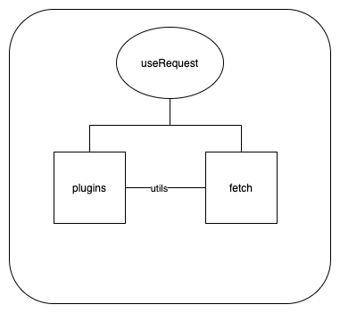

ahooks 是阿里开源的常用 hooks 的封装，也是基于业务做的封装处理，从一些常用的 hooks 分析源码
应该会有一些收获

## useMemoizedFn

这是一个持久化 function 的 hook

```js
function useMemoizedFn<T extends noop>(fn: T) {

  const fnRef = useRef<T>(fn);
  // why not write `fnRef.current = fn`?
  // https://github.com/alibaba/hooks/issues/728 https://github.com/alibaba/hooks/issues/1347
  fnRef.current = useMemo(() => fn, [fn]); // 这行代码确实是无意义的，但是可以避免在 devtool 模式下的异常行为。
  const memoizedFn = useRef<PickFunction<T>>();
  // 缓存函数 后面再次触发 因为 current 有值 所以不会触发判断
  if (!memoizedFn.current) {
    memoizedFn.current = function (this, ...args) {
      return fnRef.current.apply(this, args);
    };
  }

  return memoizedFn.current as T;
}
```

可以查看 demo 并且代码会有一些相关的注释

## useToggle

这是一个维持两个状态切换的 hooks 其实没什么复杂的逻辑 值得一提的是 用到了 TS 的重载 这个在平时写代码用到的还是比较少的

```js
import { useMemo, useState } from 'react';

export interface Actions<T> {
  setLeft: () => void;
  setRight: () => void;
  set: (value: T) => void;
  toggle: () => void;
}

function useToggle<T = boolean>(): [boolean, Actions<T>]; // 当不传默认值当时候 默认是布尔值

function useToggle<T>(defaultValue: T): [T, Actions<T>]; // 传一个默认值

function useToggle<T, U>(defaultValue: T, reverseValue: U): [T | U, Actions<T | U>]; // 传两个值

function useToggle<D, R>(defaultValue: D = false as unknown as D, reverseValue?: R) {
  const [state, setState] = useState<D | R>(defaultValue); // defaultValue 第一个值 reverseValue 第二个值

  const actions = useMemo(() => {
    const reverseValueOrigin = (reverseValue === undefined ? !defaultValue : reverseValue) as D | R;

    const toggle = () => setState((s) => (s === defaultValue ? reverseValueOrigin : defaultValue));
    const set = (value: D | R) => setState(value);
    const setLeft = () => setState(defaultValue);
    const setRight = () => setState(reverseValueOrigin);

    return {
      toggle,
      set,
      setLeft,
      setRight,
    };
    // useToggle ignore value change
    // }, [defaultValue, reverseValue]);
  }, []);

  return [state, actions];
}

export default useToggle;
// 重载 简单的解释就是定义函数的所有的出入参 然后再加一个函数的执行逻辑
```

应用场景 例如 开关 或者 需要保持两个状态来回切换

## useLatest

返回 hook 最新的值 避免闭包问题

```js
import { useRef } from "react";

function useLatest<T>(value: T) {
  const ref = useRef(value);
  ref.current = value;

  return ref;
}

export default useLatest;
```

具体可以查看对应 demo

先简单说下为什么会有闭包问题吧

为了维护 Function Component 的 state，React 用链表的方式来存储 Function Component 里面的 hooks，并为每一个 hooks 创建了一个对象。

```js
type Hook = {
  memoizedState: any,
  baseState: any,
  baseUpdate: Update<any, any> | null,
  queue: UpdateQueue<any, any> | null,
  next: Hook | null,
};
```

这个对象的 memoizedState 属性就是用来存储组件上一次更新后的 state，next 指向下一个 hook 对象。在组件更新的过程中，hooks 函数执行的顺序是不变的，就可以根据这个链表拿到当前 hooks 对应的 Hook 对象，函数式组件就是这样拥有了 state 的能力。
同时制定了一系列的规则，比如不能将 hooks 写入到 if...else... 中。从而保证能够正确拿到相应 hook 的 state。
useEffect 接收了两个参数，一个回调函数和一个数组。数组里面就是 useEffect 的依赖，当为 [] 的时候，回调函数只会在组件第一次渲染的时候执行一次。如果有依赖其他项，react 会判断其依赖是否改变，如果改变了就会执行回调函数。

因为 demo 中没有添加依赖函数 所以只会执行一次 因为 number 在定时器中被引用了 所以形成了闭包 那么以后每次取到的 number 都是 0

分析一下 为什么用 useRef 包裹之后 就不会有闭包问题了呢？

使用 useRef。
useRef 返回一个可变的 ref 对象，其 .current 属性被初始化为传入的参数（initialValue）。
useRef 创建的是一个普通 Javascript 对象，而且会在每次渲染时返回同一个 ref 对象，当我们变化它的 current 属性的时候，对象的引用都是同一个，所以定时器中能够读到最新的值。

所以 useLatest 使用 useRef 只用了简短的几行代码就避免了闭包问题

## useRequest

useRequest 可以说是 ahooks 里最复杂的一个 hook



useRequest 主要是由插件和一个 fetch 类所组成的

核心的功能都在 fetch 中，插件实现各种单一的功能 比如 防抖节流 缓存 重试等等

从入口开始 首先 useRequest 接收一些参数，然后把参数以及一些插件都传给了 useRequestImplement 函数

useRequestImplement 主要是创建了 fetch 实例 然后执行实例 run 函数

核心代码

```js
const fetchInstance = useCreation(() => {
    const initState = plugins.map((p) => p?.onInit?.(fetchOptions)).filter(Boolean);
    // 创建实例
    return new Fetch<TData, TParams>(
      serviceRef,
      fetchOptions,
      update,
      Object.assign({}, ...initState),
    );
  }, []);
  fetchInstance.options = fetchOptions;
  // run all plugins hooks
  fetchInstance.pluginImpls = plugins.map((p) => p(fetchInstance, fetchOptions));

  useMount(() => {
    if (!manual) {
      // useCachePlugin can set fetchInstance.state.params from cache when init
      const params = fetchInstance.state.params || options.defaultParams || [];
      // @ts-ignore
      fetchInstance.run(...params);
    }
  });

  useUnmount(() => {
    fetchInstance.cancel();
  });
```

看下 fetch 主要做了什么

以下是一些简化代码 主要是描述整个流程的实现，不会过多关注细节

调用 run 函数 然后 run 函数调用了 runAsync 基本上所有的逻辑都在 runAsync 中

我们可以看到代码中 执行 runPluginHandler ，这个其实就是在执行插件的逻辑，首先会遍历所有的插件 然后执行插件中包含 传入关键字的函数 这个时候会返回一些参数

this.options.关键函数 是执行从 useRequest 中传入的函数

然后依次执行所有的逻辑函数 其实 fetch 就主要干了这些事情 调用插件方法 在对应的节点调用对应的生命周期函数

```js
/* eslint-disable @typescript-eslint/no-parameter-properties */
import { isFunction } from '../../utils';
import type { MutableRefObject } from 'react';
import type { FetchState, Options, PluginReturn, Service, Subscribe } from './types';

export default class Fetch<TData, TParams extends any[]> {
  pluginImpls: PluginReturn<TData, TParams>[];

  count: number = 0;

  state: FetchState<TData, TParams> = {
    loading: false,
    params: undefined,
    data: undefined,
    error: undefined,
  };

  constructor(
    public serviceRef: MutableRefObject<Service<TData, TParams>>,
    public options: Options<TData, TParams>,
    public subscribe: Subscribe,
    public initState: Partial<FetchState<TData, TParams>> = {},
  ) {
    this.state = {
      ...this.state,
      loading: !options.manual,
      ...initState,
    };
  }

  setState(s: Partial<FetchState<TData, TParams>> = {}) {
    this.state = {
      ...this.state,
      ...s,
    };
    this.subscribe();
  }

  runPluginHandler(event: keyof PluginReturn<TData, TParams>, ...rest: any[]) {
    // @ts-ignore
    const r = this.pluginImpls.map((i) => i[event]?.(...rest)).filter(Boolean);
    return Object.assign({}, ...r);
  }

  async runAsync(...params: TParams): Promise<TData> {
    this.count += 1;
    const currentCount = this.count;

    const {
      stopNow = false,
      returnNow = false,
      ...state
    } = this.runPluginHandler('onBefore', params);
    this.setState({
      loading: true,
      params,
      ...state,
    });
    this.options.onBefore?.(params);

    try {

      let { servicePromise } = this.runPluginHandler('onRequest', this.serviceRef.current, params);
      const res = await servicePromise;
      this.setState({
        data: res,
        error: undefined,
        loading: false,
      });

      this.options.onSuccess?.(res, params);
      this.runPluginHandler('onSuccess', res, params);

      this.options.onFinally?.(params, res, undefined);

      if (currentCount === this.count) {
        this.runPluginHandler('onFinally', params, res, undefined);
      }

      return res;
    } catch (error) {
      if (currentCount !== this.count) {
        // prevent run.then when request is canceled
        return new Promise(() => {});
      }

      this.setState({
        error,
        loading: false,
      });

      this.options.onError?.(error, params);
      this.runPluginHandler('onError', error, params);

      this.options.onFinally?.(params, undefined, error);

      if (currentCount === this.count) {
        this.runPluginHandler('onFinally', params, undefined, error);
      }

      throw error;
    }
  }

  run(...params: TParams) {
    this.runAsync(...params).catch((error) => {
      if (!this.options.onError) {
        console.error(error);
      }
    });
  }

  cancel() {
    this.count += 1;
    this.setState({
      loading: false,
    });

    this.runPluginHandler('onCancel');
  }

  refresh() {
    // @ts-ignore
    this.run(...(this.state.params || []));
  }

  refreshAsync() {
    // @ts-ignore
    return this.runAsync(...(this.state.params || []));
  }

  mutate(data?: TData | ((oldData?: TData) => TData | undefined)) {
  }
}
```

plugin 其实插件逻辑都一样 按照既定规则实现自己想要的功能

比如说 重试

返回一个对象 包含一些生命周期函数 在触发报错的时候 设置一个定时器去执行 在 onBefore 清除定时器 等等逻辑

```js
import { useRef } from 'react';
import type { Plugin, Timeout } from '../types';

const useRetryPlugin: Plugin<any, any[]> = (fetchInstance, { retryInterval, retryCount }) => {
  const timerRef = useRef<Timeout>();
  const countRef = useRef(0);

  const triggerByRetry = useRef(false);

  if (!retryCount) {
    return {};
  }

  return {
    onBefore: () => {
      if (!triggerByRetry.current) {
        countRef.current = 0;
      }
      triggerByRetry.current = false;

      if (timerRef.current) {
        clearTimeout(timerRef.current);
      }
    },
    onSuccess: () => {
      countRef.current = 0;
    },
    onError: () => {
      countRef.current += 1;
      if (retryCount === -1 || countRef.current <= retryCount) {
        // Exponential backoff
        const timeout = retryInterval ?? Math.min(1000 * 2 ** countRef.current, 30000);
        timerRef.current = setTimeout(() => {
          triggerByRetry.current = true;
          fetchInstance.refresh();
        }, timeout);
      } else {
        countRef.current = 0;
      }
    },
    onCancel: () => {
      countRef.current = 0;
      if (timerRef.current) {
        clearTimeout(timerRef.current);
      }
    },
  };
};

export default useRetryPlugin;

```

其实这个 hooks 就很符合职责单一模式 fetch 只做一件事情 执行插件的生命周期函数
所有的业务功能全部独立出去 每一个插件实现各自的功能 相互解耦 职责越单一 可复用性越好 维护也更加方便

如果我们设计一个 hook 使用模块较多，尽量设计的简单易于上手，把一些复杂相关功能封装到内部去 同时还要保留一些入口方便后续一些功能的添加
