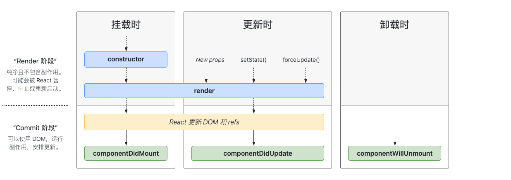
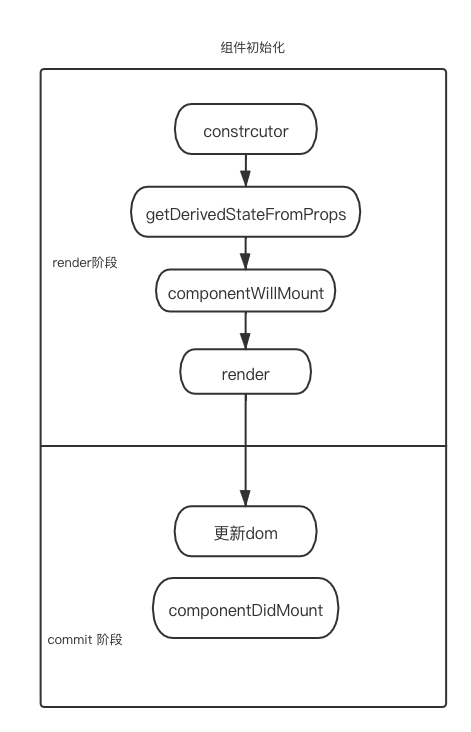
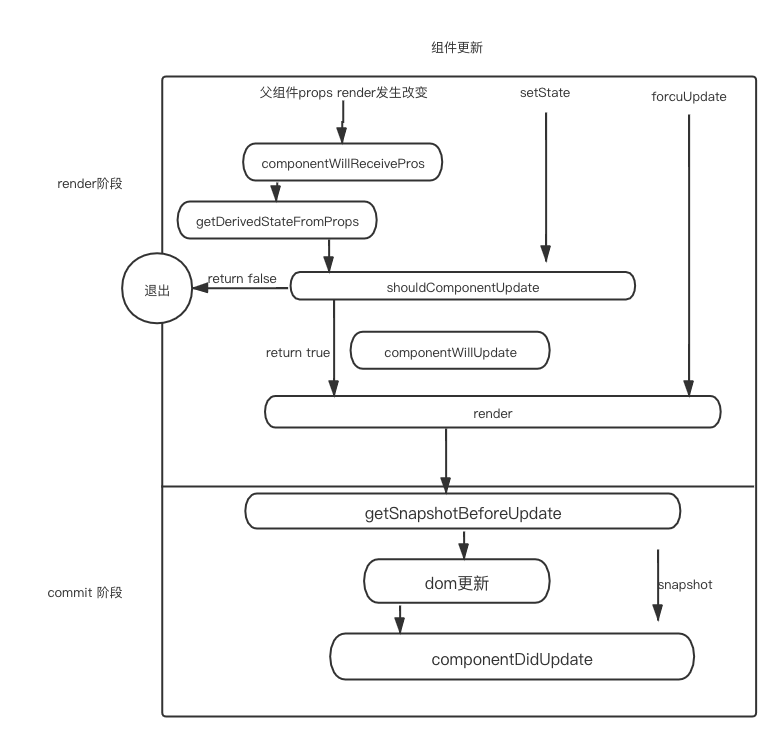

先概览一下 react 的生命周期


react 生命周期主要有两个重要的阶段 render 阶段和 commit 阶段

## 类组件生命周期初始化阶段

1.constructor 执行

constructor 执行是在类组件创建实例时调用，而且初始化的执行一次，如果不需要初始化 state 或者不尽兴方法绑定，那么不需要为组件实现构造函数

主要的作用：

- 初始化 state
- 对类组件的一些事件做处理，比如防抖截流等

  2.getDerivedStateFromProps 执行

getDerivedStateFromProps 是第二个执行的生命周期，并且接收两个参数 props, state，它是作为类的静态属性内部事无法访问 this 的，它会犯浑一个对象更新 state，如果返回 null，则不更新任何内容，这个方法只适用一些特殊的场景，即 state 的值受到 props 的影响

主要的作用：

- 代替 componentWillMount 和 componentWillReceiveProps
- 组件初始化 映射 props 到 state 上

  3.componentWillMount 执行

如果存在 getDerivedStateFromProps 和 getSnapshotBeforeUpdate 就不会执行生命周期 componentWillMount

在 16.3 版本之后，官方已经不建议使用 componentWillMount ，componentWillReceiveProps ， componentWillUpdate 三个生命周期，但是还没有完全废除

4.render 执行

render 函数主要是 jsx 元素被 React.createElement 创建成 React.element 对象的形式，

5.componentDidMount 执行

componentDidMount() 会在组件挂载后（插入 DOM 树中）立即调用。依赖于 DOM 节点的初始化应该放在这里。如需通过网络请求获取数据，此处是实例化请求的好地方

主要作用：

- 可以操作 DOM 或者 DOM 的事件监听
- 服务器请求数据，渲染视图

初始化流程图



## 类组件生命周期更细阶段

1.componentWillReceiveProps

首先会判断 getDerivedStateFromProps 是否存在，如果存在那么不会执行 componentWillReceiveProps

2.getDerivedStateFromProps

接收 props 返回新的 state

3.shouldComponentUpdate

性能优化的手段之一，根据 shouldComponentUpdate() 的返回值，判断 React 组件的输出是否受当前 state 或 props 更改的影响。默认行为是 state 每次发生变化组件都会重新渲染。大部分情况下，你应该遵循默认行为。接收两个参数`shouldComponentUpdate(nextProps, nextState)`
根据返回值判断是否 执行 render 函数

4.componentWillUpdate
不建议使用，初始化不渲染，只有接收新的 props 或者 state，才会触发渲染
5.render
6.getSnapshotBeforeUpdate

getSnapshotBeforeUpdate() 在最近一次渲染输出（提交到 DOM 节点）之前调用。它使得组件能在发生更改之前从 DOM 中捕获一些信息（例如，滚动位置）。此生命周期方法的任何返回值将作为参数传递给 componentDidUpdate()。
getSnapshotBeforeUpdate 是发生在 commit 阶段，commit 阶段还可以分为三个阶段 before Mutation（dom 修改前） Mutation（修改中）Layout（修改后），
而 getSnapshotBeforeUpdate 是发生在修改前

7.componentDidUpdate

componentDidUpdate() 会在更新后会被立即调用。首次渲染不会执行此方法。

主要作用：

- componentDidUpdate 生命周期执行，此时 DOM 已经更新，可以直接获取 DOM 最新状态。这个函数里面如果想要使用 setState ，一定要加以限制，否则会引起无限循环。
- 接受 getSnapshotBeforeUpdate 保存的快照信息。

组件更新流程图



## 类组件销毁阶段生命周期

销毁阶段生命周期就比较简单

componentWillUnmount

直接在 commit 阶段执行钩子函数

## 函数组件生命周期

函数组件开始试没有自己的状态和生命周期，后面加入了 hook 才让函数组件有了自己的状态和生命周期
主要有两个`useEffect`和`useLayoutEffect`

1.useEffect

```js
useEffect(() => {
  return destory;
}, dep);
```

useEffect 第一个参数是一个函数，返回一个函数，返回的函数用于清除 useEffect 的副作用，例如 setTimeout 和监听事件，第三项是一个数组，数组里面可以放入依赖项，如果依赖项发生改变，那么就会执行函数，如果数组为空，那么只会在初始化的时候执行一次，后面不会在执行，如果没有加入第三个参数，那么每次更新函数都会执行函数

useEffect 执行， React 处理逻辑是采用异步调用

2.useLayoutEffect

useLayoutEffect 和 useEffect 不同的地方是采用了同步执行

useLayoutEffect 是在 DOM 绘制之前之前执行，这样可以方便修改 dom

useLayoutEffect 函数 中代码执行会阻塞浏览器绘制。

修改 DOM ，改变布局就用 useLayoutEffect ，其他情况就用 useEffect 。

## useEffect 回调函数 和 componentDidMount / componentDidUpdate 执行时机有什么区别

useEffect 对 React 执行栈来看是异步执行的，而 componentDidMount / componentDidUpdate 是同步执行的，useEffect 代码不会阻塞浏览器绘制。在时机上 ，componentDidMount / componentDidUpdate 和 useLayoutEffect 更类似。
