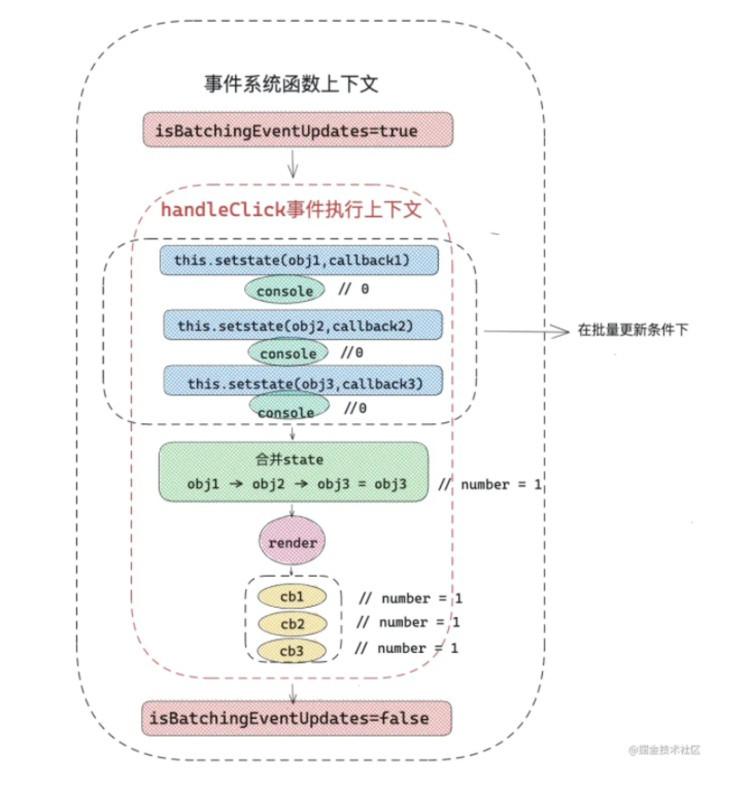
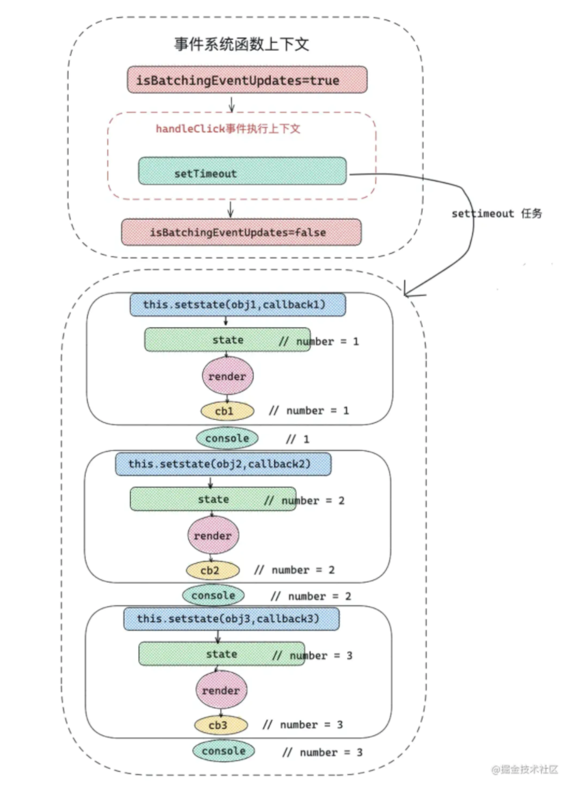

state 是同步还是异步？

## 类组件中的 state

基本用法

```js
setState(obj, callback);
```

当 obj 为对象时，则为即将合并的 state，如果 obj 是一个函数，那么当前组件的 state 和 props 为参数，返回值合并新的 state
callback 为一个函数，可以获取更新后的 state

```js
/* 第一个参数为function类型 */
this.setState((state, props) => {
  return { number: 1 };
});
/* 第一个参数为object类型 */
this.setState({ number: 1 }, () => {
  console.log(this.state.number); //获取最新的number
});
```

那么一次触发 setState 的流程是：触发 setState -> 合并 state 执行 render -> 替换真实 dom（commit 阶段）-> 执行 callback 函数

类组件中的

- 函数组件（pureComponent）是对 state 和 props 进行浅比较，如果没有变化则不更新
- 通过生命周期 shouldComponentUpdate 判断前后 state 的变化决定组件是否更新

### 看个例子加深 setState

```js
class App extends React.Component {
  state = {
    number: 0,
  };
  hand = () => {
    this.setState({ number: this.state.number + 1 }, () => {
      console.log("callback1", this.state.number);
    });
    console.log(this.state.number);
    this.setState({ number: this.state.number + 1 }, () => {
      console.log("callback2", this.state.number);
    });
    console.log(this.state.number);
    this.setState({ number: this.state.number + 1 }, () => {
      console.log("callback3", this.state.number);
    });
    console.log(this.state.number);
  };
  render() {
    return <div onClick={this.hand}>这是一个按钮</div>;
  }
}
```

打印结果 ：
0 0 0 callback1 1 callback2 1 callback3 1

为什么结果是相同的呢？
因为 React 事件执行之前会开启批量更新，然后结束的时候会关闭批量更新

看一下流程图 (图片来源 React 进阶指南)


但是这个批量更新的规则在异步操作会被打破



React 也给我们提供了异步环境下也批量更新的方法

```js
import ReactDOM from "react-dom";
const { unstable_batchedUpdates } = ReactDOM;
setTimeout(() => {
  unstable_batchedUpdates(() => {
    this.setState({ number: this.state.number + 1 });
    console.log(this.state.number);
    this.setState({ number: this.state.number + 1 });
    console.log(this.state.number);
    this.setState({ number: this.state.number + 1 });
    console.log(this.state.number);
  });
});
```

React 还提供了一个方法可以 提升 setState 的优先级

```js
handerClick = () => {
  setTimeout(() => {
    this.setState({ number: 1 });
  });
  this.setState({ number: 2 });
  ReactDOM.flushSync(() => {
    this.setState({ number: 3 });
  });
  this.setState({ number: 4 });
};
```

2 和 3 会批量更新 打印 3 然后 4 最后 1

React 同一级别更新优先级关系是:
flushSync 中的 setState > 正常执行上下文中 setState > setTimeout ，Promise 中的 setState。

## 函数中的 state

useState 的基本用法

```js
[state, dispatch] = useState(initData);
```

state 数据源  
dispatch 更改数据源  
initData 初始值

```js
export default function Index(props) {
  const [number, setNumber] = React.useState(0);
  /* 监听 number 变化 */
  React.useEffect(() => {
    console.log("监听number变化，此时的number是:  " + number);
  }, [number]);
  const handerClick = () => {
    /** 高优先级更新 **/
    ReactDOM.flushSync(() => {
      setNumber(2);
    });
    /* 批量更新 */
    setNumber(1);
    /* 滞后更新 ，批量更新规则被打破 */
    setTimeout(() => {
      setNumber(3);
    });
  };
  console.log(number);
  return (
    <div>
      <span> {number}</span>
      <button onClick={handerClick}>number++</button>
    </div>
  );
}
```

dispatch 更新后，在当前函数内是不能获取到更新后的值

因为：函数组件更新就是函数的执行，在函数一次执行过程中，函数内部所有变量重新声明，所以改变的 state ，只有在下一次函数组件执行时才会被更新。

## 参考文献

- react 官网
- react 进阶指南（小册）
