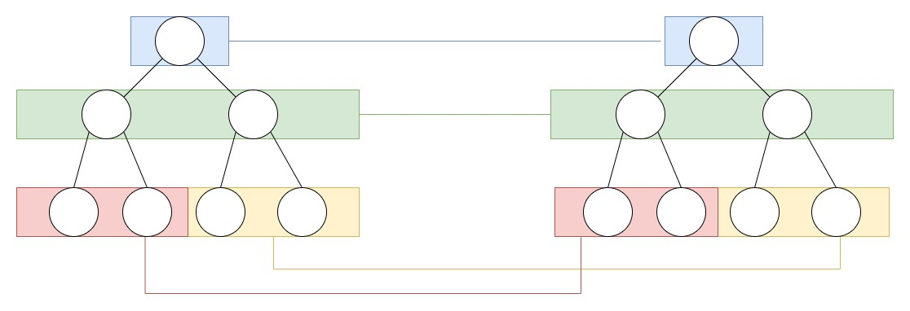
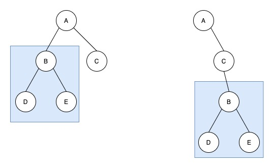
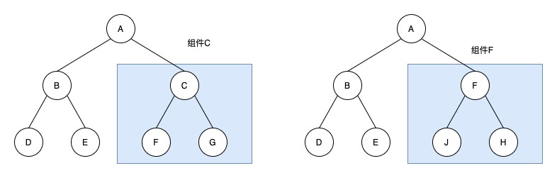

> 在 vue 的篇章了 我们介绍过 vue 的 diff 所以这里我们主要分析 react 的 diff 然后再看两者的不同

## React Diff

当前查看源码版本 18
react 的 diff 主要分为 单节点和多节点

在 react 中 节点复用必须满足 1.同一层级 2. 类型相同 3. key 相同

- 同级比较 不考虑节点的跨层比较
  

- 如果发生了跨层级操作
  
  这种情况 react 是不会复用的而是直接 删除 再重新创建

- 组件 diff
  
  - 如果是同类型组件，首先使用 shouldComponentUpdate()方法判断是否需要进行比较，如果返回 true，继续按照 React diff 策略比较组件的虚拟 DOM 树，否则不需要比较
  - 如果是不同类型的组件，则将该组件判断为 dirty component，从而替换整个组件下的所有子节点

### 单节点

src/react/packages/react-reconciler/src/ReactChildFiber.new.js diff 方法的文件路径

```js
function reconcileChildFibers(
    returnFiber: Fiber,
    currentFirstChild: Fiber | null,
    newChild: any,
    lanes: Lanes,
  ): Fiber | null {

    if (typeof newChild === 'object' && newChild !== null) {
      switch (newChild.$$typeof) {
        case REACT_ELEMENT_TYPE:
            // 单节点 diff
          return placeSingleChild(
            reconcileSingleElement(
              returnFiber,
              currentFirstChild,
              newChild,
              lanes,
            ),
          );
          // 部分代码 入口代码判断是单节点  会走到 reconcileSingleElement函数
```

```js
function reconcileSingleElement(
  returnFiber: Fiber,
  currentFirstChild: Fiber | null,
  element: ReactElement,
  lanes: Lanes
): Fiber {
  const key = element.key;
  let child = currentFirstChild;
  while (child !== null) {
    // 1.先判断key是否相同 相同再进行比较
    if (child.key === key) {
      const elementType = element.type;
      // 2 判断 elementType是不是 REACT_FRAGMENT_TYPE类型
      if (elementType === REACT_FRAGMENT_TYPE) {
        if (child.tag === Fragment) {
          // 因为这个是单节点的 所以如果剩余还有节点 那么就都删除掉
          deleteRemainingChildren(returnFiber, child.sibling);
          // userFiber是复用节点函数
          const existing = useFiber(child, element.props.children);
          existing.return = returnFiber;
          // 返回复用的fiber
          return existing;
        }
      } else {
        if (
          // 判断标签是否相同
          child.elementType === elementType ||
          (typeof elementType === "object" &&
            elementType !== null &&
            elementType.$$typeof === REACT_LAZY_TYPE &&
            resolveLazy(elementType) === child.type)
        ) {
          // 因为这个是单节点的 所以如果剩余还有节点 那么就都删除掉
          deleteRemainingChildren(returnFiber, child.sibling);
          // userFiber是复用节点函数
          const existing = useFiber(child, element.props);
          existing.ref = coerceRef(returnFiber, child, element);
          existing.return = returnFiber;
          // 返回复用的fiber
          return existing;
        }
      }
      // 因为这个是单节点的 所以如果剩余还有节点 那么就都删除掉 可能删除多个节点
      deleteRemainingChildren(returnFiber, child);
      break;
    } else {
      // 如果key不同 那么直接标记为删除 只删除当前单个节点
      deleteChild(returnFiber, child);
    }
    child = child.sibling;
  }

  // 新建fiber 返回
  if (element.type === REACT_FRAGMENT_TYPE) {
    const created = createFiberFromFragment(
      element.props.children,
      returnFiber.mode,
      lanes,
      element.key
    );
    created.return = returnFiber;
    return created;
  } else {
    const created = createFiberFromElement(element, returnFiber.mode, lanes);
    created.ref = coerceRef(returnFiber, currentFirstChild, element);
    created.return = returnFiber;
    return created;
  }
}
```

从代码里可以看出来 当 child ！== null 并且 key 相同才会深一步判断 是否复用 节点

- key 如果不同 直接标记删除 child
- key 相同 首先会判断 elementType === REACT_FRAGMENT_TYPE 这个就是 react 的 fragment 标签 如果相同再比较 tag === Fragment 如果相同则会复用节点 复用函数是 useFiber
- key 相同 如果 elementType !== REACT_FRAGMENT_TYPE 则会判断 child.elementType === elementType 标签是否相同 如果相同 则复用节点否则不复用

```js
//更新前
<div>1</div>
// 更新后
<p>1</p>

//key都是null key相同 标签不相同 不能复用
```

```js
//更新前
<div key="1">1</div>
// 更新后
<div key="2">1</div>

//key不相同 不能复用 后面不再判断
```

```js
//更新前
<div key="1">1</div>
// 更新后
<p key="1">1</p>

//key相同 标签不相同 不能复用
```

```js
//更新前
<div key="1">1</div>
// 更新后
<div key="1">2</div>

//key相同 标签相同 可以复用
```

### 多节点

上面介绍了单一节点的情况 相对还是比较容易理解，下面看看多节 diff 是如何处理的

```js
<ul>
  <li key="1">1</li>
  <li key="2">2</li>
  <li key="3">3</li>
  <li key="4">4</li>
</ul>
```

它的 jsx 对应的 children 属性不是单一节点，而是包含四个对象的数组

```js
{
  $$typeof: Symbol(react.element),
  key: null,
  props: {
    children: [
      {$$typeof: Symbol(react.element), type: "li", key: "1", ref: null, props: {…}, …}
      {$$typeof: Symbol(react.element), type: "li", key: "2", ref: null, props: {…}, …}
      {$$typeof: Symbol(react.element), type: "li", key: "3", ref: null, props: {…}, …}
      {$$typeof: Symbol(react.element), type: "li", key: "4", ref: null, props: {…}, …}
    ]
  },
  ref: null,
  type: "ul"
}
```

这个时候 reconcileChildFibers 会走到 判断多节点

```js
function reconcileChildFibers(
    returnFiber: Fiber,
    currentFirstChild: Fiber | null,
    newChild: any,
    lanes: Lanes,
  ): Fiber | null {

    if (typeof newChild === 'object' && newChild !== null) {
        // ... 忽略部分代码
      if (isArray(newChild)) {
        return reconcileChildrenArray(
          returnFiber,
          currentFirstChild,
          newChild,
          lanes,
        );
      }

          // 部分代码 入口代码判断是单节点  会走到 reconcileSingleElement函数
```
