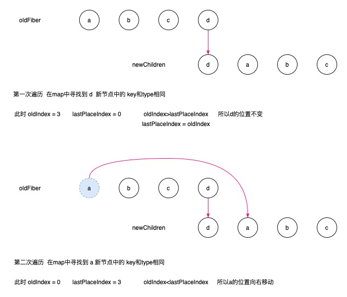
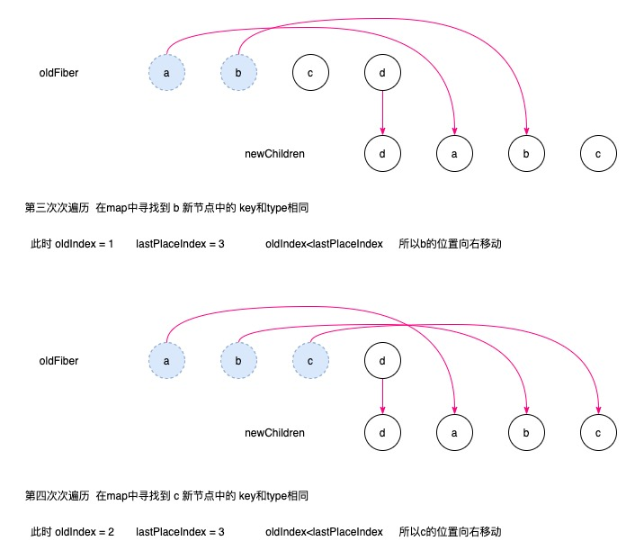
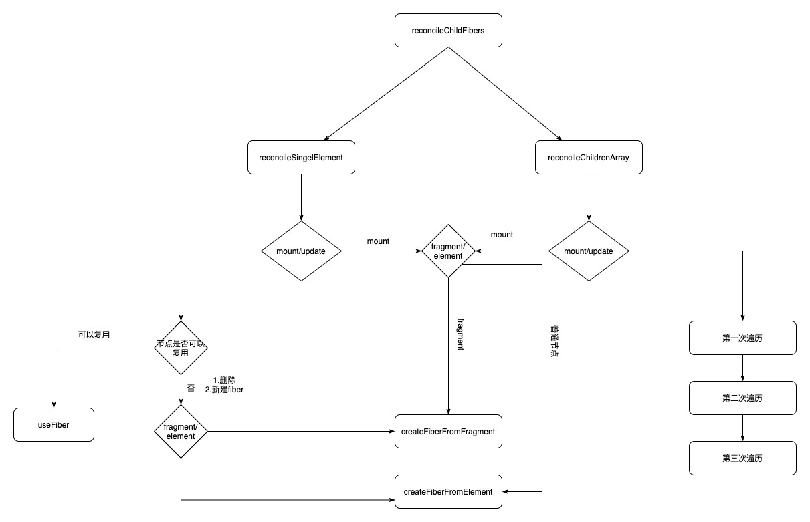

> 在 vue 的篇章了 我们介绍过 vue 的 diff 所以这里我们主要分析 react 的 diff 然后再看两者的不同

## React Diff

当前查看源码版本 18
react 的 diff 主要分为 单节点和多节点

在 react 中 节点复用必须满足 1.同一层级 2. 类型相同 3. key 相同

- 同级比较 不考虑节点的跨层比较
  

- 如果发生了跨层级操作
  
  这种情况 react 是不会复用的而是直接 删除 再重新创建

- 组件 diff
  
  - 如果是同类型组件，首先使用 shouldComponentUpdate()方法判断是否需要进行比较，如果返回 true，继续按照 React diff 策略比较组件的虚拟 DOM 树，否则不需要比较
  - 如果是不同类型的组件，则将该组件判断为 dirty component，从而替换整个组件下的所有子节点

### 单节点

src/react/packages/react-reconciler/src/ReactChildFiber.new.js diff 方法的文件路径

```js
function reconcileChildFibers(
    returnFiber: Fiber,
    currentFirstChild: Fiber | null,
    newChild: any,
    lanes: Lanes,
  ): Fiber | null {

    if (typeof newChild === 'object' && newChild !== null) {
      switch (newChild.$$typeof) {
        case REACT_ELEMENT_TYPE:
            // 单节点 diff
          return placeSingleChild(
            reconcileSingleElement(
              returnFiber,
              currentFirstChild,
              newChild,
              lanes,
            ),
          );
          // 部分代码 入口代码判断是单节点  会走到 reconcileSingleElement函数
```

```js
function reconcileSingleElement(
  returnFiber: Fiber,
  currentFirstChild: Fiber | null,
  element: ReactElement,
  lanes: Lanes
): Fiber {
  const key = element.key;
  let child = currentFirstChild;
  while (child !== null) {
    // 1.先判断key是否相同 相同再进行比较
    if (child.key === key) {
      const elementType = element.type;
      // 2 判断 elementType是不是 REACT_FRAGMENT_TYPE类型
      if (elementType === REACT_FRAGMENT_TYPE) {
        if (child.tag === Fragment) {
          // 因为这个是单节点的 所以如果剩余还有节点 那么就都删除掉
          deleteRemainingChildren(returnFiber, child.sibling);
          // userFiber是复用节点函数
          const existing = useFiber(child, element.props.children);
          existing.return = returnFiber;
          // 返回复用的fiber
          return existing;
        }
      } else {
        if (
          // 判断标签是否相同
          child.elementType === elementType ||
          (typeof elementType === "object" &&
            elementType !== null &&
            elementType.$$typeof === REACT_LAZY_TYPE &&
            resolveLazy(elementType) === child.type)
        ) {
          // 因为这个是单节点的 所以如果剩余还有节点 那么就都删除掉
          deleteRemainingChildren(returnFiber, child.sibling);
          // userFiber是复用节点函数
          const existing = useFiber(child, element.props);
          existing.ref = coerceRef(returnFiber, child, element);
          existing.return = returnFiber;
          // 返回复用的fiber
          return existing;
        }
      }
      // 因为这个是单节点的 所以如果剩余还有节点 那么就都删除掉 可能删除多个节点
      deleteRemainingChildren(returnFiber, child);
      break;
    } else {
      // 如果key不同 那么直接标记为删除 只删除当前单个节点
      deleteChild(returnFiber, child);
    }
    child = child.sibling;
  }

  // 新建fiber 返回
  if (element.type === REACT_FRAGMENT_TYPE) {
    const created = createFiberFromFragment(
      element.props.children,
      returnFiber.mode,
      lanes,
      element.key
    );
    created.return = returnFiber;
    return created;
  } else {
    const created = createFiberFromElement(element, returnFiber.mode, lanes);
    created.ref = coerceRef(returnFiber, currentFirstChild, element);
    created.return = returnFiber;
    return created;
  }
}
```

从代码里可以看出来 当 child ！== null 并且 key 相同才会深一步判断 是否复用 节点

- key 如果不同 直接标记删除 child
- key 相同 首先会判断 elementType === REACT_FRAGMENT_TYPE 这个就是 react 的 fragment 标签 如果相同再比较 tag === Fragment 如果相同则会复用节点 复用函数是 useFiber
- key 相同 如果 elementType !== REACT_FRAGMENT_TYPE 则会判断 child.elementType === elementType 标签是否相同 如果相同 则复用节点否则不复用

```js
//更新前
<div>1</div>
// 更新后
<p>1</p>

//key都是null key相同 标签不相同 不能复用
```

```js
//更新前
<div key="1">1</div>
// 更新后
<div key="2">1</div>

//key不相同 不能复用 后面不再判断
```

```js
//更新前
<div key="1">1</div>
// 更新后
<p key="1">1</p>

//key相同 标签不相同 不能复用
```

```js
//更新前
<div key="1">1</div>
// 更新后
<div key="1">2</div>

//key相同 标签相同 可以复用
```

### 多节点

上面介绍了单一节点的情况 相对还是比较容易理解，下面看看多节 diff 是如何处理的

```js
<ul>
  <li key="1">1</li>
  <li key="2">2</li>
  <li key="3">3</li>
  <li key="4">4</li>
</ul>
```

它的 jsx 对应的 children 属性不是单一节点，而是包含四个对象的数组

```js
{
  $$typeof: Symbol(react.element),
  key: null,
  props: {
    children: [
      {$$typeof: Symbol(react.element), type: "li", key: "1", ref: null, props: {…}, …}
      {$$typeof: Symbol(react.element), type: "li", key: "2", ref: null, props: {…}, …}
      {$$typeof: Symbol(react.element), type: "li", key: "3", ref: null, props: {…}, …}
      {$$typeof: Symbol(react.element), type: "li", key: "4", ref: null, props: {…}, …}
    ]
  },
  ref: null,
  type: "ul"
}
```

这个时候 reconcileChildFibers 会走到 判断多节点

```js
function reconcileChildFibers(
    returnFiber: Fiber,
    currentFirstChild: Fiber | null,
    newChild: any,
    lanes: Lanes,
  ): Fiber | null {

    if (typeof newChild === 'object' && newChild !== null) {
        // ... 忽略部分代码
        // 如果是多节点 那么走 reconcileChildrenArray函数
      if (isArray(newChild)) {
        return reconcileChildrenArray(
          returnFiber,
          currentFirstChild,
          newChild,
          lanes,
        );
      }

```

在源码中 多节点 diff 一共会遍历三次

因为 节点的更新频率是最高的，所以第一次遍历会处理 节点的更新（包括 props 更新和 type 更新 和删除）

第二次遍历 处理节点新增

第三次遍历 处理节点位置变化

同级多个节点的 diff 一定属于一下的一种或者多种情况

1. 节点更新和删除

```js
// 老节点
<ul>
  <li key="0" name="before">0</li>
  <li key="1">1</li>
</ul>

// 新节点 //name的值变化了
<ul>
  <li key="0" name="after">0</li>
  <li key="1">1</li>
</ul>

```

```js
// 老节点
<ul>
  <li key="0">0</li>
  <li key="1">1</li>
</ul>

// 新节点  type 由li变成了 div
<ul>
  <li key="0">0</li>
  <div key="1">1</div>
</ul>
```

```js
// 老节点
<ul>
  <li key="0">0</li>
  <li key="1">1</li>
</ul>

// 新节点 删除了一个li节点
<ul>
  <li key="0">0</li>
</ul>

```

2. 节点新增

```js
// 老节点
<ul>
  <li key="0">0</li>
  <li key="1">1</li>
</ul>

// 新节点 新增了一个li节点
<ul>
  <li key="0">0</li>
  <li key="1">1</li>
  <li key="2">2</li>
</ul>

```

3. 节点位置变化

```js
// 老节点
<ul>
  <li key="0">0</li>
  <li key="1">1</li>
  <li key="2">2</li>
</ul>

// 新节点 节点位置发生了变化
<ul>
  <li key="1">1</li>
  <li key="2">2</li>
  <li key="0">0</li>

</ul>
```

下面来看下源码函数 ，会在函数里添加一些关键注释

第一点 主要是发生在第一次循环遍历
第二点 发生在第二次循环遍历
第三点 发生在第三次循环遍历

代码比较长 可以分段看 每个小点查看对应的循环

```js
function reconcileChildrenArray(
  returnFiber: Fiber,
  currentFirstChild: Fiber | null,
  newChildren: Array<*>,
  lanes: Lanes
): Fiber | null {
  let resultingFirstChild: Fiber | null = null;
  let previousNewFiber: Fiber | null = null;

  let oldFiber = currentFirstChild;
  let lastPlacedIndex = 0;
  let newIdx = 0;
  let nextOldFiber = null;
  // 第一次循环
  for (; oldFiber !== null && newIdx < newChildren.length; newIdx++) {
    // oldFiber的下标大于新的，本轮循环中止
    if (oldFiber.index > newIdx) {
      nextOldFiber = oldFiber;
      oldFiber = null;
    } else {
      nextOldFiber = oldFiber.sibling;
    }
    //updateSlot会比较oldFiber与newChildren[newIdx]的key，相等的话初步复用，不相等返回null
    const newFiber = updateSlot(
      // updateSlot里面会有一个 updateElement函数 如果 elementType 相同才复用
      returnFiber,
      oldFiber,
      newChildren[newIdx],
      lanes
    );
    //  newFiber === null 循环终止 不能复用
    if (newFiber === null) {
      if (oldFiber === null) {
        // 如果oldFiber是null，本轮oldFiber没法用，用下一个试试
        oldFiber = nextOldFiber;
      }
      break;
    }
    if (shouldTrackSideEffects) {
      // 更新阶段 如果 新节点的 alternate 为空 删除老节点
      if (oldFiber && newFiber.alternate === null) {
        deleteChild(returnFiber, oldFiber);
      }
    }
    // 将 新的节点插入链表 同时根据 上次插入的未知 判断是否需要移动位置  placeChild这个函数主要是判断是否需要移动节点
    lastPlacedIndex = placeChild(newFiber, lastPlacedIndex, newIdx);
    if (previousNewFiber === null) {
      resultingFirstChild = newFiber;
    } else {
      previousNewFiber.sibling = newFiber;
    }
    previousNewFiber = newFiber;
    oldFiber = nextOldFiber;
  }
  // 如果新节点遍历完了 那么删除剩下的所有的老节点
  if (newIdx === newChildren.length) {
    deleteRemainingChildren(returnFiber, oldFiber);
    if (getIsHydrating()) {
      const numberOfForks = newIdx;
      pushTreeFork(returnFiber, numberOfForks);
    }
    return resultingFirstChild;
  }
  // 第二次循环 如果老节点没有 直接循环 走新增节点逻辑
  if (oldFiber === null) {
    for (; newIdx < newChildren.length; newIdx++) {
      const newFiber = createChild(returnFiber, newChildren[newIdx], lanes);
      if (newFiber === null) {
        continue;
      }
      lastPlacedIndex = placeChild(newFiber, lastPlacedIndex, newIdx);
      if (previousNewFiber === null) {
        resultingFirstChild = newFiber;
      } else {
        previousNewFiber.sibling = newFiber;
      }
      previousNewFiber = newFiber;
    }
    if (getIsHydrating()) {
      const numberOfForks = newIdx;
      pushTreeFork(returnFiber, numberOfForks);
    }
    return resultingFirstChild;
  }
  // 第三次循环 如果新老节点都存在那么会走到这里 移动位置
  // 因为老的节点是链表的结构 不方便查找和比较，这里把链表循环生成了一个Map集合
  const existingChildren = mapRemainingChildren(returnFiber, oldFiber);

  for (; newIdx < newChildren.length; newIdx++) {
    // 循环查找 老的节点 哪些可以复用
    const newFiber = updateFromMap(
      existingChildren,
      returnFiber,
      newIdx,
      newChildren[newIdx],
      lanes
    );
    if (newFiber !== null) {
      // 找到的同时 会删除 map中的老节点
      if (shouldTrackSideEffects) {
        if (newFiber.alternate !== null) {
          existingChildren.delete(
            newFiber.key === null ? newIdx : newFiber.key
          );
        }
      }
      // 移动插入节点  移动主要 是 placeChild函数 关于移动的逻辑 参考下面的解释
      lastPlacedIndex = placeChild(newFiber, lastPlacedIndex, newIdx);
      if (previousNewFiber === null) {
        resultingFirstChild = newFiber;
      } else {
        previousNewFiber.sibling = newFiber;
      }
      previousNewFiber = newFiber;
    }
  }
  if (shouldTrackSideEffects) {
    existingChildren.forEach((child) => deleteChild(returnFiber, child));
  }

  if (getIsHydrating()) {
    const numberOfForks = newIdx;
    pushTreeFork(returnFiber, numberOfForks);
  }
  return resultingFirstChild;
}
```

- 第一次循环

  1. key 不同 循环结束
  2. newChildren 或者 oldFiber 遍历完 循环结束
  3. key 相同 type 不同 不能复用
  4. key 相同 type 相同才可以复用

- 第二次循环

  1. 如果新老节点都遍历完了 那么 diff 结束 也不会进入第二次循环
  2. 老节点 oldFiber 遍历完 还有新节点 那执行新增节点的逻辑
  3. 新老节点都没遍历完 会进入移动节点的逻辑 不会进入第二次循环

- 第三次循环
  移动节点的逻辑 相对比较复杂

举个例子 假设 type 类型和 key 都相同 只是位置顺序不同

old: abcd
new: dabc




可以看到，我们以为从 abcd 变为 dabc，只需要将 d 移动到前面。

但实际上 React 保持 d 不变，将 abc 分别移动到了 d 的后面。
所以 只要 lastPlaceIndex > oldIndex 那么这个老节点就需要移动到右边

```js
function placeChild(
  newFiber: Fiber,
  lastPlacedIndex: number,
  newIndex: number
): number {
  newFiber.index = newIndex;
  if (!shouldTrackSideEffects) {
    newFiber.flags |= Forked;
    return lastPlacedIndex;
  }
  const current = newFiber.alternate;
  if (current !== null) {
    const oldIndex = current.index;
    // 节点移动判断
    if (oldIndex < lastPlacedIndex) {
      newFiber.flags |= Placement | PlacementDEV;
      return lastPlacedIndex;
    } else {
      return oldIndex;
    }
  } else {
    newFiber.flags |= Placement | PlacementDEV;
    return lastPlacedIndex;
  }
}
```

最后看下 react 总体到 diff 流程


## reactDiff 和 vueDiff 的区别

vueDiff 和 reactDiff 单节点处理方式是相同的，这里不再重复

看看多节点的处理有哪些不同

1. 数据结构的不同，Vue 的多个新节点的时候 老节点就是一个数组，而 React 中则是单链表，数组可以双向查找，而单链表不可以，Vue 可以双向查找，但是 React 只能从左向右查找

2. react 和 vue 为了超找方便都用到了 map 数据结构，react 是通过老节点创建了一个 map 而 vue 是通过新节点创建了 map

3. react 遍历更加简单一点，vue 中通过最长递增子序列 计算了最小次数的节点移动路径
