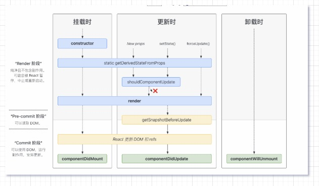

# react 生命周期函数

react 生命周期 16 到 18 是没有变化的 变化的是生命周期函数

16.3 之前的生命周期函数 也称老的生命周期

- Intialization (初始化)
  初始化阶段主要用到 `constructor` 函数
- Mounting (挂载)

  1. componentWillMount 组件挂载到 dom 前调用
  2. render 渲染
  3. componentDidMount 组件挂载到 dom 后调用

- update （更新）

  1. componentWillReceiveProps props 发生变化 引起调用 只是 state 发生变化 则不会调用
  2. shouldComponentUpdate(nextProps, nextState) 性能优化点 通过比较 nextProps 和 nextState,来判断当前组件是否有必要继续执行更新过程。
  3. componentWillUpdate(nextProps, nextState) 组件更新前调用
  4. render
  5. componentDidUpdate(prevProps, prevState) 组件更新后调用

- UnMounting(卸载)

  1. componentWillUnmount 组件卸载前调用 （清除定时器 注册事件等等）

---

16.3 以及之后的生命周期函数 也称新的生命周期 新的生命周期图片[参考官网](https://projects.wojtekmaj.pl/react-lifecycle-methods-diagram/)



新增了一些 生命周期函数 并且同时取消了一些生命周期函数

新增函数

- getDerivedStateFromProps
- getSnapshotBeforeUpdate

取消的生命周期函数

- componentWillMount
- componentWillReceiveProps
- componentWillUpdate

getDerivedStateFromProps 在 React v16.3 中，在创建和更新时，只能是由父组件引发才会调用这个函数，在 React v16.4 改为无论是 Mounting 还是 Updating，也无论是什么引起的 Updating，全部都会调用。

在 17.0 的版本，官方彻底废除 componentWillMount、componentWillReceiveProps、componentWillUpdate
如果还想使用的话可以使用：UNSAFE_componentWillMount()、UNSAFE_componentWillReceiveProps()、UNSAFE_componentWillUpdate()

为什么 官方取消了这些生命周期函数呢

在 fiber 之前 react 更新是不可以中断的，但是在 fiber 架构下 react 更新是可以中断都，我们可以发现 被废弃的生命周期都是 render 前的，因为 render 前 有可能会因为 fiber 的中断 而导致函数的多次执行

componentWillMount（） 完全可以用 componentDidMount 和 constructor 来代替

getDerivedStateFromProps 是静态方法 这里不能使用 this 为了约束开发者 开发者不能写出副作用代码

## 组件通信

- 父子通信 props
- 子父通信 props+回调
- 跨层级通信 context redux 自定义通信 Event

# react 有哪些必须要使用类组件的场景

React 的开发风格越来越偏向于函数式编程，特别是在 React 16.8 版本引入 Hooks 之后，函数式组件可以实现类组件的大部分功能，甚至在某些方面，函数式组件比类组件更具有优势。因此，现在大部分场景下，我们并不必须使用类组件。

然而，在某些特定的场景下，类组件可能还是有其独特的优势的。这主要体现在以下几个方面：

1. 生命周期方法：虽然函数式组件通过 useEffect 可以模拟大部分生命周期方法，但在一些特殊情况下，类组件的生命周期方法更直观，更易理解。比如 shouldComponentUpdate，这个方法可以直接决定组件是否重新渲染，而 useEffect 并不能完全模拟出这一功能。

2. 错误边界：错误边界(Error Boundaries)是 React 中一种用于捕获子组件树的 JS 错误并显示备用 UI 的机制。目前，只有类组件可以定义错误边界。

3. Refs：在类组件中，我们可以直接通过 this.refs 来访问 refs。虽然在函数式组件中我们也可以通过 useRef 来使用 refs，但在某些复杂的场景下，类组件的 refs 使用起来更直观，更方便。

综上，虽然 React 推荐使用函数式组件和 Hooks，但在某些特定的场景下，使用类组件仍然是有必要的。

从生命周期的角度 以及错误边界的角度回答

# 详细说下你是怎么理解 react 的 jsx

<https://blog.csdn.net/fegus/article/details/126800156>

高赞回答

首先解释概念 方案对比 优劣势

jsx 是一个 javascript 的语法扩展 结构类似 xml
jsx 主要用于声明 react 元素，但 react 中并不强制使用 jsx，即使使用 jsx 也会在构建过程中 通过 babel 插件编译为 react.createElement,所以 jsx 更像是 react.createElement 的语法糖 最终 createElement 都会返回 reactElement 元素 这个 reactElement 对象的实例 本质上是以 js 对象形式存在对 dom 对描述 这其实就是我们常说的虚拟 dom

因为我们使用 jsx 可以是代码更加简洁 结构更加清晰 易于维护 可读性比较高 比直接写 react.createElement 有着天然的优势

源代码 - 源代码 ast - 目标 ast - 目标代码
源代码解析生成 源代码 ast 语法树 然后通过 babel 插件 生成目标 ast 语法树，再转化成 目标代码

# react 生命周期的 设计思想

### react 15

组件挂载渲染 constructor -> componentWillMount -> render -> componentDidMount

组件更新 componentWillReceiveProps -> shouldComponentUpdate -> componentWillUpdate -> render -> componentDidUpdate

组件卸载 componentWillUnmount

componentWillMount 会在执行 render 方法之前触发 很大一部分人喜欢在这个声明周期做一些初始化操作 但是往往会有一些风险

render 方法被触发 在 render 执行的过程中 并不会去操作真实的 dom 他的作用是把需要渲染的内容返回出来 真正 dom 的渲染工作 是在挂载阶段的 ReactDom.render 来执行的

componentDidMount 会在 render 方法执行完毕之后触发 这个时候 dom 已经渲染完毕了 这个时候就可以对 dom 进行一些操作了 类似于异步请求和一些初始化可以在这个生命周期执行

更新阶段 主要分两种 一种是自身 setState 触发的更新 另一种是父组件触发的更新

componentWillReceiveProps 是由父组件更新触发的

组件自身触发更新是不会触发 componentWillReceiveProps 直接触发 shouldComponentUpdate 然后执行下去 后面 分别是 componentWillUpdate -> render -> componentDidUpdate

shouldComponentUpdate 主要是用来判断是否 render 所以这个也是 一个重要的性能优化节点，

### react 16

组件挂载渲染 constructor -> getDeriveStateFromProps -> render -> componentDidMount

组件更新 getDeriveStateFromProps -> shouldComponentUpdate -> getSnapshotBeforeUpdate -> render -> componentDidUpdate

组件卸载 componentWillUnmount

去除了 componentWillMount 新增了 getDeriveStateFromProps 这个新增的 api 本质上不是为了 替代 componentWillMount 而是为了 替代 componentWillReceiveProps， 它只有一个用途 使用 props 来派生/更新 state

使用 getDeriveStateFromProps 需要注意的点

1. 首先他是一个静态方法 所以是无法访问 this 实例子
2. 接受父组件的 props 和 自身组件的 state
3. 需要返回一个对象值，为什么这个值必须返回因为 react 需要这个返回值来更新组件的 state
4. 返回的 state 会和组件的 state 进行浅合并，不是覆盖式的。

react 16.3 和 16.4 生命周期的版本差异在 更新上

1. 16.3 版本只有父组件更新才会触发 getDeriveStateFromProps
2. 16.4 版本是任何因素触发的组件更新流程都会触发 getDeriveStateFromProps

为什么 react 要用 getDeriveStateFromProps 来 替代 componentWillReceiveProps 呢
因为 react16 在强制推行只用 getDeriveStateFromProps 来完成 props 到 state 到映射这一最佳实践，确保生命周期函数行为更加可控可预测，同时也在为 fiber 架构铺路

getSnapshotBeforeUpdate 的返回值会作为第三个参数传递给 componentDidUpdate
它执行的时机是在 render 方法之后，真实 dom 更新之前，在这个阶段里 我们可以同时获取更新前真实 dom 和更新后前后的 state props 信息

使用场景不多 举个例子

实现一个内容会发生变化的滚动列表，根据滚动列表的内容是否发生变化，来决定是否要记录滚动条当前的位置。
感知数据变化 获取真实 dom 信息（获取位置） 这时可以用 getSnapshotBeforeUpdate

一般使用 getSnapshotBeforeUpdate 需要和 componentDidUpdate 配合使用

在 fiber 架构下 渲染是异步渲染

在 16 架构下 生命周期主要划分两个 步骤

render 和 commit

render 用户是无感的 但是 commit 是涉及到真实的 dom 操作

因为 render 阶段是允许被暂停终止和重启，所以 render 之前的生命周期是可能被多次执行

所以 componentWillMount componentWillReceiveProps componentWillUpdate 都有可能被多次执行 在这些生命周期执行操作是存在很大的风险

例如在 componentWillMount 发起请求 有可能会发起多次

在 componentWillReceiveProps 操作 dom 有可能会操作很多次 而 getDeriveStateFromProps 是没有 this 的 所以无法操作 dom

或者在 componentWillUpdate setState 导致重复渲染死循环的 这些都是有很大的风险

所以 react 16 生命周期的改动主要的动机是为了配合 fiber 的架构带来的渲染机制

# react 的数据流动

组件从概念上类似 js 函数，他接收任意参数 即 props 并返回用于页面描述的 react 元素

所谓单向数据流 即当前组件的 state 以 props 流向组件树中比自己更低的组件

发布订阅方式驱动数据流动

redux

store 单一数据来源
action 动作 对变化的描述
reducer 函数 对变化处理和分发

数据驱动视图

store -> view -> action -> reducer -> store -> view

# 为什么需要 react-hooks

1. 告别难以理解的 class
   主要是 this 和生命周期
2. 解决业务逻辑难以拆分的问题
   类组件 逻辑会分别分散到各个生命周期，逻辑和生命周期耦合严重
   函数组件 可以把复杂逻辑进行拆分 到不同的函数组件 由 hook 帮我们实现业务的耦合 避免代码过于复杂
3. 使状态逻辑复用变的简单
   类组件使用 高阶组件和 render props 设计模式来服用逻辑 实现逻辑的复用同时 也在破坏着组件
   hook 我门可以自定义 hook 实现 不用破坏组件 也不用修改逻辑

4. 函数组件设计细想 更加契合 react

# hooks 使用限制条件

1. 不能在判断中使用
2. 只能在 react 函数内使用

hooks 本质其实是链表 hooks 的渲染是通过 依次遍历来定位每个 hooks 内容，如果前后两次读到的链表在顺序上出现差异，那么渲染的结果是不可控的

hooks 的调用链路

首次渲染

useState -> 通过 resolveDispatcher 获取 dispatcher -> 调用 dispatcher.useState ->调用 mountState -> 返回目标数组 `[state,setState]`

更新渲染

useState -> 通过 resolveDispatcher 获取 dispatcher -> 调用 dispatcher.useState ->调用 updateState ->调用 updateReducer -> 返回目标数组 `[state,setState]`

按照顺序去遍历之前构建好的链表，取出对应的信息进行渲染

# 虚拟 dom

虚拟 dom 本质上 js 和 dom 之间的一个映射缓存，它在形态上表现为一个能够描述 dom 结构以及其属性信息的 js 对象

虚拟 dom 是 js 对象
虚拟 dom 是对真实 dom 对描述

挂载阶段： react 结合 jsx 描述 构建虚拟 dom 然后通过 reactDOM.render 实现虚拟 dom 到真实 dom 到映射
更新阶段： 页面的变化在作用于真实的 dom 之前，会先作用于虚拟 dom，虚拟 dom 将在 js 层面借助 diff 算法对比出哪些真实 dom 需要改变，然后将这些改变的作用于真实的 dom

虚拟 dom 对优越之处在于 它能够提供更高效的研发模式 而且还能够保持一个不错的性能 主要点并不在于性能层面

虚拟 dom 的价值是什么？

1. 研发体验和研发效率
2. 跨平台问题

# 调和过程

调和过程是 react 实现虚拟 dom 到真实 dom 的过程
调和过程 不等一 diff 调和是使一致的过程 而 diff 是找不同的过程，它只是使一致过程中的一环

diff 算法的逻辑

1. 同级比较 不是同级 直接放弃 创新创建
2. 类型一致比较 类型不同也直接放弃 直接替换旧的节点
3. key 属性设置 可以帮助我们尽可能重用同一层级内的节点

分层递归还是递归

# setState 是同步还是异步问题

react setState 现象

setState 异步是为了避免 频繁的 render 批量更新

setTimeout 使 setState 异步变同步了，本质上是 setTimeout 帮助 setState 逃脱了 react 对它的掌控，只要是在 react 管控下的 setState 一定是异步的

setState 并不是单纯的同步或者异步，它会因为场景的不同而表现不同，在 react 钩子函数（生命周期）以及合成事件中表现为异步，而在 setTimeout setInterval 以及 dom 原生事件中表现为同步，这种差异是由 react 事务机制和批量更新机制所决定的

```js
initialize  设置 isBatchingUpdates = true // 开启批量更新

anyMethod    执行生命周期函数或者点击事件的setState

close      设置 isBatchingUpdates = false // 关闭批量更新 然后更新渲染


```

react 18 setState 都是异步的

# transaction 事务机制

给目标函数添加一系列的前置和后置函数，对目标函数进行功能增强或者代码保护

# fiber 的设计思想

首先 js 线程是单线程的，这就决定了 js 线程和渲染线程是互斥的，当一个线程执行时另一个线程只能挂起

如果 js 线程长时间的占用主线程，那么渲染层面的更新就会长时间等待，页面不更新，用户就会感觉到卡顿

react 的 stack reconciler 是一个同步递归的过程，并且不能中断，如果处理结构很复杂庞大，那么 stack reconciler 会占用很长时间，那么就会导致页面卡顿

所以 fiber 产生了

fiber 就是比线程还要细的一个过程，意思是对渲染过程更加精细的掌控

从编码的角度来看 fiber 是 react 内部中的一种数据结构 它是 fiber 树结构的节点单位，也是新架构下的虚拟 dom

从工作流的角度来看 fiber 节点保存了组件更新的状态和副作用，一个 fiber 也对应一个工作单元

fiber 架构的应用目的是为了实现增量渲染，所谓的增量渲染 其实就是把一个渲染任务拆解为多个渲染任务，然后分散到多个帧里面

实现增量渲染的目的是为了实现 任务的可中断 可恢复 并且给不同任务赋予不同的优先级，最终让页面渲染更加流畅

react 15 reconciler 找不同 -> renderer 渲染不同
react 16 scheduler 调度更新的优先级 -> reconciler 找不同 -> renderer 渲染不同

# ReactDOM.render

react 16 没有启动 coucurrent 模式 依然还是 fiber 架构 虽然 没有启动 coucurrent 不是异步渲染 但是整个数据结构层面的设计 包括整个渲染链路处理都完全用 fiber 重构了 所以 fiber 架构中的 react 不能和异步渲染严格画等号 它同时兼容了同步渲染和异步渲染

在 react 16 下 ReactDOM.render 还是同步模式

# react-router

BrowserRouter 是使用 HTML5 的 history api 来控制的路由跳转的
HashRouter 是通过 URL 的 hash 属性来控制路由跳转的

为什么我们需要前端路由

在早期 A 页面跳转 B 页面 必须刷新，然后才能重新请求数据

但是 ajax 的出现 允许我们不刷新也可以请求数据了，这样可以使页面更加流畅不用频繁刷新 于是诞生了 SPA

SPA 带来的问题

1. SPA 其实无法知道当前页面进展到了哪一步，可能你在一个站点经过反复的进行才能呼出 某一块内容，但是此时只要刷新一下页面，一切都会被清零
2. 有且仅有一个 URL 给页面做映射，这对 SEO 不够友好，搜索引擎无法收集全面的信息

为了解决问题 前端路由出现了

前端路由可以帮助我们记住用户走到了哪一步，为 SPA 中的各个视图匹配一个唯一的标识，这意味着用户前进后退触发的新内容都会映射到不同的 URL 上，即使刷新，因为当前 URL 可以标识出所在的位置，内容也不回丢失

那么如果实现这个目的呢

实践思路 hash 和 history

hash 模式是指通过改变 URL 后面 `#`分割字符串，从而让页面感知到路由变化的异种骨实现方式

hash 的感知 可以通过监听 hashchange 来触发

```js
window.addEventListener(
  "hashchange",
  () => {
    console.log("hashchange");
  },
  false
);
```

history

在 HTML4 的时代 我们可以通过一下 api 操作实现 浏览历史和页面跳转

```js
window.history.forward(); // 前进到下一页
window.history.back(); // 后退到上一页
window.history.go(1); // 前进到下一页
window.history.go(-2); // 后退两页
```

但是 这里我们只能切换 不能改变

在 HTML5 开始 浏览器支持了 pushState 和 replaceState 这两个 api 允许我们改变浏览历史

在 history 我们可以通过监听 popstate 来达到我们的目的

```js
window.addEventListener("popstate", () => {
  console.log("popstate");
});
```

每当 浏览历史发生变化 popstate 事件都会被触发

需要注意的是 forward back go 是可以触发 popstate 的监听，但是 pushState 和 replaceState 是无法触发 popstate 监听，不过我们可以使用自定事件和全局事件总线手动触发

示例代码如下

```js
// 添加一条历史记录
history.pushState({ page: 1 }, "title 1", "?page=1");

// 创建一个 popstate 事件
var popstateEvent = new PopStateEvent("popstate", {
  state: { page: 1 },
});

// 手动触发 popstate 事件
window.dispatchEvent(popstateEvent);
```

```js
// 创建一个简单的事件总线
var EventBus = {
  events: {},
  dispatch: function (event, data) {
    if (!this.events[event]) return; // 事件未注册
    this.events[event].forEach((callback) => callback(data));
  },
  subscribe: function (event, callback) {
    if (!this.events[event]) this.events[event] = [];
    this.events[event].push(callback);
  },
};

// 注册 popstate 事件
EventBus.subscribe("popstate", function (data) {
  console.log("popstate event triggered with data:", data);
});

// 手动触发 popstate 事件
EventBus.dispatch("popstate", { page: 1 });
```

# react 性能优化

1. shouldComponentUpdate 规避冗余的更新逻辑

2. PureComponent + Immutable.js PureComponent 内置了 shouldComponentUpdate 中对组件更新前后对 props 和 state 对浅比较

针对 基本类型的值来说 PureComponent 还是非常有作用的 但是 如果数据是引用类型，那么基于这种浅比较就是有风险的

- 如果数据内容没变 但是引用变了 那么浅比较就无用了还是会触发更细
- 如果数据内容变了 但是引用没变 那么内容就不回更新

那么怎么解决这个问题 使用 Immutable 不可变的值 只要这个数据被创建出来，那么就不能被更改，我们对当前数据的任何修改动作 都会返回一个新的对象
这样就事数据内容的变化和数据引用严格的关联起来。

3. React.memo 与 useMemo

memo 本质是一个高阶组件，它负责对函数组件进行包装，memo 会帮我们记住 函数组件的渲染结果，在组件前后两次 props 对比结果一致的情况下，它会直接复用最近一次的渲染结果

memo 接收两个参数 第一个是需要渲染的目标组件 第二个参数 用来承接 props 的对比逻辑，如果第二个参数不传，那么 memo 会自动进行浅比较，memo 只会对 props 进行感知 state 的变化 不会触发

useMemo 是更加精细化的管控 比如 对组件的某一段逻辑 从以往经验来看 90%的场景是不需要 useMemo useCallback 所以不要滥用 甚至还有可能拖累性能

主要围绕这三点回答

# react 设计模式

1. 高阶组件
2. render props
3. 剥离有状态组件和无状态组件

# react 17 的变化

1. 新的 jsx 转化逻辑
   不需要 手动 引入 react 了

因为 17 版本中 编译器会自动帮我么引入 jsx 的解析器

2. 事件系统的重构

react 16 通过将所有的事件冒泡到 document 来实现对事件的中心管控 因为 document 是整个文档树的根节点，操作 document 其实有很大的风险

react 17 则通过将事件冒泡到 每个 react 组件自己的容器 dom 节点上 比如我们在 id 为 root 的 dom 节点下挂在了一个 react 组件 来实现对事件的中心管控

```js
const rootElement = document.getElementById("root");
ReactDOM.render(<App />, rootElement);
```

放弃事件池

react 17 之前 合成事件对象会被放进一个叫做事件池的地方同一管理，这样做的目的是能够实现事件对象的复用，进而提高性能，每当事件处理函数执行完毕后，其对应的合成事件对象内部所有的属性都会被置空，为下一次被复用做准备，这意味着事件的逻辑一旦执行完毕，我们就拿不到事件的对象，

例如

```js
function handleChange(e) {
  setTimeout(() => {
    console.log(e); // 在这里拿不到事件 e 相关属性
  }, 100);
}
function handleChange(e) {
  e.persist(); // 阻止事件对象的回收 只有组织回收才能在setTimeout拿到
  setTimeout(() => {
    console.log(e); // 在这里可以拿到事件 e 相关属性
  }, 100);
}
```

react 17 放弃事件池 为每一个合成事件创建新的对象，所以我们不需要了 e.persist 也可以拿到 事件对象了

3. lane 模型的引入 主要是用来描述任务优先级

# useEffect 和 useLayoutEffect 的区别

useEffect 和 useLayoutEffect 在底层函数签名是一致的，都是调用 mountEffectImpl 函数 使用上基本上可以直接替换，都可以处理副作用

不同点 useEffect 在渲染过程是 异步的 useLayoutEffect 是同步的 会在dom变更之后同步调用 所以会阻塞渲染 一般我们需要操作dom等相关样式可以在 这个副作用里写
