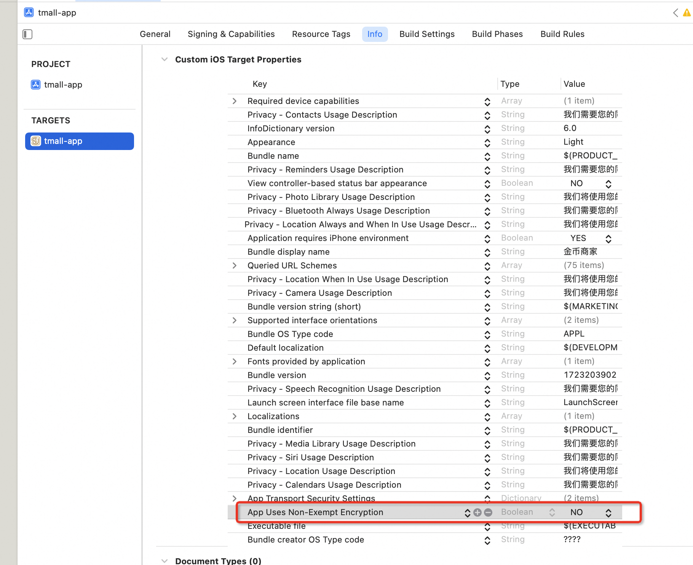
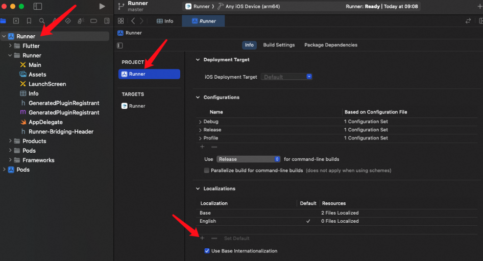

# 注意事项

## 一 公司名称设置

在第一次新建 APP 的时候 如果是企业账号，那么会让填公司名称，这个名称就是开发者名称，开发者名称只能在你首次添加 App 至账户时设置。之后无法编辑或修改，因此请务必正确设置开发者名称。

[官方文档](https://developer.apple.com/cn/help/app-store-connect/create-an-app-record/set-your-developer-name/)

如果填写错误，或者后续想要修改 只能

1. 登入<http://itunesconnect.apple.com；>

2. 点击页面右下方的【 Contact Us 】（联系我们）：

3. 选择【会员资格和账户】

4. 选择【组织名称更改】

然后选择发邮件和打电话联系客服

## AppStore 提审时的“出口合规证明”处理

在 Xcode 的项目中 info 选项 中设置一下 可以避免每次提神都需要选择一下

选择 NO

保存重新打包即可

## 上架需要隐私协议 提前准备好一个 oss 地址 在 APP 隐私中设置

## 审核需要 app 截图 注意截图尽量要和审核时内容一致 防止审核不通过

## 上架后 app store 上展示语言为英语

在 info 里添加 Localizations 选择语言 为 chinese simplified

点击项目设置 在 Localizations 中添加 chinese simplified 然后设置为 默认

然后重新打包，上传 在 testFlight 中 构建数据中 可以查看 语言
