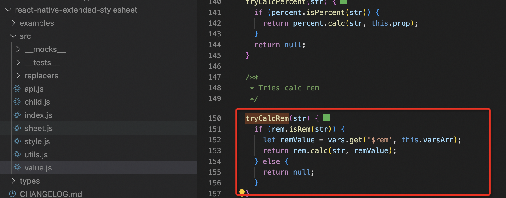
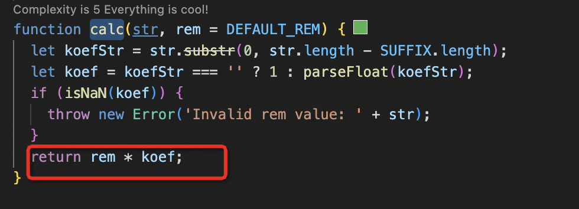

# RN 的环境变量以及主题方案

本身 react-native 没有提供这种 环境变量以及 主题切换等方案，所以我们需要根据已有的插件做一些封装处理

## 安装

```bash
npm install react-native-extended-stylesheet
```

## 介绍

react-native-extended-stylesheet 是一个为 React Native 应用程序设计的样式库，它提供了比 React Native 默认的 StyleSheet 更多的功能和灵活性。以下是它的一些主要特性：

1. 变量支持：允许你定义和使用变量，使得样式表更加动态和易于维护。

2. 表达式计算：可以直接在样式表中使用数学表达式，如 10px + 5%。

3. 条件样式：基于条件来应用不同的样式值。

4. 循环和函数：支持循环和函数，使得创建重复的样式更加简单。

5. 继承和扩展：可以创建基于其他样式的扩展样式，类似于 CSS 中的继承。

6. 动态主题：支持动态更改主题，无需重新加载应用。

7. 跨平台：虽然主要是为 React Native 设计的，但某些功能也可以在 Web 应用中使用。

8. 性能优化：通过预编译和优化样式表，提高应用的性能。

兼容性：与 React Native 的标准 StyleSheet 兼容。

### 常用方法介绍

- EStyleSheet.create(styles):
  用于创建一个扩展样式表对象，类似于 React Native 的 StyleSheet.create，但提供了额外的功能，比如变量和表达式支持。
- EStyleSheet.value(value, prop):
  用于获取样式表中的变量值。如果提供了 prop 参数，它还可以进行单位转换或百分比计算。
- EStyleSheet.flatten(style):
  接受一个样式对象，并将其转换为一个扁平的样式对象，其中所有变量和表达式都被替换为最终的值。
- EStyleSheet.build(globalVars):
  使用全局变量来构建样式表。这允许你在运行时动态更改样式表变量，并重新构建样式表。
- EStyleSheet.clearCache():
  清除 EStyleSheet 的内部缓存，通常在更改了全局变量并需要重新构建样式表时使用。
- EStyleSheet.setGlobalVariable(key, value):
  用于设置全局变量的值。这可以在运行时动态更改样式表变量。
- EStyleSheet.unsetGlobalVariable(key):
  用于删除全局变量，恢复其默认值或之前设置的值。
- EStyleSheet.getGlobalVariable(key):
  用于获取全局变量的当前值。
- EStyleSheet.replaceGlobalVariables(variables):
  替换现有的全局变量为新的变量集合，并重新构建样式表。
- EStyleSheet.equals(a, b):
  比较两个样式对象是否相等，这在性能优化或条件渲染中可能很有用。

## 基于插件构建一个公共类

```js
import { forEach } from "lodash";
import EStyleSheet from "react-native-extended-stylesheet";
import themes from "../style/themes/default";

class ThemeManager {
  static variables = {}; // 环境变量存储

  static get(expr?: any, prop?: string) {
    return EStyleSheet.value(expr.startsWith("$") ? expr : `$${expr}`, prop);
  }

  static all() {
    return this.variables;
  }

  static inject(variables, build = true) {
    // 注入环境变量
    forEach({ ...themes, ...variables }, (value, key) => {
      if (typeof value !== "undefined" && value !== null) {
        this.variables[`$${key.replace(/^\$/, "")}`] = value;
      }
    });

    if (build === true) {
      EStyleSheet.clearCache(); // 清除缓存

      return EStyleSheet.build(this.variables); // 重新构建样式表
    }

    return undefined;
  }

  static replace(variables) {
    forEach({ ...this.variables, ...variables }, (value, key) => {
      this.variables[`$${key.replace(/^\$/, "")}`] = value;
    });

    EStyleSheet.clearCache();

    return EStyleSheet.build(this.variables);
  }
}

export default ThemeManager;
```

## 在项目中具体使用

首先 我们要导出 createStyle 方法，项目中所有的样式创建都要给予这个方法创建

```js
import { ViewStyle, TextStyle, ImageStyle } from 'react-native';
import EStyleSheet from 'react-native-extended-stylesheet';
import themes from './default-themes-operations';

type ThemesConstants = keyof typeof themes;

type AddConstants<T> = {
  [P in keyof T]?: ThemesConstants | T[P];
};

type Styles = AddConstants<ViewStyle | TextStyle | ImageStyle>;

type StyleObject<T> = {
  [P in keyof T]: ThemesConstants | Styles | StyleObject<Styles>;
};

function createStyle<T>(styles: StyleObject<T>) {
  return EStyleSheet.create(styles) as T;
}

// ThemeManager.inject(themes);

export { themes, createStyle };

```

环境变量设置参考

```js
import { Dimensions } from "react-native";

const $rem = Dimensions.get("window").width / 1080;
// 此文件用于配置默认样式
const $primaryColor = "#CAA851";

export default {
  $rem,
  // 基础色值
  $white: "#fff",
  $darkGray: "#333",
  $gray: "#666",
  $red: "#c62f2e",
  $yellow: "#f9a800",
  $lightGray: "#A1A1A1",
};
```

如果我们有多套样式主题，只需在点击切换的时候 调用 `ThemeManager.inject(themes)` 注入我们新的主题样式即可，所以这个样式我们需要一开始就定义好

在 ast 环境有提到 关于 rem 转化的问题，为什么在单位上设置 rem 就会自动计算，在源码中找到了答案



