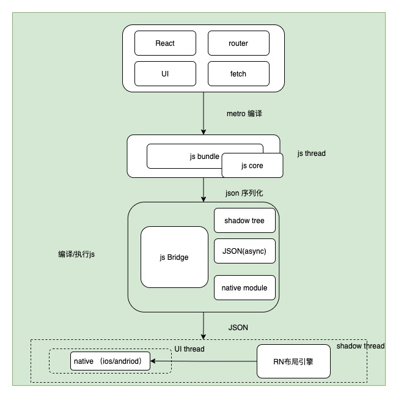
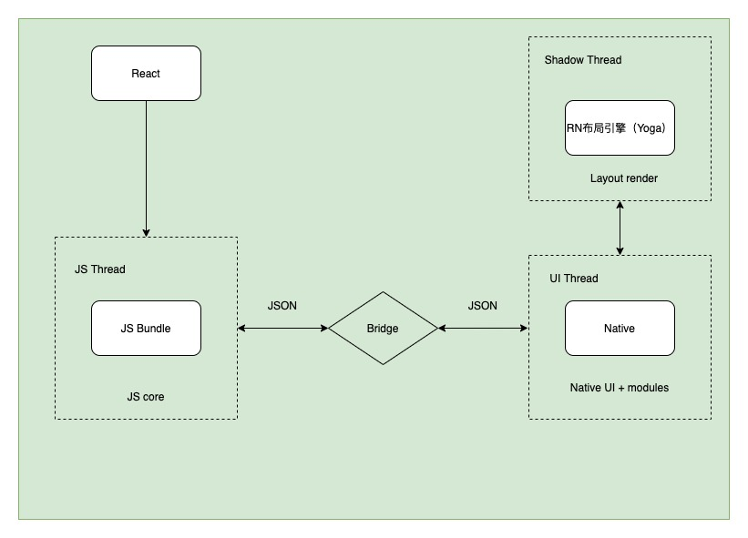
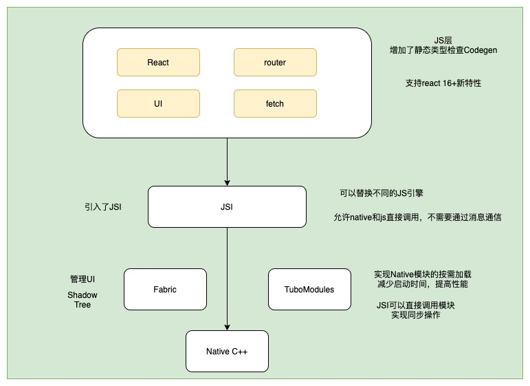

# ReactNative 原理

## RN 的特点

- 跨平台
  React Native 使用了 Virtual DOM（虚拟 DOM），只需编写一套代码，便可以将代码打包成不同平台的 App，极大提高 了开发效率，并且相对全部原生开发的应用来说，维护成本也相对更低

- 上手快
  相比于原生开发，JavaScript 学习成本低、语法灵活。允许让 Web 开发者更多地基于现有经验开发 App。ReactNative 只需使用 JavaScript 就能编写移动原生应用，它和 React 的设计理念是一样的，
- 原生体验
  由于 React Native 提供的组件是对原生 API 的暴露，虽然我们使用的是 JavaScript 语言编写的代码，但是实际上是调用了原生的 API 和原生的 UI 组件。
- 热更新
  React Native 开发的应用支持热更新，因为 React Native 的产物是 bundle 文件，其实本质上就是 JS 代码，在 App 启动的时候就会去服务器上获取 bundle 文件，我们只需要更新 bundle 文件，从而使得 App 不需要重新前往商店下 AppStore 禁止热更新的功能中有调用私有 API、篡改原生代码和改变 App 的行为。

## 老架构

看下老的架构图

### js core

JavaScriptCore 是一个 JS 引擎，IOS 系统自带了该引擎。Android 没有自带，所以 React Native 会将 JSC 和 app 打包在 一起，这会增加一点 app 的体积

### js Bridge

- Shadow Tree
- JSON(async)
- NAtive Modules 蓝牙 摄像头 网络

RN Bridge 是用 Java／C ＋＋编写的，它允许 JS 线程和 Native 线程通过一个自定义的通信传输协议来通信。js 线程会决定什么应该渲染在屏幕上，任何用户的 UI 操作行为都发生在 Native 线程上，比如点击按钮等行为都会序列化后通过 bridge 传递给 js 线程，而且 Bridge 两侧的通信是异步的，一侧发送了消息，会异步等待对方处理完。

### 三个主要的线程

- Js Thread
  JS 代码执行线程，负责逻辑层面的处理。Metro（打包工具）将 React 源码打包成一个单—JS 文件（js Bundle），然后传给上传给 js 引擎执行，现在 ios 和 android 统一是 js core．
- Shadow Thread
  进行布局计算和构造 UI 界面的线程，创建 Shadow Thee，模拟 React 结构树，可以创建虚拟 dom。RN 使用 Flexbox 布局，但是原生是不支持，所以 Yoga（RN 布局引擎） 就是用来将 Flexbox 布周转换为原生平台的布局方式。

- UI Thread
  Android 或者 ios（或其它平台）应用中的主线程。这个线程主要负责原生渲染（Native UI）和调用原生能力（Native Modules）比如蓝牙等

### 项目启动过程流程图

1. 初始化
   - 加载 JavaScript 代码：开发模式下从网络下载，生产环境从设备存储中读取；
   - 初始化 Native Modules：根据 Native Module 注册信息，加载并实例化所有 Native Module；
   - 注入 Native Module 信息：取 Native Module 注册信息，作为全局变量注入到 JS Context 中
   - 初始化 JavaScript 引擎：即 JavaScriptCore
2. 执行

- JS 线程将视图信息（结构、样式、属性等）传递给 Shadow 线程，创建出用于布局计算的 Shadow Tree，比 Shadow 线程计算好布局之后，再将完整的视图信息（包括宽高、位置等）传递给主线程，主线程据此创建 Native View
- 对于用户输入，则先由主线程将相关信息打包成事件消息传递到 Shadow 线程，再根据 Shadow Tree 建立的映射关系生成相应元素的指定事件，最后将事件传递到 JS 线程 执行对应的 JS 回调函数

### 
缺点

- 消息通知是异步的，对于连续的手势操作，有可能产生卡顿
- JSON 本身在性能上也存在问题，JSON parse JSON stringify 类似于深拷贝，耗费内存
- 消息的通信，是在一个 channel 里进行的，异步通信可能会产生阻塞

## 新架构

因为老的架构存在诸多性能问题，所以推出新架构来解决这些问题

看下新的架构图

新的架构主要增加了 JSI Fabric TuroModules 以及 codeGen

- JS 层的改变

  1. React：支持 React 16 ＋的新特性，包括 async rendering、Data Fetching 等等；
  2. 增强 JS 静态类型检查（CodeGen），来保证消息通信的类型安全，以解决 JavaScript 与 Native 通信中被广为诟病的 Bridge API 数据类型问题
     - 减少数据类型错误
     - 减少数据验证的次数，提高通信性能
  3. 引入 JSI（JavaScript Interface），允许替换不同的 JS 引擎

- Bridge 层的改变
  划分成 Fabric 和 TurboModules 两部分，分别负责 UI 管理与 Native 模块
- Native 层的改变
  精简核心模块，将非核心部分拆分出去，作为社区模块，独立更新维护

### JSI

1．上层 JavaScript 代码需要一个运行时环境，在 React Native 中这个环境是 JSC（JavaScriptCore）。不同于之前 直接将 JavaScript 代码输入给 JSC，新的架构中引入了一层 JSI（JavaScript Interface），作为 JSC 之上的抽 象，用来屏蔽 JavaScript 引擎的差异，允许换用不同的 JavaScript 引擎（如最近推出的 Hermes）。

更重要的，有了 JSI 之后，JavaScript 还能持有 C ＋＋对象的引用，并调用其方法：从而允许 JavaScript 与 Native 的直接调用，而不必通过跨线程消息通信，省去序列化／反序列化的成本，还能减轻 Bridge 的通信压力（如大量消息排队堵车）；同时 JSI 所在的 C ＋＋层也可以作为复用 Native 代码的一种方式，拥有 Native 的天然支持：

1. Android：通过 JNI（Java Native Interface）调用 C 或 C ＋＋模块；
2. IOS：Objective-C 默认支持

### 新的 Bridge

新的 Bridge 层被划分成 Fabric 和 TurboModules 两部分：

- Fabric：负责管理 UI
- TurboModules：负责与 Native 交互

#### Fabric

期望以更现代化的方式去实现 React Native 的渲染层.简化之前渲染流程中复杂跨线程交互（React—＞ Native—＞ Shadow Tree->Native UI)
具体的.直接在 C++层创建 Javascript 与 Native 共享的 Shadow Tree，并通过 JSI 层将 UI 操作接口暴露给 JavaScript 层，允许 JavaScript 直接控制高优先级的 UI 操作，甚至允许同步调用（应对列表快速滚动，页面切换，动画等场景）

#### TurboModules

- 实现 Native 模块按需加载，减少启动时间，提高性能，

  - 之前所有 Native Modules（无论是否需要用到）都要在应用启动时进行初始化，因为 Native 不知道 JavaScript 将会调用哪些功能模块。而新的 TurboModules 允许按需加载 Native 模块，并在模块初化之后 动过程直接持有其引用，不再依靠消息通信来调用模块功能。因此，应用的启动时间也会有所提升

- 通过 JSI，可以让 JS 直接调用 Native 描块，实现同步操作
