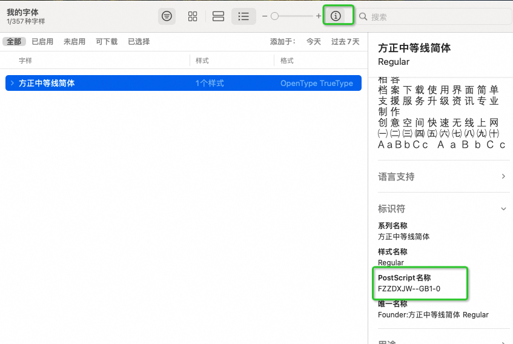
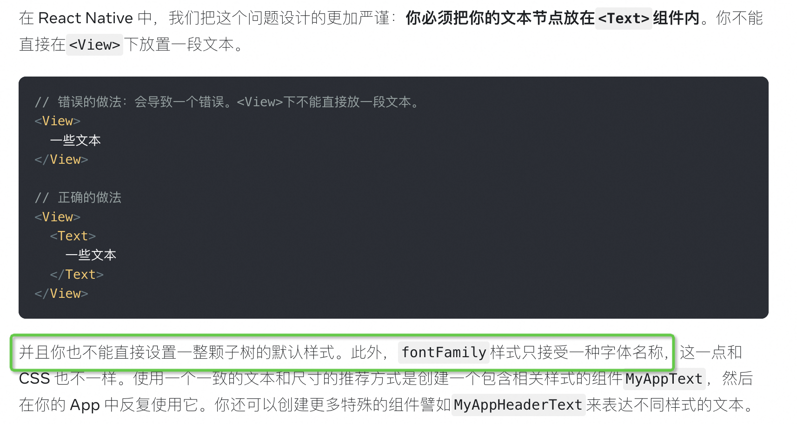

# 如何在 RN 中自定义字体

## 查看字体库的 postscript 名称

在 mac 上 打开 字体库



找到名字，是因为在 ios 上，字体文件名必须与字体库中的 postscript 名称完全匹配 才能生效，不是根据文件名来的，所以 这里我们把字体库设置成 这个名，安卓和 ios 统一

## 添加字体

在 assets/fonts 文件夹下添加字体文件

然后 在项目根目录下创建 react-native.config.js 文件，

```js
module.exports = {
  // 这个填字体库的相对路径即可
  assets: ["./assets/fonts/"],
};
```

## 执行 link

`执行 npx react-native link 命令` 如果你的 RN 版本为 0.69+，那么使用 npx react-native-asset 命令

对于 Android 来说，这个命令做了如下事情：

将字体文件拷贝到 android/app/src/main/assets/fonts 目录下，完成之后可以发现字体被拷贝到这个目录下了

对于 iOS 来说，这个命令做了如下事情：

创建 Resources 文件夹，并将字体文件 link 到该文件夹下

同时 还修改了 Info.plist 文件，添加了字体配置

## 使用自定义字体

```js
const styles = StyleSheet.create({
  text: {
    backgroundColor: "transparent",
    fontSize: 17,
    fontFamily: "FZZDXJW--GB1-0",
    textAlign: "center",
    margin: 8,
  },
});
```

## 样式继承限制

在 Web 上，要想指定整个文档的字体和大小，我们只需要写：

```css
/* 这段代码是CSS, *不是*React Native */
html {
  font-family: "lucida grande", tahoma, verdana, arial, sans-serif;
  font-size: 11px;
  color: #141823;
}
```

在官网上清楚的描述了 APP 端端样式不能设置一整颗子树的默认样式


所以我们有两种方式来来设置字体

1. 在开发的时候给每一个 Text 标签的样式都设置一个 fontFamily
2. 设置一个 MyAppText 组件来替代 Text 标签，由 MyAppText 统一设置 fontFamily

当然这两种都只是设置开发初期设置规范，按照这个规范开发，如果是已经开发完的项目在按照这种方式修改那么成本是非常大的

所以基于完成的项目，想要设置自定义字体，我们开发了一个 babel 插件，在编译的时候取识别，给每一个 样式都是添加一个 fontFamily

## babel 插件

```js
module.exports = function ({ types: t }) {
  return {
    name: "add-font-family", // not required
    visitor: {
      CallExpression(path, state) {
        const calleeNode = path.get("callee");
        let satisfied = calleeNode.isIdentifier({ name: "createStyle" });
        if (!satisfied) {
          const isSatifiedExpression =
            calleeNode.isMemberExpression() &&
            calleeNode.get("object").isIdentifier({ name: "EStyleSheet" }) &&
            calleeNode.get("property").isIdentifier({ name: "create" });
          satisfied =
            isSatifiedExpression &&
            /(nusi-mobile)|(nusi-pos)/.test(state.file.opts.filename);
        }
        if (satisfied) {
          path.traverse({
            ObjectProperty(subpath) {
              const { value } = subpath.node;
              if (t.isObjectExpression(value)) {
                const hasFontFamily = value.properties.some((property) => {
                  const { key } = property;
                  return t.isIdentifier(key, { name: "fontFamily" });
                });
                if (!hasFontFamily) {
                  value.properties.push(
                    t.objectProperty(
                      t.identifier("fontFamily"),
                      t.stringLiteral("FZZDXJW--GB1-0")
                    )
                  );
                }
              }
            },
          });
        }
      },
    },
  };
};
```

## 使用

在 .babelrc 文件中添加 这个插件

```js
module.exports = (api) => {
  const options = {
    presets: [
      [
        "module:metro-react-native-babel-preset",
        {
          enableBabelRuntime: false,
        },
      ],
    ],
    plugins: [["./configs/plugin/add-font-family"]],
  };
  return options;
};
```

然后打包测试是否生效即可
