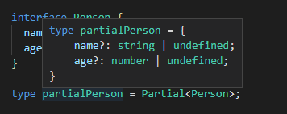
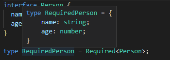
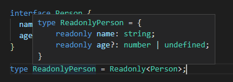
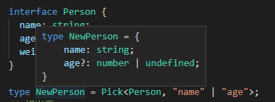
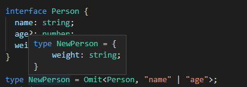
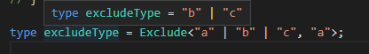
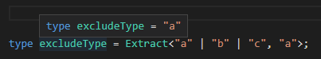
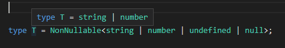

typescript 内部是封装了许多工具类，可以帮助我们快速实现，并且这些内置类都是全局的

## partial

可以将一个类型的所有属性都变成可选属性

```js
interface Person {
  name: string;
  age?: number;
}

type partialPerson = Partial<Person>;

// Partial 的实现代码
type Partial<T> = {
  [P in keyof T]?: T[P];
};
```

预览效果  


## Required

与 Partial 相反 把所有的属性都变成必填属性

```js
interface Person {
  name: string;
  age?: number;
}

type RequiredPerson = Required<Person>;

// Required 的实现代码
type Required<T> = {
  [P in keyof T]-?: T[P];
};
```

预览效果  


## Readonly

把所有属性修改为只读属性

```js
interface Person {
  name: string;
  age?: number;
}

type ReadonlyPerson = Readonly<Person>;
// Readonly 的实现代码
type Readonly<T> = {
  readonly [P in keyof T]: T[P];
};
```

预览效果  


## Pick

选取给定类型的指定键值 然后组成一个新的类型

```js
interface Person {
  name: string;
  age?: number;
  weight: string;
}

type NewPerson = Pick<Person, "name" | "age">;

// Pick的实现代码
type Pick<T, K extends keyof T> = {
  [P in K]: T[P];
};
```

预览效果



## Omit

去除指定类型的键值 ，剩下的键值形成一个新的类型

```js
interface Person {
  name: string;
  age?: number;
  weight: string;
}

type NewPerson = Omit<Person, "name" | "age">;

// Omit的实现代码
type Omit<T, K extends keyof any> = Pick<T, Exclude<keyof T, K>>;
```

效果预览  


## Exclude

Exclude 的作用就是从联合类型中去除指定的类型。

```js
type excludeType = Exclude<"a" | "b" | "c", "a">;
// Exclude 实现代码
type Exclude<T, U> = T extends U ? never : T;
```

预览效果  


## Extract

跟 Exclude 相反 提取联合类型的类

```js
type excludeType = Extract<"a" | "b" | "c", "a">;

// 代码实现
type Extract<T, U> = T extends U ? T : never;
```

预览效果



## NonNullable

NonNullable 的作用是从联合类型中去除 null 或者 undefined 的类型

```js
type T = NonNullable<string | number | undefined | null>
//代码实现
type NonNullable<T> = T extends null | undefined ? never : T;
```

预览效果



## 模板字符串

```js
type T0 = Uppercase<'Hello'>; // => 'HELLO'
type T1 = Lowercase<T0>; // => 'hello'
type T2 = Capitalize<T1>; // => 'Hello'
type T3 = Uncapitalize<T2>; // => 'hello'

// 代码实现

// 转换字符串字面量到大写字母
type Uppercase<S extends string> = intrinsic;
// 转换字符串字面量到小写字母
type Lowercase<S extends string> = intrinsic;
// 转换字符串字面量的第一个字母为大写字母
type Capitalize<S extends string> = intrinsic;
// 转换字符串字面量的第一个字母为小写字母
type Uncapitalize<S extends string> = intrinsic;

```

更多内置类 参考函数
