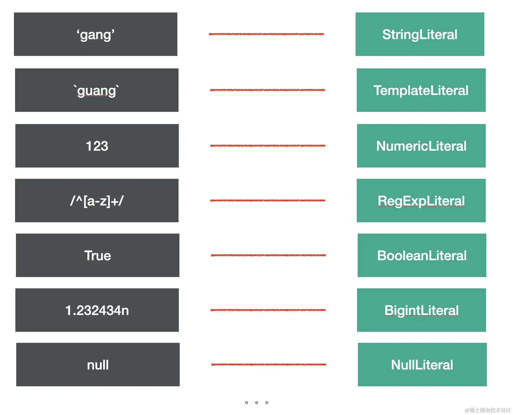
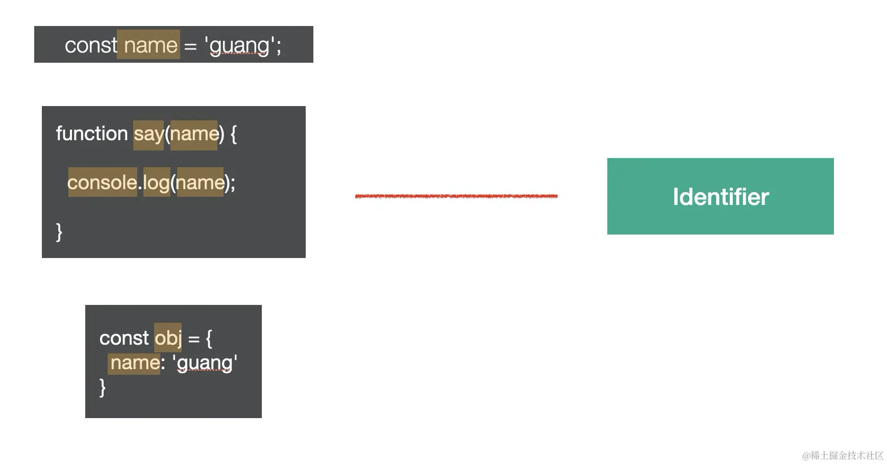
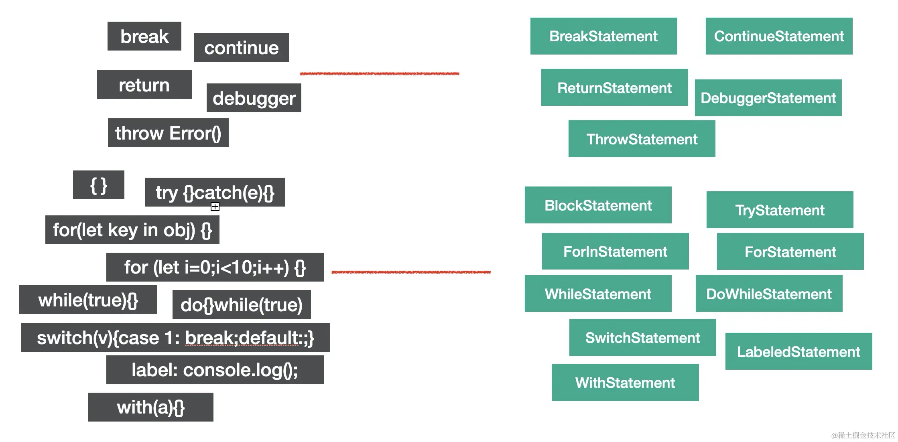
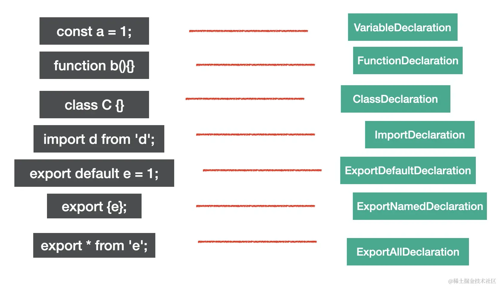
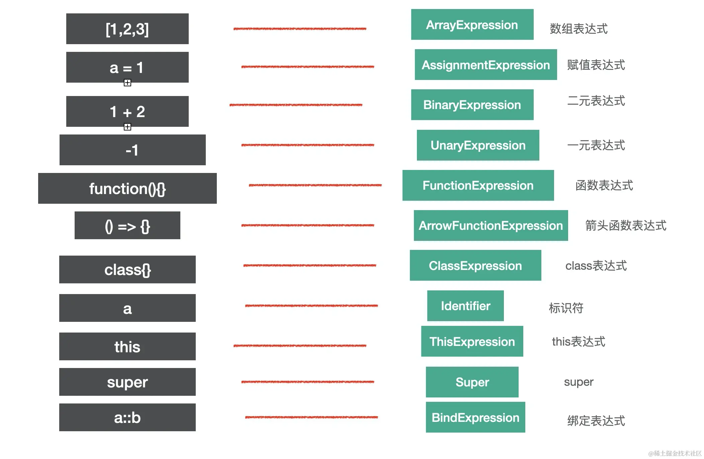
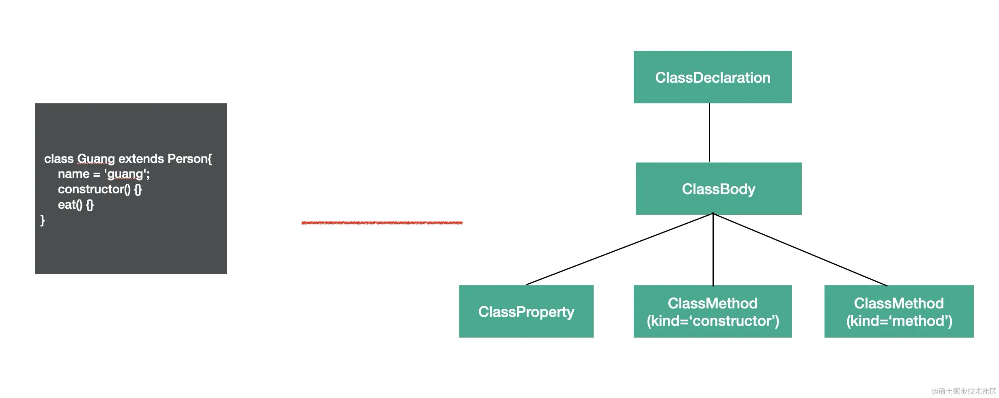
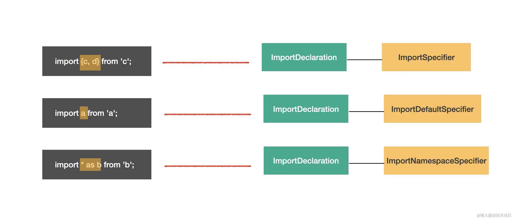
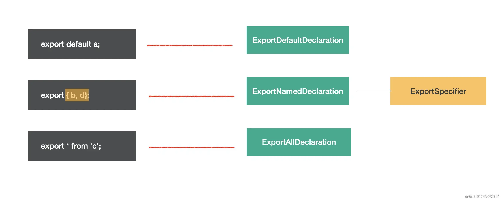
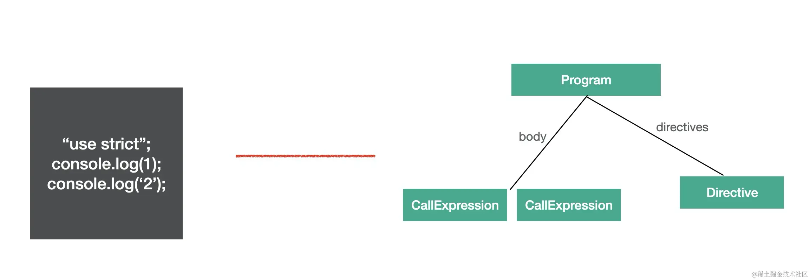
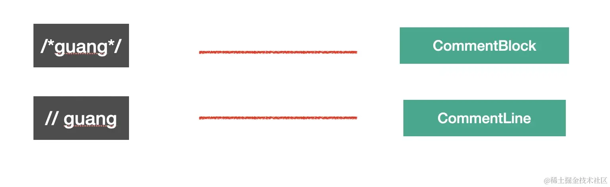

# 常见节点

## Literal

Literal 是字面量的意思

例如 `let name = 'test'` 这个 `'test'`就是 字符串字面量 StringLiteral 同样还有其他字面量 布尔字面量 数子字面量等等
具体看图



## Identifier

Identifier 是标识符的意思 变量名、属性名、参数名等各种声明和引用的名字，都是 Identifer

例如 `let name = 'test'` 中的 `name` 就是标识符

具体看图



## Statement

Statement 是语句的意思，它是可以独立执行的单位 比如 return break continue
这些 每一行都是一个 Statement

```js
break;
continue;
return;
debugger;
throw Error();
{}
try {} catch(e) {} finally{}
for (let key in obj) {}
for (let i = 0;i < 10;i ++) {}
while (true) {}
do {} while (true)
switch (v){case 1: break;default:;}
label: console.log();
with (a){}

```

看图


## Declaration

声明语句是一种特殊的语句，它执行的逻辑是在作用域内 声明一个变量 函数 class import export

对应的节点如图所示



## Expression

Expression 是表达式 特点是执行完以后有返回值

对应节点如图所示



## Class

Class 有专门的节点

对应节点如图所示



## Modules

模块分 import 和 export 两种

### import

import 有三种使用方法 对应 三种节点

```js
import { c, d } from "c";
import a from "a";
import * as b from "b";
```



### export

export 也有三种使用方法 对应 三种节点

```js
export { b, d };
export default a;
export * from "c";
```



## Program & Directive

program 是代表整个程序的节点，它有 body 属性代表程序体，存放 statement 数组，就是具体执行的语句的集合。还有 directives 属性，存放 Directive 节点，比如"use strict" 这种指令会使用 Directive 节点表示。



## File & Comment

babel 的 AST 最外层节点是 File，它有 program、comments、tokens 等属性，分别存放 Program 程序体、注释、token 等，是最外层节点。

注释分为块注释和行内注释，对应 CommentBlock 和 CommentLine 节点。



无需全部记住，只需要记住一些常用的节点，其他节点可以查阅文档 或者 直接在线查看即可
[在线查看网站](https://astexplorer.net/#)

## AST 的公共属性

- type： AST 节点的类型

- start、end、loc：start 和 end 代表该节点在源码中的开始和结束下标。而 loc 属性是一个对象，有 line 和 column 属性分别记录开始和结束的行列号。

- leadingComments、innerComments、trailingComments： 表示开始的注释、中间的注释、结尾的注释，每个 AST 节点中都可能存在注释，而且可能在开始、中间、结束这三种位置，想拿到某个 AST 的注释就通过这三个属性。
