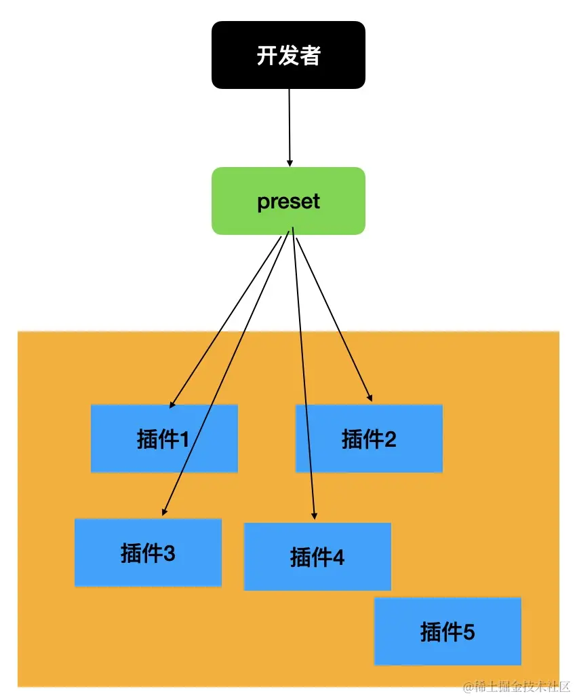

# 介绍 plugin 和 preset 一些基础知识

## plugin

plugin 的使用方式有两种，直接在.babelrc 中配置即可

```json
{
  "plugins": ["pluginA", "pluginB", ["pluginC", { "option": true }]]
}
```

plugin 有两种格式

### 返回对象的函数

```js
export default function (api, options, dirname) {
  return {
    inherits: parentPlugin,
    manipulateOptions(options, parserOptions) {
      options.xxx = "";
    },
    pre(file) {
      this.cache = new Map();
    },
    visitor: {
      StringLiteral(path, state) {
        this.cache.set(path.node.value, 1);
      },
    },
    post(file) {
      console.log(this.cache);
    },
  };
}
```

- inherits 继承某个插件
- visitor 指定 traverse 时调用的函数。
- pre 和 post 分别在遍历前后调用，可以做一些插件调用前后的逻辑，比如可以往 file（表示文件的对象，在插件里面通过 state.file 拿到）中放一些东西，在遍历的过程中取出来。
- manipulateOptions 用于修改 options，是在插件里面修改配置的方式，比如 syntaxt plugin 一般都会修改 parser options：

### 对象

```js
export default plugin = {
  pre(state) {
    this.cache = new Map();
  },
  visitor: {
    StringLiteral(path, state) {
      this.cache.set(path.node.value, 1);
    },
  },
  post(state) {
    console.log(this.cache);
  },
};
```

直接写一个对象 不用函数包裹，这种方式用于不需要处理参数的情况

## preset

plugin 是单个转换功能的实现，当 plugin 比较多或者 plugin 的 options 比较多的时候就会导致使用成本升高。这时候可以封装成一个 preset，用户可以通过 preset 来批量引入 plugin 并进行一些配置。preset 就是对 babel 配置的一层封装。



preset 格式和 plugin 一样 可以是一个对象 也可以是一个函数

```js
export default function (api, options) {
  return {
    plugins: ["pluginA"],
    presets: [["presetsB", { options: "bbb" }]],
  };
}
```

```js
export default obj = {
  plugins: ["pluginA"],
  presets: [["presetsB", { options: "bbb" }]],
};
```

## 总结

preset 和 plugin 从形式上差不多，但是应用顺序不同。

babel 会按照如下顺序处理插件和 preset：

先应用 plugin，再应用 preset
plugin 从前到后，preset 从后到前
这个顺序是 babel 的规定。

babel 对插件和 preset 的命名也有一定的规则。

babel 希望插件名字中能包含 babel plugin，这样写 plugin 的名字的时候就可以简化，然后 babel 自动去补充。所以我们写的 babel 插件最好是 babel-plugin-xx 和 @scope/babel-plugin-xx 这两种，就可以简单写为 xx 和 @scope/xx。

写 babel 内置的 plugin 和 preset 的时候也可以简化，比如 @babel/preset-env 可以直接写@babel/env，babel 会自动补充为 @babel/preset-env。
