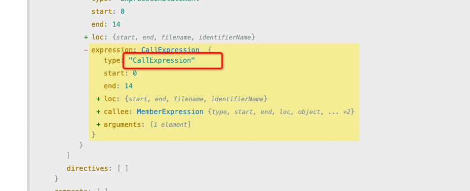

# 需求一

把`console.log(1)`转化成 `console.log('filename: （行号，列号）', 1)`

## 环境搭建

安装插件 npm i @babel/parser @babel/traverse @babel/generator @babel/types

## 分析

根据在线地址可以看出，函数调用表达式的 AST 是 CallExpression



[在线地址](https://astexplorer.net/#)

我们需要做的事遍历 AST 的时候对 console.log 自动插入一些参数，也就是通过 visitor 指定对 CallExpression 的 一些 AST 做修改

CallExpression 节点有两个属性，callee 和 arguments，callee 是函数名，arguments 是参数列表

## 代码实现

（因为 @babel/parser 等包都是通过 es module 导出的，所以通过 commonjs 的方式引入有的时候要取 default 属性。）

```js
const parser = require("@babel/parser");
const traverse = require("@babel/traverse").default;
const generator = require("@babel/generator").default;
const types = require("@babel/types");

const sourceCode = `
    console.log(1);

    function func() {
        console.info(2);
    }

    export default class Test {
        say() {
            console.debug(3);
        }
        render() {
            return <div>{console.error(4)}</div>
        }
    }
`;
/**
 parser 需要知道代码是不是 es module 规范的，需要通过 parser options 指定 sourceType 位 module 还是 script，我们直接设置为 unambiguous，让 babel 根据内容是否包含 import、export 来自动设置。
**/
const ast = parser.parse(sourceCode, {
  sourceType: "unambiguous",
  plugins: ["jsx"],
});

const targetCalleeName = ["log", "info", "debug", "error"].map(
  (item) => `console.${item}`
);

traverse(ast, {
  CallExpression(path, state) {
    // path.node.callee 就是上图中节点里的callee 通过 generator 生成对应的字符串
    const calleeName = generator(path.node.callee).node;
    if (targetCalleeName.includes(calleeName)) {
      // 在上图中可以看到 loc start 有对应的 line 和 column
      const { line, column } = path.node.loc.start;
      // 在参数前添加 filename: (行号，列号)
      path.node.arguments.unshift(
        // 创建一个字符串字面量节点
        types.stringLiteral(`filename: (${line}, ${column})`)
      );
    }
  },
});

const { code, map } = generate(ast);
console.log(code);

// 执行 node index.js
```

打印如下

```js
console.log("filename: (2, 4)", 1);
function func() {
  console.info("filename: (5, 8)", 2);
}
export default class Test {
  say() {
    console.debug("filename: (10, 12)", 3);
  }
  render() {
    return <div>{console.error("filename: (13, 25)", 4)}</div>;
  }
}
```

这样就实现了一个简单的 babel 转化

## 需求二

把

`console.log(1)`

转化成

```js
console.log("filename: （行号，列号）");
console.log(1);
```

这个时候就需要我们在目标节点前插入一个节点
插入节点 需要用到 `path.insertBefore` api
整体替换节点 需要用到 `path.replaceWith` api

对于普通的节点我们直接插入节点即可 。但是在 JSX 表达式中 不能用插入的方式 而是要整体替换节点

```js
<div>{console.log(111)}</div>
// 要替换成
<div>{[console.log('filename.js(11,22)'), console.log(111)]}</div>

```

因为 {} 里只能是表达式，这个 AST 叫做 JSXExpressionContainer，表达式容器
所以我们要用新的节点替换旧的节点，因为新插入的节点也是 console.log, 所以这里直接跳过

```js
const parser = require("@babel/parser");
const traverse = require("@babel/traverse").default;
const generate = require("@babel/generator").default;
const template = require("@babel/template").default;
const types = require("@babel/types");

const sourceCode = `
    console.log(1);

    function func() {
        console.info(2);
    }

    export default class Test {
        say() {
            console.debug(3);
        }
        render() {
            return <div>{console.error(4)}</div>
        }
    }
`;
/**
 parser 需要知道代码是不是 es module 规范的，需要通过 parser options 指定 sourceType 位 module 还是 script，我们直接设置为 unambiguous，让 babel 根据内容是否包含 import、export 来自动设置。
**/
const ast = parser.parse(sourceCode, {
  sourceType: "unambiguous",
  plugins: ["jsx"],
});

const targetCalleeName = ["log", "info", "debug", "error"].map(
  (item) => `console.${item}`
);

traverse(ast, {
  CallExpression(path, state) {
    // 为什么这里要加 isNew 判断 因为新拆入的节点 还会执行 CallExpression 这个方法，所以需要判断一下
    if (path.node.isNew) return;
    // path.node.callee 就是上图中节点里的callee 通过 generator 生成对应的字符串
    const calleeName = generate(path.node.callee).code;
    if (targetCalleeName.includes(calleeName)) {
      // 在上图中可以看到 loc start 有对应的 line 和 column
      const { line, column } = path.node.loc.start;
      // 在参数前添加 filename: (行号，列号)
      const newNode = template.expression(
        `console.log("filename: (${line}, ${column})")`
      )();
      newNode.isNew = true;
      // 判断是否是JSX节点
      if (path.findParent((path) => path.isJSXElement())) {
        path.replaceWith(types.arrayExpression([newNode, path.node]));
        path.skip(); // 跳过
      } else {
        path.insertBefore(newNode);
      }
    }
  },
});

const { code, map } = generate(ast);
console.log(code);
```

打印如下

```js
console.log("filename: (2, 4)");
console.log(1);
function func() {
  console.log("filename: (5, 8)");
  console.info(2);
}
export default class Test {
  say() {
    console.log("filename: (10, 12)");
    console.debug(3);
  }
  render() {
    return <div>{[console.log("filename: (13, 25)"), console.error(4)]}</div>;
  }
}
```

## 改造插件

这里我们把上面的功能，改造以插件的方式引用

babel 支持 transform 的插件 模版是这样

```js
module.exports = function (api, options) {
  return {
    visitor: {
      Identifier(path, state) {},
    },
  };
};
```

函数返回一个对象 对象有 visitor 属性

函数第一个属性 api 可以获取到 types template traverse generate 等方法 所以不需要我们单独引入这些

而且作为插件用的时候，并不需要自己调用 parse、traverse、generate，这些都是通用流程，babel 会做，我们只需要提供一个 visitor 函数，在这个函数内完成转换功能就行了。

函数的第二个参数 state 中可以拿到插件的配置信息 options 等，比如 filename 就可以通过 state.filename 来取。

```js
const generate = require("@babel/generator").default;

const targetCalleeName = ["log", "info", "error", "debug"].map(
  (item) => `console.${item}`
);

module.exports = function ({ types, template }) {
  return {
    visitor: {
      CallExpression(path, state) {
        if (path.node.isNew) return;
        // path.node.callee 就是上图中节点里的callee 通过 generator 生成对应的字符串
        const calleeName = generate(path.node.callee).code;
        if (targetCalleeName.includes(calleeName)) {
          // 在上图中可以看到 loc start 有对应的 line 和 column
          const { line, column } = path.node.loc.start;
          // 在参数前添加 filename: (行号，列号)
          const newNode = template.expression(
            `console.log("filename: (${line}, ${column})")`
          )();
          newNode.isNew = true;
          if (path.findParent((path) => path.isJSXElement())) {
            path.replaceWith(types.arrayExpression([newNode, path.node]));
            path.skip();
          } else {
            path.insertBefore(newNode);
          }
        }
      },
    },
  };
};
```

引入 @babel/core 核心库 transformSync 来编译代码

```js
const { transformFileSync } = require("@babel/core");
const consolePlugin = require("./plugin/consolePlugin");
const path = require("path");

const { code } = transformFileSync(path.join(__dirname, "./sourceCode.js"), {
  plugins: [consolePlugin],
  parserOpts: {
    sourceType: "unambiguous",
    plugins: ["jsx"],
  },
});

console.log(code);
```

这样就改造成插件的形式
