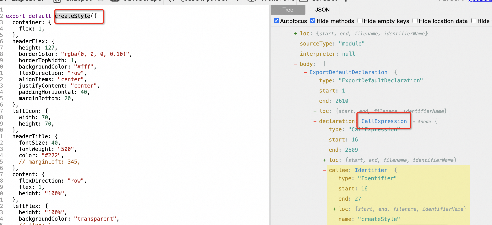
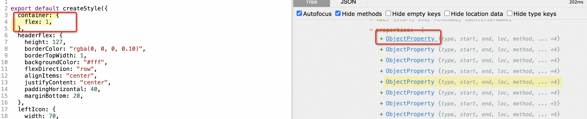

# 需求描述

在 RN 我有这样一个需求，就是需要将 px 单位转化为 rem 单位，因为 rem 单位可以适配不同屏幕尺寸，所以需要将 px 单位转化为 rem 单位。

## 实现思路

1. 首先需要获取屏幕的宽度，可以使用`Dimensions.get('window').width`来获取屏幕的宽度。
2. 然后需要定义一个基准值，比如设计稿的宽度为 750px，那么基准值就是 750。
3. 最后需要定义一个函数，将 px 单位转化为 rem 单位，公式为`px / 基准值 * 100`。

在主题里设置 一个变量，然后通过这个变量来计算 rem 单位。 375 是 我们设计稿的尺寸大小

```js
import { Dimensions } from "react-native";

const $rem = Dimensions.get("window").width / 375;
```

主题变量的设置可以查看 react-native 模块的环境变量解决方案

## babel 插件开发

首先我们想要实现一个效果呢

```js
export default createStyle({
  headerTitle: {
    fontSize: 40,
    fontWeight: "500",
    color: "#222",
    width: 200,
  },
  content: {
    flexDirection: "row",
    flex: 1,
    height: 100,
  },
});
```

我们需要把这个代码经过 babel 转化成下面的格式

```js
export default createStyle({
  headerTitle: {
    fontSize: "40rem",
    fontWeight: "500",
    color: "#222",
    width: "200rem",
  },
  content: {
    flexDirection: "row",
    flex: 1,
    height: "100rem",
  },
});
```

至于这里为什么设置 rem 单位的问题 详细可以参考 react-native 模块的环境变量解决方案 有详细介绍 rem 的问题

## 代码实现

思路就是匹配找到 createStyle 然后找出 匹配的节点 添加 rem

```js
// 罗列出所有需要转化的单位
const properties = [
  "width",
  "minWidth",
  "maxWidth",
  "height",
  "minHeight",
  "maxHeight",
  "padding",
  "paddingTop",
  "paddingBottom",
  "paddingLeft",
  "paddingRight",
  "paddingVertical",
  "paddingHorizontal",
  "margin",
  "marginTop",
  "marginBottom",
  "marginLeft",
  "marginRight",
  "left",
  "right",
  "top",
  "bottom",
  "top",
  "left",
  "right",
  "fontSize",
  "borderWidth",
  "borderLeftWidth",
  "borderTopWidth",
  "borderRightWidth",
  "borderBottomWidth",
  "borderRadius",
  "paddingHorizontal",
  "paddingVertical",
  "marginHorizontal",
  "marginVertical",
  "lineHeight",
  "borderTopLeftRadius",
  "borderTopRightRadius",
  "borderBottomLeftRadius",
  "borderBottomRightRadius",
];

module.exports = function ({ types: t }) {
  return {
    name: "rem-transform", // not required
    visitor: {
      // 因为  createStyle 是一个函数  而 CallExpression 表示函数调用 可以看下图 在线解析的对应节点
      CallExpression(path, state) {
        const calleeNode = path.get("callee");
        // 判断标识 是否是 createStyle
        let satisfied = calleeNode.isIdentifier({ name: "createStyle" });
        if (satisfied) {
          // path.traverse方法用于遍历抽象语法树中的节点
          path.traverse({
            // ObjectProperty 表示对象属性 由下图在线节点 可以看出，我们遍历的节点，所有 我们在写一个babel插件时，很多属性不清楚可以直接查看在线babel的AST节点
            ObjectProperty(subpath) {
              // 获取当前节点name值 然后判断是否在符合的范围内
              if (properties.includes(subpath.get("key.name").node)) {
                // 判断是不是数字类型 和 值不能为 0
                if (
                  subpath.get("value").isNumericLiteral() &&
                  subpath.get("value").node.value !== 0
                ) {
                  // 添加 rem
                  const val = `${subpath.get("value").node.value}rem`;
                  // 替换 当前AST节点
                  subpath.get("value").replaceWith(t.stringLiteral(val));
                } else if (
                  subpath.get("value").isStringLiteral() &&
                  subpath.get("value").node.value.startsWith("$")
                ) {
                  const val = `$rem * ${subpath.get("value").node.value}`;
                  subpath.get("value").replaceWith(t.stringLiteral(val));
                }
              }
            },
          });
        }
      },
    },
  };
};
```




traverse 中的一些方法用法 参考[官方文档](https://github.com/jamiebuilds/babel-handbook/blob/master/translations/en/plugin-handbook.md#babel-traverse)

调试 参考前面的文章 直接新增一个文件 然后 引入 测试即可
