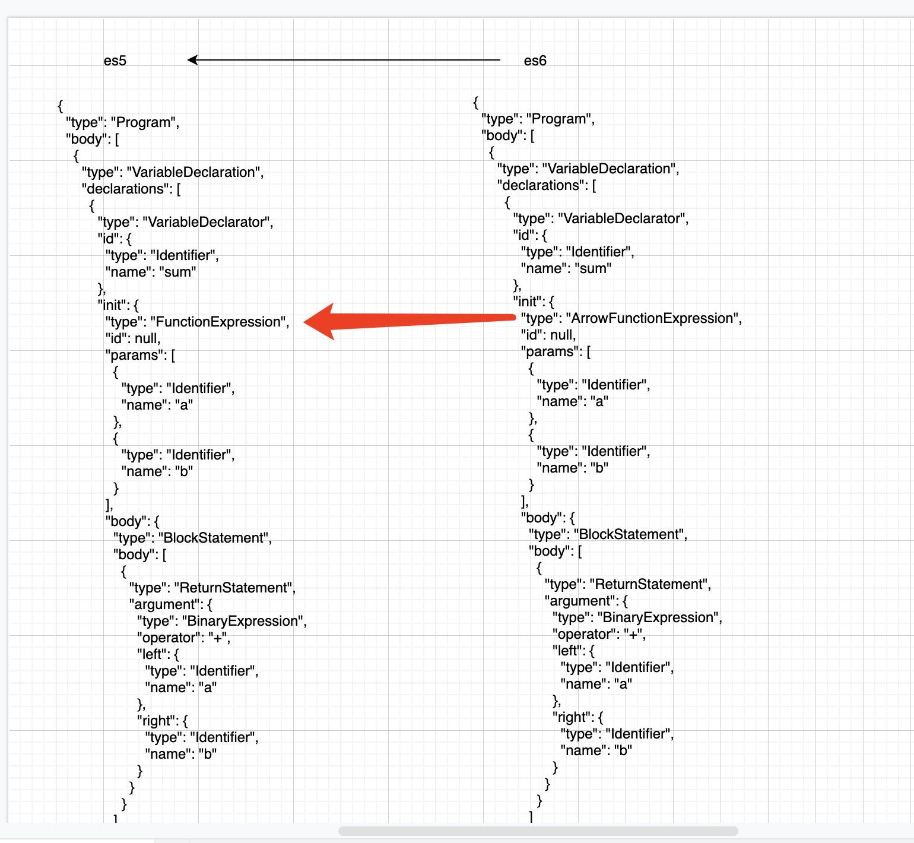

## 什么是抽象语法树

原理是通过 javascript Parser 把代码转化为一颗抽象语法树（AST） 这颗树定义了代码的结构，通过操纵这颗树，我们可以精准的定位到声明语句
赋值语句 运算语句 等等 实现对代码的分析和优化

抽象语法树 是源代码的抽象语法结构的树状表达形式

- 解析我们的语法 => 生成语法树
- 遍历树（先序深度优先） => 更改树的内容
- 生成新的内容

## 抽象语法树的用途

- 代码语法检查 代码风格检查 代码的格式化（比如eslint等代码检查 自动修复）
- 代码混淆压缩（uglify2）
- 优化 变更代码 改变代码结构
  - 代码打包工具 webpack rollup
  - commonjs AMD CMD
  - jsx TS 转化成原生js

## Esprima

这个插件 可以帮我把 js 语法解析成 抽象语法树

看一下这个简单的 js 被转化后的 抽象语法树

```js
var answer = 6 * 7;
```

转化后的抽象语法树

```js
{
  "type": "Program",
  "body": [
    {
      "type": "VariableDeclaration",
      "declarations": [
        {
          "type": "VariableDeclarator",
          "id": {
            "type": "Identifier",
            "name": "answer"
          },
          "init": {
            "type": "BinaryExpression",
            "operator": "*",
            "left": {
              "type": "Literal",
              "value": 6,
              "raw": "6"
            },
            "right": {
              "type": "Literal",
              "value": 7,
              "raw": "7"
            }
          }
        }
      ],
      "kind": "var"
    }
  ],
  "sourceType": "script"
}

```

## estraverse

这个插件可以帮我们遍历语法树

## escodegen

这个插件可以把语法树生成对应的 js 语法

```js
let code = `function AST(){}`;
let esprima = require("esprima");
let tree = esprima.parseScript(code);
console.log(tree);

let estraverse = require("estraverse");

estraverse.traverse(tree, {
  enter(node) {
    if (node.type === "Identifier") {
      node.name = "ast";
    }
  },
});
let escodegen = require("escodegen");
let result = escodegen.generate(tree);
console.log(result);

//定义一个 简单的js语法函数  经历 被编译成抽象语法树  然后深度优先遍历 修改函数名  然后 再把语法树 转化成js语言
```

了解了 这个大致流程 我们也就知道了 其实 babel 就是做的一个这样的事情 都是通过抽象语法树 遍历 修改 再转成 js 语法

## 写一个 babel 插件 深度理解 整个过程

直接使用 babel 来实现

```js
npm i @babel/core babel-types --save-dev
```

`@babel/core`核心库 用来转化 `babel-types` 转成 ast

一个把箭头函数转化es5的函数简单 babel插件

例子

`let sum = (a,b)=>{return a+b}`

我们来看一下 箭头函数 转化成抽象语法树是什么样子的  再看一下 非箭头函数转化成抽象语法树是什么样子的
转化后的 代码 可以 [esprima在线网站](https://esprima.org/demo/parse.html#)查看


可以看出 两者的区别在于 ArrowFunctionExpression FunctionExpression 

理论上我们只要把对应的值修改 然后再转化成js语言 就可以达到目的 好 来写一些

```js
let babel = require('@babel/core') //用来生成语法树 并且遍历转化语法树
let t = require('babel-types') // 用来生成新的节点 或者判断 某个节点是否是某个类型

let code = 'let sum = (a,b)=>{return a+b}'


let ArrowPlugin = {
  // visitor 可以访问源代码生成的语法树所有的节点 捕获特定的节点
    visitor:{
      // 捕获箭头函数的表达式 然后转化成普通函数
        // path 树的路径  当遍历到 ArrowFunctionExpression
        ArrowFunctionExpression(path){
          let id = path.parent.id // path.node代表当前节点  path.parent代表父节点
            let node = path.node
            let params = node.params
            let body = node.body
            let generator = node.generator
            let async = node.async
            // 生成一个函数表达式
            let func = t.functionExpression(id,params,body,generator,async)
            path.replaceWith(func)
        }
    }
}

// .babelrc
// babel 本身没有什么转化的能力 必须要传入一些插件才可以
let r = babel.transform(code,{
    plugins:[
        ArrowPlugin
    ]
})
console.log(r.code) 
// let sum = function (a, b) {
// return a + b;
//};
```

过程不是很复杂 只是需要了解一下相关的api 如果要写一些babel的插件 可以 到查看babel一些相关的文档