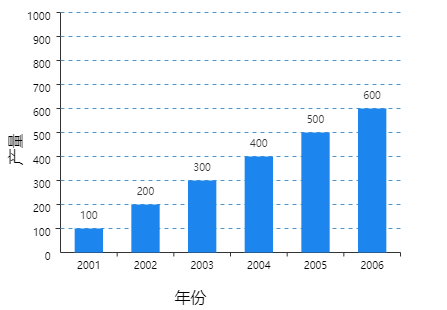

## 创建画布

```html
<!DOCTYPE html>
<html lang="en">
  <head>
    <meta charset="UTF-8" />
    <meta http-equiv="X-UA-Compatible" content="IE=edge" />
    <meta name="viewport" content="width=device-width, initial-scale=1.0" />
    <title>canvas</title>
  </head>
  <body>
    // 可以在创建设置宽高 也可以使用js动态设置画布宽高
    <canvas id="canvas" height="1000" width="1000"></canvas>
  </body>
  <script>
    <script>
    var canvas = document.getElementById("canvas");
    var context = canvas.getContext("2d");
    var cx = canvas.width = 1000;
    var cy = canvas.height = 1000;
  </script>
</html>
```

## 常用的 API

- fill() 填充路径
- stroke() 描边
- arc() 创建圆弧
- rect() 创建矩形
- fillRect() 绘制矩形路径区域
- strokeRect() 绘制矩形路径描边
- clearRect() 在给定的矩形内清楚指定的像素
- arcTo() 创建两切线之间的弧/曲线
- beginPath() 起使一条路径，或者重置当前路径
- moveTo() 把路径移动到画布的指定点，不创建线段
- lineTo() 添加一个新的点 然后在画布中创建改点到最后指定点的线条
- closePath() 创建当前点回到起始点的路径
- clip() 从原始画布剪切任意形状的区域
- quadraticCurveTo() 创建二次方贝塞尔曲线
- bezierCurveTo() 创建三次方贝塞尔曲线
- isPointInPath() 如果指定的点位于当前路径中，则返回 true 否则 false
- [canvas api 文档](https://www.canvasapi.cn/) 不明白的可以参考文档

接下来我们实现一个个小例子来熟悉这些 api

## 画一个三角形

想要实现一个三角形，首先我们要学会怎么画线段

```js
var canvas = document.getElementById("canvas");
var ctx = canvas.getContext("2d");

ctx.beginPath();
// ctx.moveTo(x,y) xy是画布中坐标
ctx.moveTo(100, 100);
// ctx.lineTo(x,y)
ctx.lineTo(100, 200);
// 设置描边样式
ctx.strokeStyle = "#000";
// 对路径进行描边
ctx.stroke();
// 这样我们就画了一个线段
```

既然我们画了一个线段，那么我们用三条线段不就组成了一个三角形吗

```js
var canvas = document.getElementById("canvas");
var ctx = canvas.getContext("2d");

ctx.beginPath();
ctx.moveTo(100, 100);
ctx.lineTo(100, 200);
ctx.lineTo(200, 150);
ctx.lineTo(100, 100);
ctx.stroke();
// 这样我们就画了一个空心的三角形 如果想画一个实心的三角形，我们可以把ctx.stroke()修改为 ctx.fill()
```

## 画个圆

画个圆还是比较简单的，因为提供给我固定的 api 使用

```js
var canvas = document.getElementById("canvas");
var ctx = canvas.getContext("2d");

ctx.beginPath();
ctx.arc(100, 100, 50, 0, Math.PI * 2, false);
// 可以控制画圆的颜色
ctx.fillStyle = "#000";
ctx.closePath();
ctx.fill(); // 实心圆  空心圆可以用  ctx.stroke()

// context.arc(x, y, radius,  startAngle, endAngle [, anticlockwise]);
// x对应圆心横坐标 y对应圆心纵坐标 radius 半径  startAngle 开始角度  endAngle结束角度  anticlockwise顺时针还是逆时针
```

## 画个渐变

如何设置渐变

- createLinearGradient() 创建线性渐变
- createPattern() 在指定方向上重复指定的元素
- createRadialGradient() 创建放射性渐变
- addColorStop() 规定渐变的颜色 和位置

```js
var canvas = document.getElementById("canvas");
var ctx = canvas.getContext("2d");

// ctx.createLinearGradient(x0,y0,x1,y1);
// x0：开始渐变的 x 坐标
// y0：开始渐变的 y 坐标
// x1：结束渐变的 x 坐标
// y1：结束渐变的 y 坐标
var grd = ctx.createLinearGradient(0, 0, 100, 0);
grd.addColorStop(0, "pink");
grd.addColorStop(1, "red");
ctx.fillStyle = grd;
ctx.fillRect(0, 0, 200, 200);
```

## 绘制文本

```js
var canvas = document.getElementById("canvas");
var ctx = canvas.getContext("2d");

ctx.font = "48px serif";
// 实心文本 10 ，50 代表的是字的起始坐标位置
ctx.fillText("Hello world", 10, 50);
//空心文本
ctx.strokeText("Hello world", 10, 50);
```

## 绘制图片

```js
var canvas = document.getElementById("canvas");
var ctx = canvas.getContext("2d");

var img = new Image();
img.onload = function () {
  // 0 0 图片的起始坐标
  ctx.drawImage(img, 0, 0);
};
img.src = "https://mdn.mozillademos.org/files/5395/backdrop.png";
```

drawImage 还有一些其他可选的参数

drawImage(image, sx, sy, sWidth, sHeight, dx, dy, dWidth, dHeight);

[详细参数参考文档](https://www.canvasapi.cn/CanvasRenderingContext2D/drawImage)

## 画个最基本的柱状图



首选我们分析一下，要实现这样一个柱状图要做哪些事情

- 实现坐标轴
- 实现刻度
- 画矩形
- 绘制文本

总体可以分为这几种，我可以一个一个来实现，分解功能更容易理解

### 实现坐标轴

坐标轴的实现实际上就是两个线段，参考之前的教程相信我们都已经会实现线短，那么 实现坐标轴岂不是轻而易举，开始之前我们要先定义一些变量方便我们之后的使用

```js
var canvas = document.getElementById("canvas");
var ctx = canvas.getContext("2d");

// 定义一些画布属性
let cWidth = canvas.width, // 画布宽度
  cHeight = canvas.height, // 画布高度
  cPadding = 80, //画布上下左右的编剧
  yAxisH = cHeight - cPadding * 2, // y轴的高度 等于画布高度减去上下的边距
  xAxisW = cWidth - cPadding * 2, // x轴的宽度 等于画宽度减去左右边距
  originX = cPadding, // 原点横坐标
  originY = yAxisH + cPadding, // 原点纵坐标
  yAxisNum = 10, // y轴分段
  xAxisNum = 0, // x轴分段 根据数据分
  data = [
    [2001, 100],
    [2002, 200],
    [2003, 300],
    [2004, 400],
    [2005, 500],
    [2006, 600],
  ]; // 数据
```

然后定义一个初始化函数，我们就开始画坐标系，有没有发现我们的刻度实际上也是线段，所以我们可以封装一下画线的函数，上代码

```js
// 调用初始化函数
init();
// 初始化
function init() {
  xAxisNum = data.length;
  // 首先我们要画一个坐标系
  // 画坐标系
  drawAxis();
  // 画刻度线
  drawMarker();
  // 画柱子
  drawBar();
}
// 画坐标系
function drawAxis() {
  // 画坐标系首先画线段，因为有很多地方都需要画线，所以我们封装一个划线的函数
  // 定义线条的颜色
  ctx.strokeStyle = "#333";
  // y轴
  drawLine(cPadding, cPadding, cPadding, cHeight - cPadding);
  // x轴
  drawLine(cPadding, cHeight - cPadding, cWidth - cPadding, cHeight - cPadding);
}
// 划线函数
function drawLine(x, y, x1, y1) {
  // 划线我们需要两个点就可以画出目标线段，原点和目标点
  ctx.beginPath();
  ctx.lineWidth = 1; // 线宽
  ctx.moveTo(x, y);
  ctx.lineTo(x1, y1);
  ctx.stroke();
  ctx.closePath();
}
```

有没有发现，我们的实现的坐标系比较模糊,

> canvas 绘图时，会从两个物理像素的中间位置开始绘制并向两边扩散 0.5 个物理像素。当设备像素比为 1 时，一个 1px 的线条实际上占据了两个物理像素（每个像素实际上只占一半），由于不存在 0.5 个像素，所以这两个像素本来不应该被绘制的部分也被绘制了，于是 1 物理像素的线条变成了 2 物理像素，视觉上就造成了模糊

我们可以通过偏移画布来解决问题

```js
function init() {
  xAxisNum = data.length;
  // 首先我们要画一个坐标系
  ctx.translate(0.5, 0.5); // 解决画图很模糊的问题
  // 画坐标系
  drawAxis();
  // 画刻度线
  drawMarker();
  // 画柱子
  drawBar();
  ctx.translate(-0.5, -0.5); // 解决画图很模糊的问题
}
```

这样看起来是不是比之前清晰很多

### 实现刻度和文字

刻度也都是一个一个线段，只要我们给出每个刻度的坐标即可

```js
// 刻度函数
function drawMarker() {
  //y轴 刻度
  let yVal = yAxisH / yAxisNum; // 刻度间的距离
  ctx.textAlign = "right";
  for (let i = 0; i <= yAxisNum; i++) {
    // 绘制文本
    ctx.fillText(i * 100, originX - 10, originY - i * yVal + 7);
    if (i > 0) {
      this.ctx.strokeStyle = "#333";
      // 刻度
      drawLine(originX, originY - i * yVal, originX - 5, originY - i * yVal);
      this.ctx.strokeStyle = "#4F94CD";
      // x轴辅助线
      drawLine(
        originX,
        originY - i * yVal,
        cWidth - cPadding,
        originY - i * yVal,
        true
      );
    }
  }

  ctx.save();
  ctx.font = "16px Arial";
  ctx.rotate(-Math.PI / 2);
  ctx.fillText("产量", -cHeight / 2, 40);
  ctx.restore();

  // x轴刻度
  let xVal = xAxisW / xAxisNum;
  ctx.strokeStyle = "#333";
  ctx.textAlign = "center";
  for (let i = 0; i < xAxisNum; i++) {
    ctx.fillText(data[i][0], originX + (i + 1) * xVal - xVal / 2, originY + 16);
    drawLine(
      originX + (i + 1) * xVal,
      originY,
      originX + (i + 1) * xVal,
      originY + 6
    );
  }
  ctx.save();
  ctx.font = "16px Arial";
  ctx.fillText("年份", (cWidth - cPadding) / 2, cHeight - cPadding + 50);
  ctx.restore();
}
```

因为我们的辅助线添加了虚线，所以我画线函数需要修改下

```js
// 划线函数
function drawLine(x, y, x1, y1, z = false) {
  // 划线我们需要两个点就可以画出目标线段，原点和目标点
  ctx.beginPath();
  // 加入是否需要虚线的判断
  if (z) {
    // 虚线
    ctx.setLineDash([4, 4]);
  }
}
```

### 实现矩形

```js
function drawBar() {
  let xVal = xAxisW / xAxisNum; // x刻度间的距离大小
  // 柱子宽度
  let barW = xVal / 2;
  for (let i = 0; i < xAxisNum; i++) {
    // 数据应该占据y轴的高度
    let barH = (data[i][1] * yAxisH) / 1000;
    let x = originX + i * xVal + barW / 2;
    let y = originY - barH;
    // 画矩形
    drawRect(x, y, barW, barH);
    // 写文字
    ctx.fillStyle = "#333";
    ctx.fillText(data[i][1], x + barW / 2, y - 10);
  }
}
// 画矩形
function drawRect(x, y, w, h) {
  ctx.beginPath();
  ctx.rect(x, y, w, h);
  ctx.fillStyle = "#1C86EE";
  ctx.fill();
  ctx.closePath();
}
```

## 画折线图

折线图我们就在之前的柱状图基础是改动，我们只实现核心的功能，折线。其实也非常简单，就是计算出每个数据点的位置，然后划线出来

```js
// 折线图
function drawLineChart(){
    let xVal = xAxisW / xAxisNum;
    ctx.setLineDash([ ]);
    for(let i=0;i<xAxisNum;i++){
        let barH = data[i][1]*(yAxisH/1000);
        let y = originY - barH;
        if(i==0){
            ctx.moveTo(cPadding+xVal/2,y)
        }else{
            ctx.lineTo(cPadding + (i+1)*(xVal)-(xVal/2),y)
        }
    }
    ctx.stroke()
}
```


## 参考文章

- MDN
- https://www.canvasapi.cn/