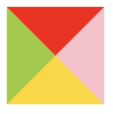
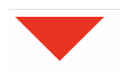

## border

```css
.triangle {
  width: 0;
  height: 0;
  border: 100px solid;
  border-color: orangered skyblue gold yellowgreen;
}
```

给一个 div 宽度和高度都是 0 的元素 border 的值都会直接相交，border 属性是三角形组成的

看下效果图


所有我们得到一个四个三角形

如果想要单个三角形 那么 只需要保留一个 其他的三个 设置透明即可

```css
.triangle {
  width: 0;
  height: 0;
  border-top: 50px solid red;
  border-right: 50px solid transparent;
  border-left: 50px solid transparent;
}
```



## linear-gradient

```css
.triangle {
  width: 160px;
  height: 200px;
  outline: 2px solid skyblue;
  background-repeat: no-repeat;
  background-image: linear-gradient(
      32deg,
      orangered 50%,
      rgba(255, 255, 255, 0) 50%
    ), linear-gradient(148deg, orangered 50%, rgba(255, 255, 255, 0) 50%);
  background-size: 100% 50%;
  background-position: top left, bottom left;
}
```

## clip-path

兼容性较差

```css
.triangle {
  margin: 100px;
  width: 160px;
  height: 200px;
  background-color: skyblue;
  clip-path: polygon(0 0, 0% 100%, 100% 50%);
}
```
