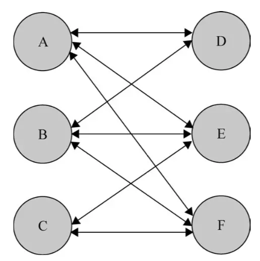
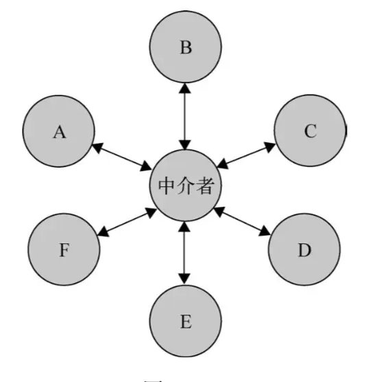

## 中介者模式

什么叫中介者模式

中介者模式的作用就是解除对象与对象之间的紧耦合关系  
增加一个中介者对象后，所有的相关对象都通过中介者对象来通信，而不是互相引用，所以当一个对象发生改变时，只需要通知中介者对象即可。  
中介者使各对象之间耦合松散，而且可以独立的地改变他们之间的交互，中介者模式使网状的多对多关系变成了一对多的关系  
下面我们来看两张图直观体会一下中介者模式  

vuex 和 redux 就使典型的中介者模式

缺点：

- 新增一个中介者对象，如果对象间交互非常复杂，会导致中介者对象很复杂，最后往往难以维护
- 过度集中化，中介者出现故障，那么代码可能出现问题

怎么取衡量是否使用中介者模式呢
中介者模式可以非常方便对模块或者对象进行解耦，但对象之间并非需要解耦，实际项目中，模块和对象有一些依赖关系是正常的，  
 一般来说如果对象之间的复杂耦合度导致了代码维护和调用出现了困难，而这些耦合度随项目的变化程指数增长曲线，那么这个时候我们就可以考虑中介者模式来重构代码
