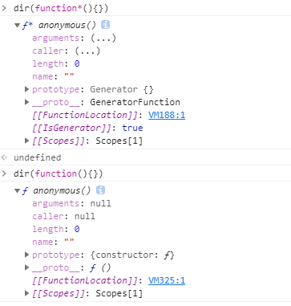

介绍 Generator 之前我们先了解一下 Iterator

## Iterator

遍历器（Iterator）是一种机制（接口）：为各种不同的数据结构提供统一的访问接口，任何数据结构只要部署 Iterator 接口，就可以完成遍历操作，一次处理数据成员

- 拥有 next 方法用于依次遍历数据结构的成员
- 每次遍历返回的结果是一个对象{done:false,value:'xxx'}
  - done:记录是否完成遍历
  - value:当前遍历的结果

拥有 Symbol.Iterator 属性的数据结构（值），都是可以遍历的，可以基于 for of 循环

- 数组
- 部分类数组
- String
- Set
- Map
- generator OBject

注意：对象不具备 Symbol.iterator 属于不可遍历的数据结构

那我们已经知道 Iterator 主要的功能以及目的，我们模拟一下这个过程

```js
class Iterator {
  constructor(assemble) {
    let self = this;
    // 挂载到实例的是有属性上:方便后期在方法中基于实例获取这些值
    // assemble:数字作为索引逐级递增、拥有length属性存储集合长度
    self.assemble = assemble;
    self.index = 0;
  }
  next() {
    let self = this,
      assemble = self.assemble,
      index = self.index;
    if (index > assemble.length - 1) {
      return { done: true, value: undefined };
    } else {
      return {
        done: false,
        value: assemble[self.index++],
      };
    }
  }
}
let itor = new Iterator([10, 20, 30, 40]);
console.log(itor.next()); //->{done:false,value:10}
console.log(itor.next()); //->{done:false,value:20}
console.log(itor.next()); //->{done:false,value:30}
console.log(itor.next()); //->{done:false,value:40}
console.log(itor.next()); //->{done:true,value:undefined}
```

对象不具备 Symbol.iterator 是无法遍历的，那我们可以给对象添加一个 Symbol.iterator 对象就可以遍历

```js
let obj = {
  0: 10,
  1: 20,
  length: 2,
  [Symbol.iterator]: Array.prototype[Symbol.iterator],
};
// 把数组的 [Symbol.iterator]给对象
// 当然我们还可以自己写一个函数
let obj = {
  0: 10,
  1: 20,
  length: 2,
  [Symbol.iterator]: function () {
    return new Iterator(this);
  },
};
// 这样 就可以使用for of 遍历  for of 内部是使用iterator.next去迭代处理的
```

默认使用 Iterator 的场合

- 解构赋值
- 扩展运算符(...)
- yield \*
- for...of
- Array.from()
- Map(), Set(), WeakMap(), WeakSet()（比如 new Map([['a',1],['b',2]])）
- Promise.all()
- Promise.race()

## Generator

生成器对象是由一个 generator function 返回的 并且它符合可迭代协议和迭代器协议

生成器有两个特征

- function 关键字和函数名之间有一个星号
- 函数体内部使用 yield 表达式 定义不同的内部状态

普通函数和迭代器函数的区别



- 生成器函数 [[IsGenerator]]:true
- 「把它当做一个实例 **proto**」  
  普通函数是 Function 的实例，普通函数.**proto**===Function.prototype
  生成器函数是 GeneratorFunction 的实例，生成器函数.**proto**===GeneratorFunction.prototype -> GeneratorFunction.prototype.**proto**===Function.prototype
  ({}).toString.call(生成器函数) => "[object GeneratorFunction]"

- 「把它作为一个构造函数 prototype」  
  普通构造函数.prototype -> 原型对象（constructor:构造函数）
  生成器构造函数.prototype -> 原型对象(空对象：可以自己设置内容)
  生成器函数.prototype.**proto** === Generator.prototype（next/return/throw/Symbol.toStringTag/Symbol.iterator...）

```js
// 生成器定义的函数不能new
function* fn() {}
new fn(); // Uncaught TypeError fn is not a constructor
```

Generator 是基于 Iterator 迭代器规范管理 Promise 或者异步编程的；Promise 是基于承诺模式管理异步编程；async/await 是对 Generator 的进一步封装「语法糖」；

```js
function* fn() {
  yield 1;
  yield 2;
  yield 3;
  return 4;
}
let itor = fn();
console.log(itor.next()); //->{done:false,value:1}
console.log(itor.next()); //->{done:false,value:2}
console.log(itor.next()); //->{done:false,value:3}
console.log(itor.next()); //->{done:true,value:4}

// 创建了fn的实例 但是和呢哇执行不一样 fn中的代码还没有执行
// 当后续执行itor.next 才会执行代码
// 每执行依次next 遇到一个 yield就结束 （每次返回都符合迭代器规范）
```

```js
// 执行next传递值，可以把传递值作为上一次yeild后的结果，但是yield后面跟的值是给每一次next执行后的value的
function* fn() {
  let x = yield 1;
  console.log(x);
}
let itor = fn();
console.log(itor.next());
console.log(itor.next(10));

//->{done:false,value:1}
// 10
//->{done:true,value:undefined}
```

### throw

Generator 有一个 throw 方法 可以在函数体外抛出错误 在 Generator 函数体内捕获

例如

```js
var g = function* () {
  try {
    yield;
  } catch (e) {
    console.log("内部捕获", e);
  }
};

var i = g();
i.next();

try {
  i.throw("a");
  i.throw("b");
} catch (e) {
  console.log("外部捕获", e);
}
// 内部捕获 a
// 外部捕获 b
```

但是只能第一次捕获 第二次抛出错误 会被函数体外 捕获
