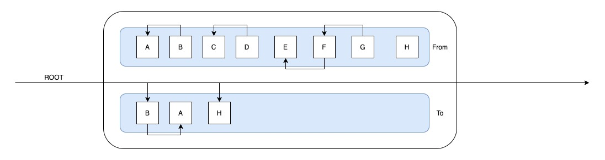

> 当网页运行时，浏览器会给网页分配一段连续的内存空间使用,内存空间会被分为栈内存和堆内存，栈内存只用于管理函数的执行顺序，堆内存用于存储其他所有对象，程序运行时会使用内存，但是内存空间是有限的，所以就有了垃圾回收的概念

- 引用：内存的起始地址
- 弱引用： WeakMap WeakSet
- 垃圾：无任何引用的对象
- 回收：清空被垃圾占用的内存
- 垃圾回收区域：堆内存
- 发生时间：程序空闲时间

## 引用计数

堆中的每个对象都有一个引用计数器。当一个对象被创造初始化赋值之后，该变量计数就设置为 1

看个例子

```js
// user 具有对这个对象的引用
let user = {
  name: "John",
}; // 计数变量 +1 1
let admin = user; // 计数变量 +1 2
```

当引用失效时 计数器的值就减 1

```js
user = null; // 计数变量 -1 1
admin = null; // 计数变量 -1 0 这个时候该对象计数值为0 那么就代表失去了引用 那么就可以回收 该对象
```

优点：引用计数收集器执行简单，实现简单，判定效率高，无延迟，对程序不被长时间打断的实时环境比较有利。

缺点：赋值时需要更新计数器，增加了微量时间开销，影响不大。最严重的问题是引用计数器无法处理循环引用的问题。

循环引用的例子

```js
let a = {
  b: 1,
  next: {
    b: 2,
    next: a,
  },
};
a = null; // 这个时候 该对象不可访问 计数也不为0 无法被回收 导致内存泄漏
```


## 标记清除

标记：遍历所有对象找标记活动对象
清除：遍历所有对象，清除没有标记的对象

标记清除算法是一种间接回收算法，它不像计数引用，并非直接检测垃圾本身，而是先确定所有的存活对象，然后反过来判断其他对象都是垃圾

## 根搜索算法 Tracing Collector

这是在 V8 引擎中使用的一种垃圾回收算法，简单介绍下

GC Roots Set（根集），他是可访问的引用集合，Roots Set 中的引用变量可以用于访问对象的属性以及调用对象的方法

该算法的基本思路是：通过一系列的 GC Roots 的对象作为起点，遍历寻找对应的引用节点，找到这些节点之后 继续向下递归寻找节点，所有所有走过的路径称为引用链，当一个对象到 GC Roots 没有引用链 代表该对象不可用


可以作为 根节点的对象：

- 所有正在运行栈上的引用变量
- 所有的全局对象 全局变量
- 所有的内置对象
- GC 判断对象是否可达 看的是强引用 非弱引用

## V8 引擎的垃圾回收

V8 的垃圾回收器叫 Orinoco，在早期的时候 垃圾回收器在标记和回收行为时，都会暂停 js 主线程的执行，我们把这种执行方式称为 stop-the-world

垃圾收集器定期执行的任务

- 识别活对象和死对象
- 回收/重用死对象占用的内存
- 压缩/碎片 整理内存

这些任务可以按照顺序执行 也可以任意交错执行，stop-the-world 的方式 会暂停 js 主线程，带来的副作用就是 用户感觉到卡顿和延迟


V8 把堆内存划分为两个区域 新生代 Young Generation 和 老生代 Old Generation，新生代主要存放的是生存时间短的对象，例如执行上下文。
老生代用于存储生存时间长的对象，例如函数声明。

新生代通常只有 1M-8M 的容量 老生代容量比较大

新生代区域又被进一步划分 为 from-space 和 to-space 两个区域

### Major GC

在 Orinoco 中 有两个不同的 GC ，Major GC 用来回收老生代的垃圾 Minor GC 用来回收新生代的垃圾
Major GC 采用了 Mark-Sweep 算法 （标记-清除）和 Mark-Compact 算法 （标记-整理）来管理内存

Mark-Sweep


从上图可以看出 使用 Mark-Sweep 算法 把未被标记的对象都清除后 产生了很多内存碎片。为了解决这问题 又引入了 Mark-Compact 算法

Compact 主要功能是移动存活的对象 修改引用 让它们指向新的地址


通过 Compact 算法的整理 我们得到了一个新的布局，不过这样整理的方式 会对堆内存遍历很多次 因此内存越大 性能消耗越大，不过因为老生代里的内存对象比较少，并且变动也少，所以 V8 仍然使用这种方法来管理老生代

### Minor GC

Minor GC 是专门用来管理新生代内存，并且使用了 Scavenge 算法进行垃圾回收 而 Scavenge 具体实现则采用了 cheney 的 GC 复制算法
这是一种使用空间换取时间的方法。

首先，空间复制算法会将新生代空间一分为二，Form-space 和 To-space 两个空间，新的对象首先会占满 From-space 空间，当 From-space 被占满，那么开始清理任务，并将剩下的活动对象 复制到 To-space 空间

#### 普通的复制算法

大致看一下 这个流程


看上图 当 From 空间占满时开始 清理任务 并且 把剩余的 移动到 To-space



首先 GC 根据根搜索法 开始从 Root 开始查找，首先找到活动对象 B 然后将 B 复制到 To-space 空间，然后接着查询 B 的引用，找到了 A，把 A 复制到 To-space，这是一个递归的过程。然后 A 没有新的引用，重新从 Root 开始查找，找到了 H 复制到 To-space 空间，接着查找 发现活跃的对象都已经复制完毕，接下来 把 From-space 空间清空，然后将两个空间互换，这样就有一个全新的 To-space 空间

#### Cheney GC 复制算法

普通的复制算法 使用的是深度优先搜索，Cheney 复制算法使用的是广度优先搜索，时间上有一定的优势


Cheney 复制算法 没有把临近的对象放到一起，访问速度上可能会稍慢于普通的复制算法，但是这种算法 没有了递归的风险 不用担心栈溢出等。

当然如果一直重复这个过程的话，总有新生代被占满的时候，所以如果当一个对象经历过两次 任务清理还存在，那么这个对象会被放入到老生代内存，这个过程叫晋升

## 对 stop-the-world 的优化

而 Mark-Compact 算法在执行过程中需要移动对象，而当活动对象较多的时候，它的执行速度不可能很快，为了避免 JavaScript 应用逻辑和垃圾回收器的内存资源竞争导致的不一致性问题，垃圾回收器会将 JavaScript 应用暂停，这个过程，被称为全停顿（stop-the-world）。

在新生代中 空间小 存活对象少，算法执行效率快，所以这个影响比较小，但是在老生代中 活动对象多，算法效率慢，导致页面卡顿比较严重。所以需要对全停顿进行优化

- Incremental 增量
- Parallel 并行
- Concurrent 并发
- Lazy sweeping 惰性清理

### 增量+惰性清理

增量的意思是在主线程间歇的时候执行一部分 GC 的标记，会把 GC 分成多个小任务。


当增量标记完成，如果我们对内存足以使 JS 代码快速执行，那么我们这个时候没必要立刻清理内存，可以将清理的过程延迟一下，让 js 逻辑代码先执行。这个清理使用的是惰性清理。

增量标记与惰性清理的出现，使主线程的最大停顿时间减少了 80%。页面更加流畅了。

因为在增量过程中，我们的堆内存的状态会发生变化，为了解决这个问题，V8 引入了 写屏障技术，Write-barrier 记录这些引用关系，但是同时也带来了一些额外的成本。实际上这种方式只是把执行分散开来，但是总体时间没有减少。

## 并行和并发

并行是主线程和辅助线程同时执行大致数量相等的任务，改方案依然采用的是 stop-the-world 方式,只是将清理任务交给多个线程来执行，可以减少暂停的时间。


并发是不暂停 js 执行代码的同时 辅助线程执行 GC 的工作，但是这种技术实现比较困难，因为 js 随时会改变堆内存中的状态，如果辅助线程和主线程同时修改同一对象就更加难以处理


## V8 中的新生代

在 V8 中的新生代使用的是并行的机制，在将活动对象从 From-space 复制到 to-space 时，启用多个辅助线程，并行的进行整理。由于多个线程可能会竞争同一个对象，因此第一个线程对该对象操作之后，都必须维护这个对象的转发地址，以便于其他线程能够快速判断该对象是否已经被复制。

## V8 中的老生代

在老生代中，如果堆中的内存大小超过某个阈值，会启用并发（Concurrent）标记任务。每个辅助线程都会去追踪每个标记到的对象的指针以及对这个对象的引用，而在 JavaScript 代码执行时候，并发标记也在后台的辅助进程中进行，当堆中的某个对象指针被 JavaScript 代码修改的时候，写入屏障（write barriers）技术会在辅助线程在进行并发标记的时候进行追踪。
