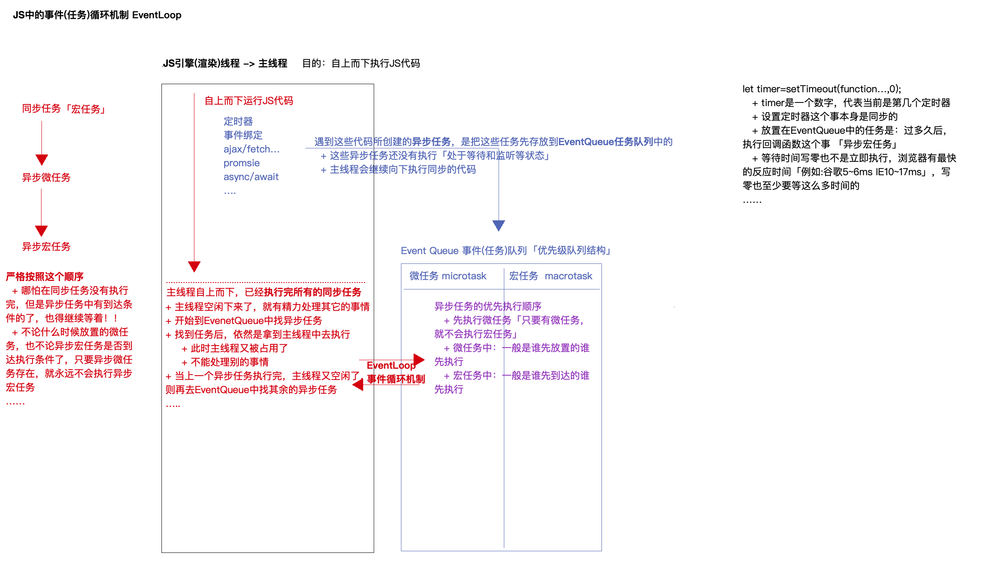

# EventLoop

js 是单线程运行机制，一次只能执行一个任务，不能多个任务同时执行，只能以排队的形式，只有前面的任务完成了后面的任务才可以开始，如果前面的任务非常耗时，那么就形成了阻塞，所以就诞生了 EventLoop 即事件循环，来解决这个问题（异步原理）

在 js 中，任务分为宏任务（macrotask）和微任务（microtask）两者都是队列，先执行宏任务的同步代码之后再执行微任务

## 进程和线程的概念

进程：可以理解为一个程序（浏览器打开一个页面）  
线程：程序中具体做事的人，一个进程可以有多个线程，一个线程只能做一件事情

浏览器是多线程的，打开一个页面浏览器会分配多个线程，同时处理多个事情

- GUI 渲染线程：自上而下的渲染页面
- js 引擎（渲染）线程：因为 js 是单线程的，所以浏览器只会开辟一个线程来执行 js 代码
- HTTP 网络请求线程：加载资源和数据
- 定时器监听线程：监听定时器是否到达时间
- DOM 事件监听线程：监听 DOM 事件的触发

## 宏任务

包括 script 全部代码 setTimeout requestAnimationFrame setInterval setImmediate I/O UI Rendering 事件绑定 http(ajax)请求

## 微任务

包括 promise Process.nextTick(node 独有) mutationObserver async/await

## 同步任务和异步任务

Javascript 单线程任务被分为同步任务和异步任务，同步任务会在调用栈中按照顺序等待主线程依次执行，异步任务会在异步任务有了结果后，将注册的回调函数放入任务队列中等待主线程空闲的时候（调用栈被清空），被读取到栈内等待主线程的执行。



## 看一段代码的执行过程

```js
const foo = () => console.log("First");
const bar = () => setTimeout(() => console.log("Second"), 500);
const baz = () => console.log("Third");

bar();
foo();
baz();
```

;

执行代码，首先把代码推入执行栈中执行代码，如果是同步代码那么直接执行，如果是异步代码，那么把代码推入队列中，然后继续执行栈中的同步代码，如果再次遇到异步代码，再次推入队列中，以此类推，当执行栈为空的时候，我们把队列中的代码依次推入栈中执行。

## 再看一段代码

```js
setTimeout(() => {
  console.log("timer1");
  Promise.resolve().then(() => {
    console.log("promise1");
  });
});
setTimeout(() => {
  console.log("timer2");
  Promise.resolve().then(() => {
    console.log("promise2");
  });
});
```

;

执行栈在执行完同步任务后，查看执行栈是否为空，如果执行栈为空，就会去执行 Task（宏任务），每次宏任务执行完毕后，检查微任务(microTask)队列是否为空，如果不为空的话，会按照先入先出的规则全部执行完微任务(microTask)后，设置微任务(microTask)队列为 null，然后再执行宏任务，如此循环。

## 还看一段代码

关于 async/await 的运行机制

1.async 定义的是一个 Promise 函数和普通函数一样只要不调用就不会进入事件队列。  
2.async 内部如果没有主动 return Promise，那么 async 会把函数的返回值用 Promise 包装。  
3.await 关键字必须出现在 async 函数中，await 后面不是必须要跟一个异步操作，也可以是一个普通表达式。  
4.遇到 await 关键字，await 右边的语句会被立即执行然后 await 下面的代码进入等待状态，等待 await 得到结果。await 后面如果不是 promise 对象, await 会阻塞后面的代码，先执行 async 外面的同步代码，同步代码执行完，再回到 async 内部，把这个非 promise 的东西，作为 await 表达式的结果。await 后面如果是 promise 对象，await 也会暂停 async 后面的代码，先执行 async 外面的同步代码，等着 Promise 对象 fulfilled，然后把 resolve 的参数作为 await 表达式的运算结果。

```js
setTimeout(function () {
  console.log("6");
}, 0);
console.log("1");
async function async1() {
  console.log("2");
  await async2();
  console.log("5");
}
async function async2() {
  console.log("3");
}
async1();
console.log("4");

// 打印结果
1;
2;
3;
4;
5;
6;
```

1.6 是宏任务在下一轮事件循环执行  
2.先同步输出 1，然后调用了 async1()，输出 2。  
3.await async2() 会先运行 async2()，5 进入等待状态。  
4.输出 3，这个时候先执行 async 函数外的同步代码输出 4。  
5.最后 await 拿到等待的结果继续往下执行输出 5。  
6.进入第二轮事件循环输出 6。

## 真的是最后一段代码了

```js
Promise.resolve().then(() => {
  console.log("Promise1");
  setTimeout(() => {
    console.log("setTimeout2");
  }, 0);
});
setTimeout(() => {
  console.log("setTimeout1");
  Promise.resolve().then(() => {
    console.log("Promise2");
  });
}, 0);
console.log("start");

// start
// Promise1
// setTimeout1
// Promise2
// setTimeout2
```

刚开始整个脚本代码可以看作成一个宏任务来执行，同步代码压入栈中，异步代码放入队列中，微任务放入微任务队列，宏任务放入宏任务队列，当宏任务执行完，检查微任务执行，依次循环

1.遇到 promise.resolve().then() 放入微任务队列
2.setTimeout 放入宏任务队列  
3.执行同步代码 console.log('start) 打印 start  
4.宏任务执行完检查微任务，发现有 promise  
5.执行 promise 打印 console.log('Promise1')  
6.发现 setTimeout 宏任务，放入队列中  
7.微任务执行完，本次宏任务结束，开始下一次宏任务执行  
8.打印 console.log('setTimeout1')  
9.发现微任务 promise 放入队列中  
10.宏任务执行完，检查微任务，发现有微任务，执行代码，打印 Promise2，微任务空  
11.本次宏任务结束，开始下一次宏任务 12.打印 setTimeout2，宏任务执行完，检查微任务，发现没有微任务，本次宏任务结束，终止。

参考资料  
1.https://juejin.cn/post/6844904004007247880#heading-11  
2.https://dev.to/lydiahallie/javascript-visualized-event-loop-3dif  
3.https://blog.csdn.net/roamingcode/article/details/85052590  
4.https://juejin.cn/post/6844903764202094606?utm_source=gold_browser_extension%3Futm_source%3Dgold_browser_extension
