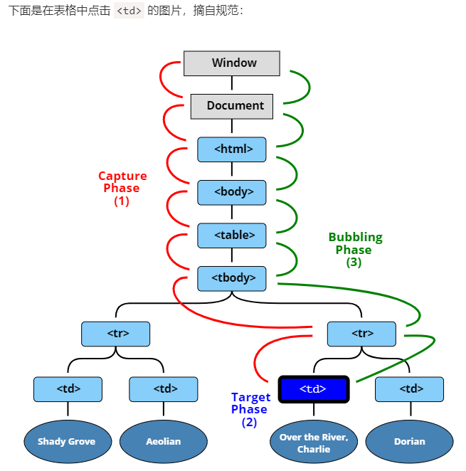

## 介绍

事件流是一个事件沿着特定的数据结构传播的过程，冒泡和捕获是事件流在 dom 中两种不同的传播方法

一共三个阶段

- 事件捕获 ---事件（从 Window）向下走近元素。
- 事件目标 ---事件到达目标元素。
- 事件冒泡 ---事件从元素上开始冒泡。

## 捕获和冒泡

> 事件捕获:当鼠标点击或者触发 dom 事件，浏览器会从根节点开始由外向内进行事件传播，如果点击了子元素，那么父元素注册了捕获事件，那么会先触发父元素的绑定事件

> 事件冒泡：冒泡是由内向外传播，一直到根节点

;  
w3c 的标准是先发生捕获再发生冒泡

;

## 事件对象

标准事件属性（常用属性）

target 事件目标节点
currentTarget 事件监听器触发的元素

标准事件方法（常用方法）

preventDefault() 阻止默认事件
stopPropagation() 组织冒泡

## 事件阻止

event.preventDefault()：取消事件对象的默认动作以及继续传播。
event.stopPropagation()/ event.cancelBubble = true：阻止事件冒泡。

event.stopImmediatePropagation()
如果一个元素在一个事件上有多个处理程序，即使其中一个停止冒泡，其他处理程序仍会执行。

换句话说，event.stopPropagation() 停止向上移动，但是当前元素上的其他处理程序都会继续运行。

有一个 event.stopImmediatePropagation() 方法，可以用于停止冒泡，并阻止当前元素上的处理程序运行。使用该方法之后，其他处理程序就不会被执行。

## 事件注册

```js
node.addEventListener(
  "click",
  (event) => {
    console.log("捕获 ");
  },
  true // 默认是false 冒泡才执行  修改为true 代表捕获阶段就执行
);
```

## 事件委托

在 js 中性能优化的其中一个主要思想是减少 dom 操作。  
假设有 100 个 li，每个 li 有相同的点击事件。如果为每个 Li 都添加事件，则会造成 dom 访问次数过多，引起浏览器重绘与重排的次数过多，性能则会降低。 使用事件委托则可以解决这样的问题  
实现事件委托是利用了事件的冒泡原理实现的。当我们为最外层的节点添加点击事件，那么里面的 ul、li、a 的点击事件都会冒泡到最外层节点上，委托它代为执行事件

```js
<ul id="ul">
  <li>1</li>
  <li>2</li>
  <li>3</li>
</ul>;
window.onload = function () {
  var ulEle = document.getElementById("ul");
  ul.onclick = function (ev) {
    //兼容IE
    ev = ev || window.event;
    var target = ev.target || ev.srcElement;

    if (target.nodeName.toLowerCase() == "li") {
      alert(target.innerHTML);
    }
  };
};
```
