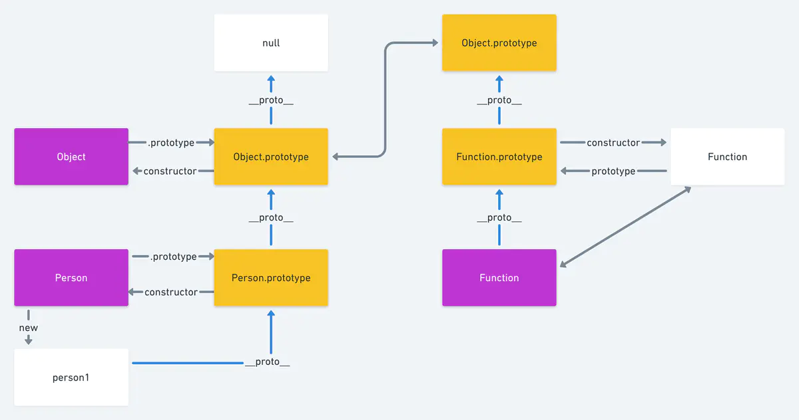

# 深入理解原型

## 构造函数

创建一个函数，当我们 new 这个函数，哪个这个过程就叫做构造函数  
通过构造函数创建对象也称为实例化

```js
function Animal(color) {
  // 实例属性
  this.color = color;
}
// 静态属性
Animal.age = "4";
let dog = new Animal("black");
```

在构造函数上定义方法，（方法是不共享的）  
每生成一个对象，添加一个方法，都是新建的内存，这样会造成内存的浪费

```js
function Star() {
  this.sing = function () {
    console.log("我爱唱歌");
  };
}
let stu1 = new Star();
let stu2 = new Star();
stu1.sing(); //我爱唱歌
stu2.sing(); //我爱唱歌
console.log(stu1.sing === stu2.sing); //false
```

在构造函数的原型上定义方法（方法是共享的）

```js
function Star(name) {
  this.name = name;
}
Star.prototype.sing = function () {
  console.log("我爱唱歌", this.name);
};
let stu1 = new Star("小红");
let stu2 = new Star("小蓝");
stu1.sing(); //我爱唱歌 小红
stu2.sing(); //我爱唱歌 小蓝
console.log(stu1.sing === stu2.sing); //true
```

## new 过程发生了什么

#### 看一段代码

```js
function Person() {}
Person.prototype.index = 10;
let stu = new Person();
console.log(stu.index); //10
```

步骤详解 new 过程  
1.首先会创建一个新的空对象 `let stu = new Object()`  
2.把创建的对象 stu 的`_proto_`指向 Person 的原型对象`prototype` `stu._proto_ = Person.prototype`  
3.改变 this 的指向，指向创建的新对象 `Person.call(stu)`  
我们可以发现，我们并没有把属性也赋值给新的对象，那么新的对象是怎么拿到值的呢？答案是原型链，当执行步骤 2 的时候，原型链就产生了，
`stu->Person.prototype->Object.prototype->null`
当 stu 查找自身属性 index，如果找不到就会向上查找，直到最顶层 null 为止。如果找到属性，那么会立刻终止，停止查找

#### 静态属性

```js
function Person() {}
Person.name = "s";
Person.prototype.age = "1";
const p = new Person();
console.log(p.age); // 1
console.log(p.name); // undefined
```

因为 name 是 Person 的静态属性，是绑定在 Person 的函数上的，并不在原型链上，所以 p 是获取不 name 的。

## _proto_

每一个 js 对象（除了 null）都具有一个属性叫 `_proto_`，这个属性会指向该对象的原型

对象`_proto_`属性的值就是它对应的原型对象，

```js
function Person() {}
var person = new Person();
console.log(person._proto_ === Person.prototype); // true
```

```js
var one = { x: 1 };
var two = new Object();
one.__proto__ === Object.prototype; // true
two.__proto__ === Object.prototype; // true
one.toString === one.__proto__.toString; // true
```

## prototype

只有函数才会有 `prototype`  
什么是原型：`Father.prototype`就是原型，其作用就是共享方法  
通过原型共享方法可以避免内存空间的浪费

## 原型链

开局一张图

;

person1 到 null 这个过程，（蓝色的线），就称为原型链

分析一下过程

1.我们从 Person 开始，开始从创建一个函数 Person  
2.创建对象`let person1 = new Person()` `person1._proto_=== Person.prototype`  
3.`Person.prototype.constructor === Person`原型的构造器指向原型 4.`Person.prototype._proto_ === Object.prototype`  
5.`Object.prototype._proto_ === null`  
从图中还可以看出的关系

```
person1._proto_._proto_ === Object.prototype
person1._proto_._proto_._proto_ === null
```

6.`Function._proto_=== Function.prototype`  
7.`Function.prototype._proto_ === Object.prototype`  
8.`Function.prototype.constructor === Function`

看一道题目

```js
Object.prototype.__proto__; //null
Function.prototype.__proto__; //Object.prototype
Object.__proto__; //Function.prototype
```

## 继承

看一道题目

```
按照如下要求实现Person 和 Student 对象
 a)Student 继承Person
 b)Person 包含一个实例变量 name， 包含一个方法 printName
 c)Student 包含一个实例变量 score， 包含一个实例方法printScore
 d)所有Person和Student对象之间共享一个方法
```

es5 写法

```js
// 先定义两个函数
function Person(name) {
  //实例变量name
  this.name = name;
  // 包含的方法
  this.printName = function () {
    console.log("this is printName");
  };
}
// 共享方法要放在原型上
Person.prototype.comment = function () {
  console.log("共享方法");
};
function Student(score) {
  this.score = score;
  this.printScore = function () {
    console.log("this is printScore");
  };
}
// student 想要继承Person的原型的方法，就要吧 Person的实例赋值给Student的原型
Student.prototype = new Person();
let person = new Person("小紫", 80);
let stu = new Student("小红", 100);
console.log(stu.printName === person.printName); //false
console.log(stu.comment === person.comment); //true
```

es6 写法
class 类，本质上还是函数，只不过是函数的语法糖，写起来更方便

```js
//类中的所有方法都会被继承
class Person {
  constructor(name) {
    this.name = name;
  }
  printName() {
    console.log("This is printName");
  }
  commonMethods() {
    console.log("我是共享方法");
  }
}

class Student extends Person {
  constructor(name, score) {
    //调用父类的constructor(name) 此时是作为一个函数
    super(name); // this指向是当前环境Student
    //相当于Student.prototype.constructor.call(this)

    // 此时super作为一个对象使用
    console.log(super.printName()); //this指向是Person
    // 相当于 Person.prototype.printName()
    this.score = score;
  }
  printScore() {
    console.log("This is printScore");
  }
}

let stu = new Student("小红");
let person = new Person("小紫");
console.log(stu.printName === person.printName); //true
console.log(stu.commonMethods === person.commonMethods); //true
```
