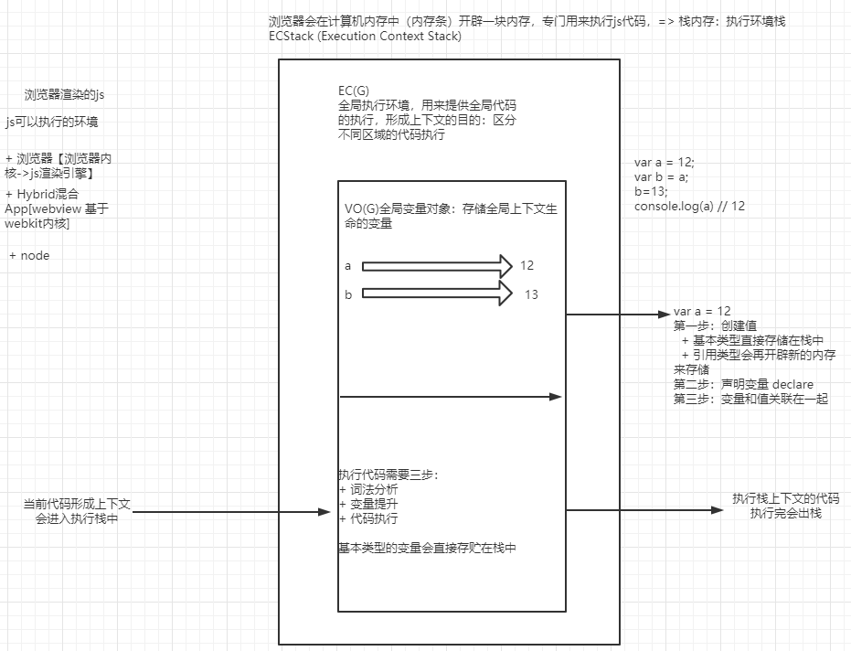
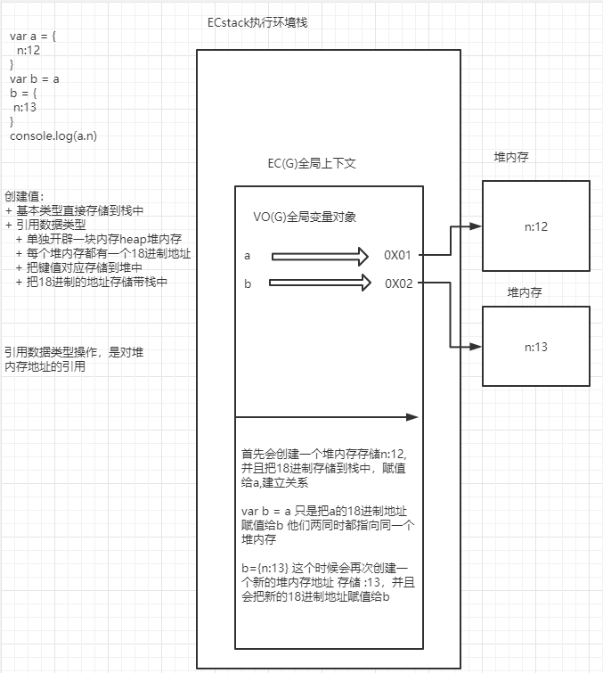
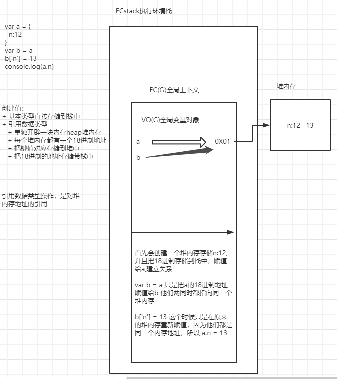
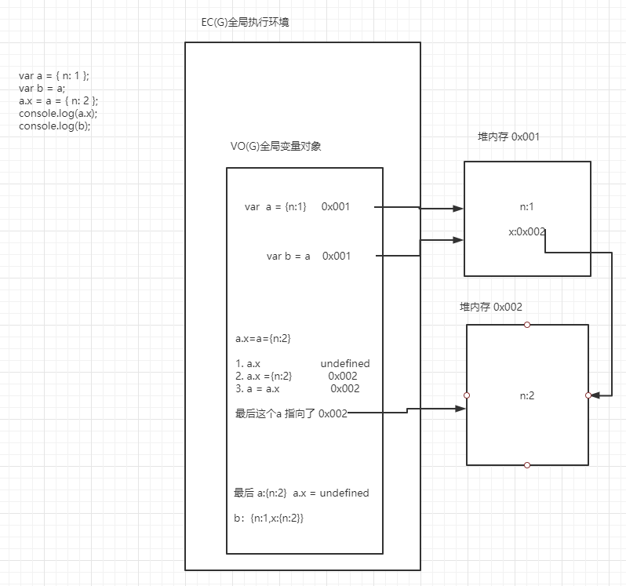
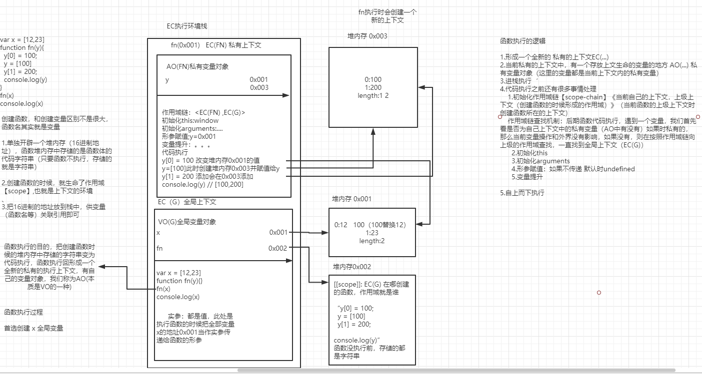

## 堆内存地址均为 16 进制，有的图笔误

## 看题分析

```js
var a = 12;
var b = a;
b = 13;
console.log(a); // 12
```



```js
var a = { n: 12 };
var b = a;
b = {
  n: 13,
};
console.log(a.n); // 12
```



```js
var a = { n: 12 };
var b = a;
b["n"] = 13;
console.log(a.n); // 13
```



```js
var a = { n: 1 };
var b = a;
a.x = a = { n: 2 };
console.log(a.x); // undefined
console.log(b); // {n:1,x:{n:2}}
```

a.x = a = {n:2}

优先级：

1 首先会访问 a.x 优先级最高
2 a.x = {n:2}
3 a = a.x



[运算符优先级](https://developer.mozilla.org/zh-CN/docs/Web/JavaScript/Reference/Operators/Operator_Precedence)

## 函数执行的底层机制

```js
var x = [12, 23];
function fn(y) {
  y[0] = 100;
  y = [100];
  y[1] = 200;
  console.log(y);
}
fn(x);
console.log(x);
```



一般的函数在执行完毕都会释放出栈
