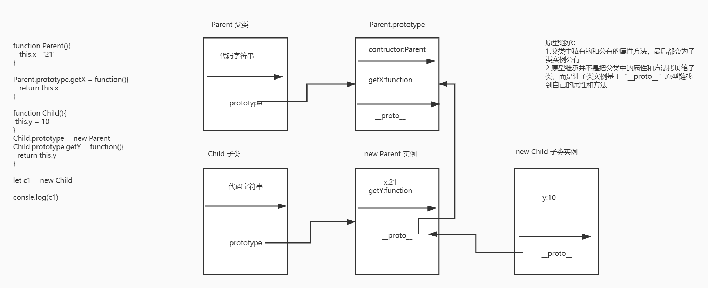

## 原型链继承

```js
function Parent() {
  this.name = "ww";
}
//首先把getName 方法挂载到 Parent 原型
Parent.prototype.getName = function () {
  consooe.log(this.name);
};
function Child() {}
// 然后 实例化 Parent 挂载到 Child的原型上，这样，Child 原型上就有了name属性和getName方法
Child.prototype = new Parent();
// new Parent() 实际上就是创建一个新的对象

var child = new Child();

console.log(child.getName());

// 原型链继承有一个问题就是 如果this.name是引用类型的，那么继承的属性相互间会相互影响，如果儿子更改，那么父亲的值也会相应更改
```



## 借用构造函数（经典继承）

```js
function Parent() {
  this.name = ["ww", "ee"];
}
function Child() {
  // 我们new Child 相当于 把Parent上下文的代码在自己的环境执行了一遍，
  // 所以每次 new Child 都拥有一个自己 name 属性，且相互不会影响
  Parent.call(this);
}
var child1 = new Child();
child1.name.push("cc");
var child2 = new Child();
child2.name.push("dd");
console.log(child1, child2);
// Child {name: Array(3)}name: (3) ["ww", "ee", "cc"]__proto__: Object Child {name: Array(3)}name: (3) ["ww", "ee", "dd"]__proto__: Object
```

缺点 ：只能继承私有属性，原型上的属性和方法无法继承

## 组合继承 （结合原型链继承和借用构造函数继承）

基本思想是，父亲的方法挂载到原型上，然后实例化挂载到儿子的原型上，这样儿子就有了父亲的方法，然后用借用构造函数的方法，让父亲的实例化属性被儿子继承，并且都拥有自己的独立属性，互不影响
看代码

```js
function Parent() {
  this.name = "ww";
  this.like = ["ss", "dd"];
}
Parent.prototype.sayName = function () {
  console.log(this.name);
};
function Child() {
  Parent.call(this);
}
Child.prototype = new Parent();

var child = new Child();
child.sayName(); // ww

// 并且 儿子可以传值给父亲

function Parent(name) {
  this.name = name;
}
Parent.prototype.sayName = function () {
  console.log(this.name);
};
function Child(name) {
  Parent.call(this, name);
}
Child.prototype = new Parent();

var child = new Child("jj");
console.log(child.name); // jj
```

优点：融合原型链继承和构造函数的优点，是 JavaScript 中最常用的继承模式。

## 原型式继承

对参数浅复制，Object.create()的原理，实际就是浅拷贝

```js
function objectCopy(obj) {
  function Fun() {}
  Fun.prototype = obj;
  return new Fun();
}
```

引用类型始终被共享

## 寄生式继承

缺点：和借用构造函数继承一样，每次都会被创建

```js
function createObj(o) {
  var clone = Object.create(o);
  clone.sayName = function () {
    console.log("hi");
  };
  return clone;
}
```

## 寄生组合继承（实际上就是寄生式和组合式继承的结合）

组合继承已经很大程度解决了引用类型公用，和方法继承的问题，但是，在使用的时候我们会调用两次 Parent ,所以我们需要解决这个问题 只调用一次，寄生组合正好可以解决这一问题，详细看代码

```js
function Parent(name) {
  this.name = name;
}
Parent.prototype.sayName = function () {
  console.log(this.name);
};
function Child(name) {
  Parent.call(this, name);
}
Child.prototype = Object.create(Parent.prototype);
Child.prototype.constructor = Child;
Child.prototype.getName = function () {
  console.log(this.name);
};
let c1 = new Child();
```

目前最完美继承方式，可以实现私有属性继承为私有属性，公有属性继承为公有属性

参考链接 ：
https://github.com/mqyqingfeng/Blog/issues/16
https://juejin.cn/post/6914216540468576263
