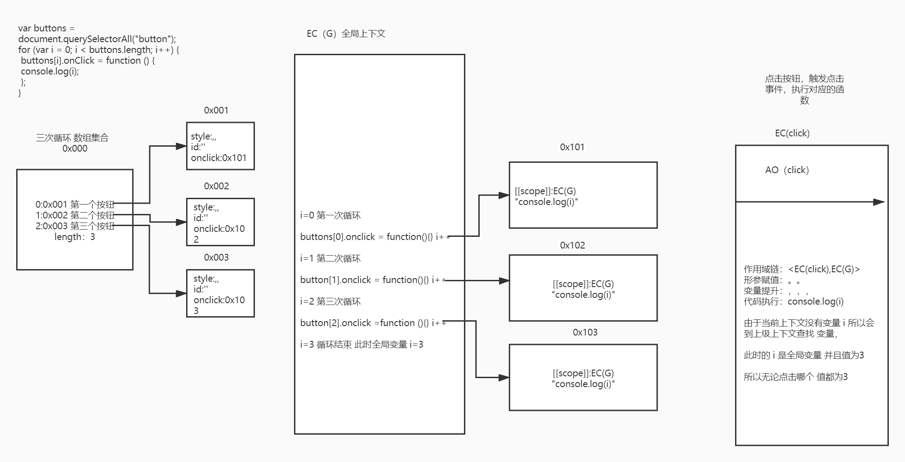

## 闭包

MDN 概念：一个函数和对其周围状态（lexical environment，词法环境）的引用捆绑在一起（或者说函数被引用包围），这样的组合就是闭包（closure）。也就是说，闭包让你可以在一个内层函数中访问到其外层函数的作用域。在 JavaScript 中，每当创建一个函数，闭包就会在函数创建的同时被创建出来。

闭包：函数运行时候的一种机制（不是某种代码形式）

函数执行会形成一个私有上下文，如果上下文种的某些内容（一般指的是堆内存地址）被上下文以外的一些事物（如：变量/事件绑定）所占用，则当前上下文不能被出栈释放（这是浏览器的垃圾回收机制（GC）决定的）

闭包机制：形成一个不被释放的上下文

保护：保护私有上下文种的私有变量和外界互不影响  
保存：上下文不被释放，那么上下文中的私有变量和值都会被保存起来，可以供其下级的上下文使用

弊端：如果大量使用闭包，会导致栈内存太大，页面渲染会变慢，性能受到影响，所以真实项目中需要合理应用闭包

## 看一段代码

```js
function makeFunc() {
  var name = "Mozilla";
  function displayName() {
    alert(name);
  }
  return displayName;
}

var myFunc = makeFunc(); // 因为函数makeFunc 返回了一个新的函数，这个函数被外部变量myFunc 占用，所以函数不能被释放，形成了闭包
myFunc();
```

这段代码就是一个闭包

## 看个案例

创建三个 button 按钮，点击按钮，获取索引

```js
var buttons = document.querySelectorAll("button");
for (var i = 0; i < buttons.length; i++) {
  buttons[i].onClick = function () {
    console.log(i);
  };
}
// 有经验的人一下就能看出来全部是3，可是，为什么是全部是3呢，我们来分析一下
```



怎么解决这个问题呢？

方案一 闭包

利用闭包的机制，保存变量 i

```js
var buttons = document.querySelectorAll("button");
for (var i = 0; i < buttons.length; i++) {
  // 自执行函数执行，会产生一个上下文EC(A) 私有形参变量 i= 0 /1/ 2
  // EC(A) 上下文中创建一个函数，并且让全局buttons中的某一项占用创建的函数
  (function (i) {
    buttons[i].onClick = function () {
      console.log(i);
    };
  })(i);
}
```

把 var 改成 let 内部原理其实也是闭包的机制

弊端;如果循环很多次 性能较差

方案二 自定义属性

```js
var buttons = document.querySelectorAll("button");
for (var i = 0; i < buttons.length; i++) {
  // 每一轮循环都创建一个自定义属性，保存i
  buttons[i].myIndex = i;
  buttons[i].onClick = function () {
    // 因为当前上下的环境是buttons 所以可以用this
    console.log(this.myIndex);
  };
}
```

弊端 ：每次循环都需要添加自定义属性 但是比闭包的性能要好点

方案三 事件委托

我没可以再 button 添加自定义属性 index

```js
<button index="0"></button>
<button index="1"></button>
<button index="2"></button>
```

利用事件委托的机制获取 index

```js
document.body.onClick = function (e) {
  var target = e.target;
  var targetTag = target.tagName;

  if (targetTag === "BUTTON") {
    var index = target.getAttribute("index");
    console.log(index);
  }
};
```

## 利用闭包机制实现的高级编程技巧

