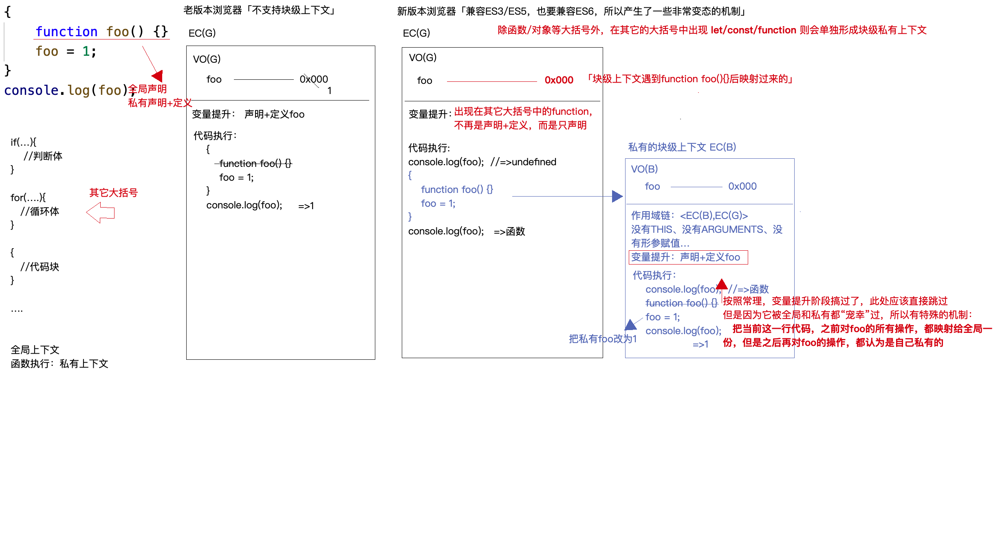
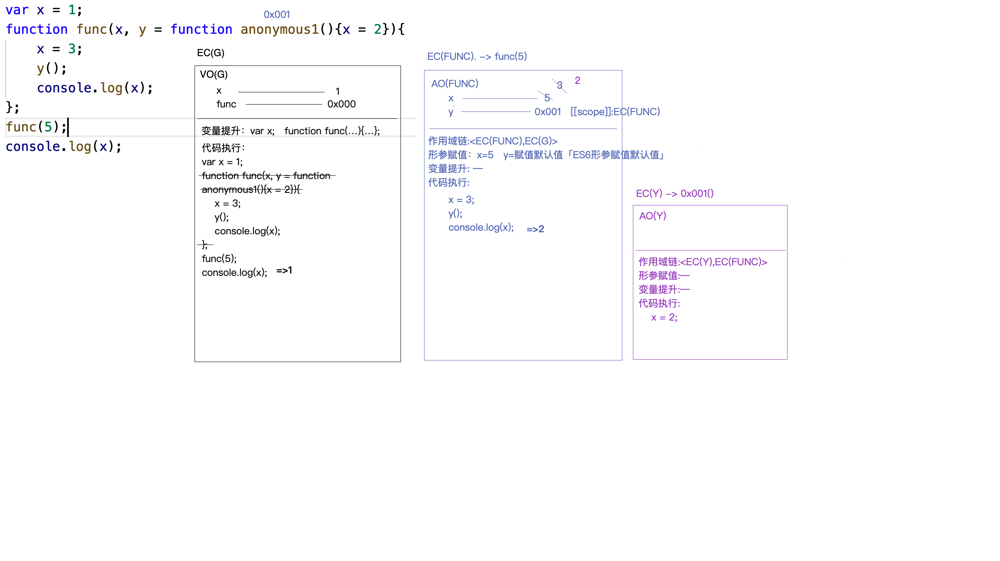
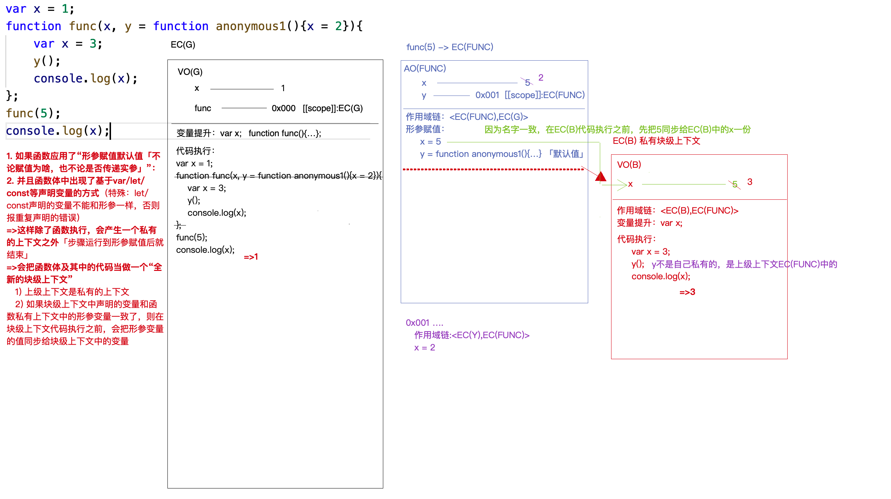

## 知识点

VO(G):全局变量对象「全局上下文中声明的变量」

GO「window」:全局对象 「浏览器默认开辟的一个堆内存，存储供 JS 调用的各种 API 的」

console.log(a);//首先看 VO(G)中是否有，如果没有，则再看 GO 中有没有，如果也没有，则报错：a is not defined

## 第一题

```js
var a = 12;
var b = 13;
var c = 14;
function fn(a) {
  // a 是私有变量 所以 a =10 b和c是全局变量
  console.log(a, b, c); //10 13 14
  a = 100;
  b = 200;
  // a和b都重新赋值
  console.log(a, b, c); // 100 200 14
}
// 因为函数没有返回值 所以值为undefined 全局变量b也变成undefined,如果函数有返回值，那么 b就是函数的返回值
b = fn(10);
console.log(a, b, c); // 12 undefined 14

// 只有var和函数才会变量提升
```

## 第二题

```js
var i = 0;
function A() {
  var i = 10;
  function x() {
    console.log(i);
  }
  return x;
}
var y = A();
y();
function B() {
  var i = 20;
  y();
}
B();

/*
 * EC(G)变量提升
 *   var i;
 *   A = 0x000; [[scope]]:EC(G) 
 *   var y;
 *   B = 0x001; [[scope]]:EC(G) 
 *
var i = 0;
function A() {
    /!*
     * EC(A)私有上下文
     *   作用域链:<EC(A),EC(G)>
     *   形参赋值:--
     *   变量提升: 
     *      var i;
     *      x = 0x002; [[scope]]:EC(A)
     *!/
    var i = 10;
    function x() {
        /!*
         * EC(X1)私有上下文
         *   作用域链:<EC(X1),EC(A)>
         *   形参赋值:--
         *   变量提升:--
         *!/
        /!*
         * EC(X2)私有上下文
         *   作用域链:<EC(X2),EC(A)>
         *   形参赋值:--
         *   变量提升:--
         *!/
        console.log(i);
    }
    return x; //return 0x002;
}
var y = A(); //y=0x002;
y(); //=>10
function B() {
    /!*
     * EC(B)私有上下文
     *   作用域链:<EC(B),EC(G)>
     *   形参赋值:--
     *   变量提升:
     *     var i;
     *!/
    var i = 20;
    y();//=>10
}
B();
*/
```

## 第三题

```js
var a = 1;
var obj = {
  name: "wj",
};
function fn() {
  var a2 = a;
  obj2 = obj;
  //obj2不是私有的，向全局找，如果全局也没有
  //  情况1：输出obj2  直接报错  Uncaught ReferenceError: obj2 is not defined
  //  情况2：赋值操作  相当于给window设置一个obj2的属性，并且赋值  window.obj2=0x001
  a2 = a;
  obj2.name = "j"; // 全局查找如果没有，则会查找window,还没有就会报错undefined
}
fn();
console.log(a); // 1
console.log(obj); // {name:'j'}
```

## 第四题

```js
var a = 1;
function fn(a) {
  // 首先会变量提升
  // var a;(私有作用域中有a了。不会重复声明)
  // a =  0x001 (不会重复声明，但是会重复赋值)
  console.log(a); // 是个函数
  var a = 2; // 私有属性 a 重新赋值为2
  function a() {}
  console.log(a); // 2
}
fn(a);
console.log(a); // 1
```

## 第五题

```js
console.log(a); //先看VO(G)中是否有，没有再看GO中是否有，也没有 Uncaught ReferenceError: a is not defined
a = 12;
function fn() {
  console.log(a);
  a = 13;
}
fn();
console.log(a);
```

## 第六题

```js
{
  console.log(foo);
  function foo() {} // 新版浏览器  可以这样理解，在foo()函数之前所有的操作都会同步全局一份，之后的代码都是私有的，不会同步
  foo = 1;
  console.log(foo); // 1
}
console.log(foo); // foo函数
```



## 第七题

```js
var x = 1;
function func(
  x,
  y = function anonymous1() {
    x = 2;
  }
) {
  x = 3;
  y();
  console.log(x);
}
func(5);
console.log(x);
```



## 第八题

```js
var x = 1;
function func(
  x,
  y = function anonymous1() {
    x = 2;
  }
) {
  var x = 3;
  y();
  console.log(x);
}
func(5);
console.log(x);
```


