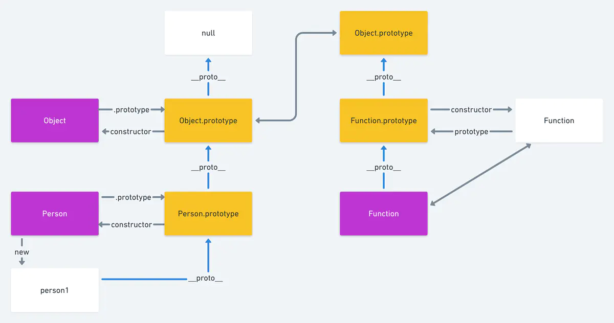
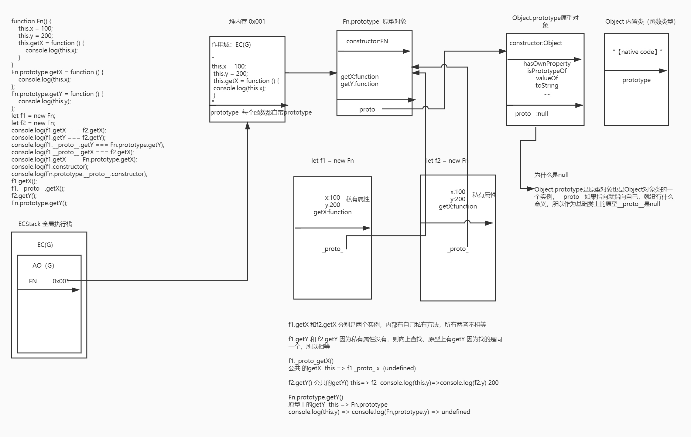
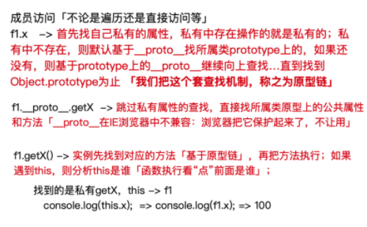

# 深入理解原型

## 构造函数

创建一个函数，当我们 new 这个函数，哪个这个过程就叫做构造函数  
通过构造函数创建对象也称为实例化

```js
function Animal(color) {
  // 实例属性
  this.color = color;
}
// 静态属性
Animal.age = "4";
let dog = new Animal("black");
```

在构造函数上定义方法，（方法是不共享的）  
每生成一个对象，添加一个方法，都是新建的内存，这样会造成内存的浪费

```js
function Star() {
  this.sing = function () {
    console.log("我爱唱歌");
  };
}
let stu1 = new Star();
let stu2 = new Star();
stu1.sing(); //我爱唱歌
stu2.sing(); //我爱唱歌
console.log(stu1.sing === stu2.sing); //false
```

在构造函数的原型上定义方法（方法是共享的）

```js
function Star(name) {
  this.name = name;
}
Star.prototype.sing = function () {
  console.log("我爱唱歌", this.name);
};
let stu1 = new Star("小红");
let stu2 = new Star("小蓝");
stu1.sing(); //我爱唱歌 小红
stu2.sing(); //我爱唱歌 小蓝
console.log(stu1.sing === stu2.sing); //true
```

## new 过程发生了什么

#### 看一段代码

```js
function Person() {}
Person.prototype.index = 10;
let stu = new Person();
console.log(stu.index); //10
```

步骤详解 new 过程  
1.首先会创建一个新的空对象 `let stu = new Object()`  
2.把创建的对象 stu 的`_proto_`指向 Person 的原型对象`prototype` `stu._proto_ = Person.prototype`  
3.改变 this 的指向，指向创建的新对象 `Person.call(stu)`  
我们可以发现，我们并没有把属性也赋值给新的对象，那么新的对象是怎么拿到值的呢？答案是原型链，当执行步骤 2 的时候，原型链就产生了，
`stu->Person.prototype->Object.prototype->null`
当 stu 查找自身属性 index，如果找不到就会向上查找，直到最顶层 null 为止。如果找到属性，那么会立刻终止，停止查找

#### 静态属性

```js
function Person() {}
Person.name = "s";
Person.prototype.age = "1";
const p = new Person();
console.log(p.age); // 1
console.log(p.name); // undefined
```

因为 name 是 Person 的静态属性，是绑定在 Person 的函数上的，并不在原型链上，所以 p 是获取不 name 的。

## _proto_

每一个 js 对象（除了 null）都具有一个属性叫 `_proto_`，这个属性会指向该对象的原型

对象`_proto_`属性的值就是它对应的原型对象，

```js
function Person() {}
var person = new Person();
console.log(person._proto_ === Person.prototype); // true
```

```js
var one = { x: 1 };
var two = new Object();
one.__proto__ === Object.prototype; // true
two.__proto__ === Object.prototype; // true
one.toString === one.__proto__.toString; // true
```

## prototype

只有函数才会有 `prototype`  
什么是原型：`Father.prototype`就是原型，其作用就是共享方法  
通过原型共享方法可以避免内存空间的浪费

## 原型链

开局一张图

;

person1 到 null 这个过程，（蓝色的线），就称为原型链

分析一下过程

1.我们从 Person 开始，开始从创建一个函数 Person  
2.创建对象`let person1 = new Person()` `person1._proto_=== Person.prototype`  
3.`Person.prototype.constructor === Person`原型的构造器指向原型 4.`Person.prototype._proto_ === Object.prototype`  
5.`Object.prototype._proto_ === null`  
从图中还可以看出的关系

```
person1._proto_._proto_ === Object.prototype
person1._proto_._proto_._proto_ === null
```

6.`Function._proto_=== Function.prototype`  
7.`Function.prototype._proto_ === Object.prototype`  
8.`Function.prototype.constructor === Function`

看一道题目

```js
Object.prototype.__proto__; //null
Function.prototype.__proto__; //Object.prototype
Object.__proto__; //Function.prototype
```

## 继承

看一道题目

```
按照如下要求实现Person 和 Student 对象
 a)Student 继承Person
 b)Person 包含一个实例变量 name， 包含一个方法 printName
 c)Student 包含一个实例变量 score， 包含一个实例方法printScore
 d)所有Person和Student对象之间共享一个方法
```

es5 写法

```js
// 先定义两个函数
function Person(name) {
  //实例变量name
  this.name = name;
  // 包含的方法
  this.printName = function () {
    console.log("this is printName");
  };
}
// 共享方法要放在原型上
Person.prototype.comment = function () {
  console.log("共享方法");
};
function Student(score) {
  this.score = score;
  this.printScore = function () {
    console.log("this is printScore");
  };
}
// student 想要继承Person的原型的方法，就要吧 Person的实例赋值给Student的原型
Student.prototype = new Person();
let person = new Person("小紫", 80);
let stu = new Student("小红", 100);
console.log(stu.printName === person.printName); //false
console.log(stu.comment === person.comment); //true
```

es6 写法
class 类，本质上还是函数，只不过是函数的语法糖，写起来更方便

```js
//类中的所有方法都会被继承
class Person {
  constructor(name) {
    this.name = name;
  }
  printName() {
    console.log("This is printName");
  }
  commonMethods() {
    console.log("我是共享方法");
  }
}

class Student extends Person {
  constructor(name, score) {
    //调用父类的constructor(name) 此时是作为一个函数
    super(name); // this指向是当前环境Student
    //相当于Student.prototype.constructor.call(this)

    // 此时super作为一个对象使用
    console.log(super.printName()); //this指向是Person
    // 相当于 Person.prototype.printName()
    this.score = score;
  }
  printScore() {
    console.log("This is printScore");
  }
}

let stu = new Student("小红");
let person = new Person("小紫");
console.log(stu.printName === person.printName); //true
console.log(stu.commonMethods === person.commonMethods); //true
```

## 图解原型以及原型链的过程

```js
function Fn() {
  this.x = 100;
  this.y = 200;
  this.getX = function () {
    console.log(this.x);
  };
}
Fn.prototype.getX = function () {
  console.log(this.x);
};
Fn.prototype.getY = function () {
  console.log(this.y);
};
let f1 = new Fn();
let f2 = new Fn();
console.log(f1.getX === f2.getX);
console.log(f1.getY === f2.getY);
console.log(f1.__proto__.getY === Fn.prototype.getY);
console.log(f1.__proto__.getX === f2.getX);
console.log(f1.getX === Fn.prototype.getX);
console.log(f1.constructor);
console.log(Fn.prototype.__proto__.constructor);
f1.getX();
f1.__proto__.getX();
f2.getY();
Fn.prototype.getY();
```

;

```js
console.log(f1.getX === f2.getX);
// 因为getX 在f1和f2上是私有的，所以方法不相同  false
console.log(f1.getY === f2.getY);
// 因为两者私有属性都没有getY 会查找到原型上，所以两者是相同的  true
console.log(f1.__proto__.getY === Fn.prototype.getY);
// 因为两者指向的都是原型上的 getY方法所以是  true
console.log(f1.__proto__.getX === f2.getX);
// f1.__proto__.getX指向原型上的方法， f2.getX是私有的，所以是false
console.log(f1.getX === Fn.prototype.getX);
// false
console.log(f1.constructor);
// Fn
console.log(Fn.prototype.__proto__.constructor);
// Object
f1.getX(); // 100
f1.__proto__.getX(); // undefined
f2.getY(); // 200
Fn.prototype.getY(); // undefined
```

;

js 面向对象的底层机制：

- 每一个（除箭头函数外）函数数据类型，都自带属性：prototype，属性值是一个对象（Function.prototype 除外）并且原型对象中自带一个属性：constructor 属性值是当前构造函数本身，目的是为了存储当前类所属的实例，调用公共方法和属性

  - 普通函数/箭头函数/生成器函数
  - 构造函数（自定义函数）
  - 内置类（内置构造函数）

- 每一个对象数据类型，都天生自带一个属性：**proto**原型链属性
  （隐式原型），属性值指向所属类的原型对象 prototype，目的是为了找到原型上的公共方法。 - 普通对象 数组对象 正则对象 日期对象 - prototype 原型对象 - 实例对象 - 函数也是对象

## 原型重定向

```js
function Fn() {}
Fn.prototype.x = 100;
Fn.prototype.y = 200;
```

当我们把原型的指向重新赋值给一个新的对象，这就叫原型重定向，那么原型重定向会有什么问题以及怎么解决

```js
Fn.prototype = {
  getX() {},
  getY() {},
};
// 这个时候我们的原型已经重新指向了，并且之前原型有的方法以及属性也都不存在了，并且constructor也丢失了
```

```js
// 我们可以手动添加constructor

Fn.prototype = {
  constructor: Fn,
  getX() {},
  getY() {},
};
// 手动添加，constructor会由之前的不可枚举变成可枚举的
```

```js
Fn.prototype = Object.assign(Fn.prototype, {
  getX() {},
  getY() {},
}); //->这种合并的办法，Fn.prototype还是之前的堆地址，只不过是把新对象中的内容全部扩展到了原始的堆中
```

```js
let proto = {
  constructor: Fn,
  getX() {},
  getY() {},
};

Fn.prototype = Object.assign({}, Fn.prototype, proto);
// 这样合并 会创建一个新的对象，并且之前的原型上的方法也会被保留下来
```

```js
let obj1 = {
  x: 100,
  n: {
    0: 1,
    1: 2,
  },
};
let obj2 = {
  y: 300,
  n: {
    name: "00",
  },
};
//Object.assign:合并两个对象[浅拷贝]
//   + 让obj2中的内容替换obj1中的：两者都有的以obj2为主，只有其中一个具备的都是相当于新增...
//   + 最后返回的是obj1对象的堆内存地址「相当于改变的是obj1对象中的内容」，并不是返回一个全新的对象...
// let obj = Object.assign(obj1, obj2);
// console.log(obj === obj1); //true
// let obj = Object.assign({}, obj1, obj2);
// console.log(obj); //->全新的对象，也就是assign的第一个参数「新对象」

// console.log(Object.assign(obj1, obj2)); //->浅比较：obj2.n直接覆盖obj1.n
```

```js let obj = {
    fn1() {},
    fn2: function fn2() {}
    // 两者写法的区别：
    //   + 第一种写法：obj.fn1函数是没有prototype属性的 「不能被作为构造函数」
    //   + 第二种写法：和正常的函数没有区别
};
new obj.fn1(); //Uncaught TypeError: obj.fn1 is not a constructor */
```

原型重定向相信已经有所收获，那么你有没有疑问为什么要用原型重定向呢。

优点：

- 把原型上为其实例提供的公共属性和方法，全部写到一起，提高整体的模块性
- 后续向原型上扩展方法会更方便

```js
// 没有使用重定向
fn.prototype.getx = function(){}
....

fn.prototype.gety = function(){}

// 使用重定向

fn.prototype = {
  getx:function(){},
  gety:function(){}
}
```

缺点：

- 会失去 constructor
- 原始原型上的方法会消失

解决办法 fn.prototype = Object.assign(fn.prototype,{...})

## 原型内置类

向内置类的原型上扩展方法

- 内置类的原型上提供了很多方法，但是不一定满足业务需求，此时需要我们自己扩展一些方法

优势

- 调用方便
- 可以实现链式调用
- 限制调取的方法的类型
- 扩展方法，各个模块都可以直接调用

弊端

- 自己扩展的方法，容易明明重复替换原有的方法（所以命名最好要加前缀）

demo

```js
// 实现数组去重
Array.prototype.unique = function unique() {
  // this:一般都是当前要操作的实例(也就是要操作的数组)
  let obj = {},
    self = this;
  for (let i = 0; i < self.length; i++) {
    let item = self[i];
    if (obj.hasOwnProperty(item)) {
      // 数组之前出现过这一项，当前项就是重复的，我们此时删除当前项即可
      self.splice(i, 1);
      i--;
      continue;
    }
    obj[item] = item;
  }
  return self; //实现链式写法
};
let arr = [10, 30, 40, 20, 40, 30, 10, 40, 20];
arr
  .unique()
  .sort((a, b) => a - b)
  .reverse(); //执行完成sort返回的是排序后的数组（原始数组也是变的）... 执行完成push返回的是新增后数组的长度「不能再调数组方法了」 => “链式写法”：执行完成一个方法，返回的结果是某个实例，则可以继续调用这个实例所属类原型上的方法...
console.log(arr);
```
